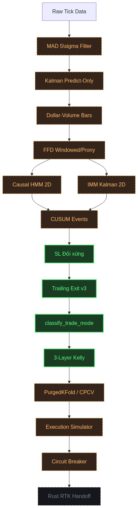

\begin{titlepage}
\begin{center}
\vspace*{1.5cm}

\Large
\textbf{1907 TACTICAL AI RESEARCH}

\vspace{2.5cm}

\Huge
\textbf{HỆ THỐNG GIAO DỊCH THUẬT TOÁN}

\vspace{0.8cm}
\Large
\textbf{Nền tảng theo dõi xu hướng cấp định chế dựa trên vi cấu trúc dòng lệnh và học máy phòng thủ kép}

\vspace{2.5cm}

\textbf{BÁO CÁO NGHIÊN CỨU}

\vfill

\Large
\textbf{Tác giả:} 1907 Tactical AI Research\\
\textbf{Phiên bản:} v11.9\\
\textbf{Ngày hoàn thành:} 27/07/2026

\vspace{1.5cm}
\end{center}
\end{titlepage}

\renewcommand{\abstractname}{Tóm tắt nội dung}
\begin{abstract}
\normalsize
Nghiên cứu này trình bày thiết kế, triển khai và kiểm định hệ thống giao dịch thuật toán Aegis Trading System --- một nền tảng theo dõi xu hướng cấp định chế (Institutional-Grade Trend-Following Platform) tích hợp các phương pháp tiên tiến nhất từ lý thuyết vi cấu trúc dòng lệnh, học máy tài chính và quản trị rủi ro định lượng. Cấu trúc liên kết chặt chẽ ba trụ cột cốt lõi: xử lý nhiễu bằng bộ lọc Kalman, phân bổ tỷ trọng theo xác suất bằng HMM, và quản lý rủi ro đuôi đen thông qua Kelly Shrinkage. Báo cáo này đóng vai trò như một tài liệu tham khảo chính thức về mặt toán học và cấu trúc dữ liệu cho quá trình triển khai hệ thống lõi.
\end{abstract}

\clearpage
\tableofcontents
\clearpage


\clearpage

**Tác giả:** Hoàng Công Lý + Đinh Văn Thái Khang
**Đơn vị:** 1907 Tactical AI Research Group  
**Phiên bản:** v11.9 — Tháng 7/2026  
**Ngôn ngữ lập trình:** Python 3.10+ (Nghiên cứu & Kiểm định) | Rust (Lõi thực thi thời gian thực)  
**Mã nguồn:** [github.com/1907TacticalAI/aegis-trading-system](https://github.com/1907TacticalAI/aegis-trading-system)

---

# 2. Giới thiệu (Introduction)

## 2.1 Bối cảnh và động lực nghiên cứu

Thị trường tài chính toàn cầu, đặc biệt là thị trường tiền mã hóa (cryptocurrency), đã trải qua sự chuyển đổi cấu trúc sâu sắc trong thập kỷ gần đây. Theo báo cáo của Bank for International Settlements (BIS, 2023), giao dịch thuật toán hiện chiếm hơn 70% khối lượng giao dịch trên các sàn giao dịch lớn. Sự gia tăng này đặt ra ba thách thức cốt lõi:

1. **Nhiễu vi cấu trúc** (Microstructure Noise): Dữ liệu tick thực tế chứa nhiều loại nhiễu kỹ thuật — bad ticks do lỗi đường truyền, spikes ảo do thuật toán spoofing, và biến động giả tạo do thanh khoản mỏng. Các phương pháp lọc nhiễu truyền thống (z-score đơn giản) không phân biệt được giữa nhiễu kỹ thuật và sự kiện đuôi đen (tail events) thực sự.

2. **Chuyển đổi cấu trúc thị trường** (Regime Switching): Thị trường liên tục luân chuyển giữa các cấu trúc (trending, mean-reverting, choppy) với tần suất và biên độ không thể dự đoán trước. Hệ thống giao dịch tĩnh — sử dụng một bộ tham số cố định — sẽ thất bại thảm hại khi cấu trúc thay đổi.

3. **Rò rỉ dữ liệu tương lai** (Look-ahead Bias / Data Leakage): Đây là "kẻ giết người thầm lặng" trong nghiên cứu tài chính định lượng. Phần lớn các chiến lược backtest cho kết quả phi thực tế do vô tình sử dụng thông tin tương lai trong quá trình huấn luyện mô hình hoặc tính toán tham số.

Nghiên cứu này ra đời từ nhu cầu xây dựng một hệ thống giao dịch thuật toán đáp ứng đồng thời ba yêu cầu: (i) xử lý chính xác nhiễu vi cấu trúc, (ii) thích ứng động với chuyển đổi cấu trúc thị trường, và (iii) đảm bảo tính nghiêm ngặt thống kê chống rò rỉ dữ liệu xuyên suốt toàn bộ pipeline.

## 2.2 Tổng quan tài liệu liên quan

### 2.2.1 Vi cấu trúc dòng lệnh và Dollar-Volume Bars

Công trình tiên phong của Easley, López de Prado và O'Hara (2012) về Volume-Synchronized Probability of Informed Trading (VPIN) đã mở ra hướng tiếp cận mới cho phân tích vi cấu trúc dòng lệnh. López de Prado (2018) trong *Advances in Financial Machine Learning* (AFML) đề xuất sử dụng Dollar-Volume Bars thay thế cho nến thời gian truyền thống, cho phép lấy mẫu dữ liệu dựa trên hoạt động thực tế của thị trường thay vì đồng hồ vật lý.

### 2.2.2 Sai phân phân số và tính dừng

Hosking (1981) và Granger & Joyeux (1980) đặt nền móng cho quá trình ARFIMA với tham số sai phân phân số $d \in (0, 0.5)$. López de Prado (2018, Chương 5) phát triển thuật toán Fractional Differentiation cửa sổ (Windowed FFD) cho phép chuyển đổi chuỗi giá không dừng thành dừng mà bảo toàn bộ nhớ dài hạn — một đặc tính quan trọng cho chiến lược theo dõi xu hướng.

### 2.2.3 Mô hình ẩn Markov trong tài chính

Hamilton (1989) là người đầu tiên áp dụng mô hình Markov chuyển đổi cấu trúc (Markov-Switching Model) cho phân tích chu kỳ kinh tế. Bulla & Bulla (2006) mở rộng cho thị trường tài chính. Nghiên cứu gần đây của Nystrup et al. (2017, 2020) tích hợp HMM với chiến lược phân bổ tài sản động, cho thấy hiệu quả vượt trội so với mô hình tĩnh.

### 2.2.4 Tiêu chuẩn Kelly và quản trị rủi ro

Kelly (1956) đề xuất công thức phân bổ vốn tối ưu cực đại hóa tốc độ tăng trưởng log kỳ vọng. Thorp (2006) và MacLean et al. (2011) phát triển các biến thể Fractional Kelly và demonstrating rằng Half-Kelly ($\lambda = 0.5$) giảm 75% phương sai drawdown chỉ với 25% giảm tốc độ tăng trưởng kỳ vọng.

### 2.2.5 Kiểm định chống quá khớp

Bailey & López de Prado (2014) đề xuất Deflated Sharpe Ratio (DSR) để trừng phạt hiện tượng data-snooping trong kiểm định chiến lược. Phương pháp Combinatorially Purged Cross-Validation (CPCV) và Probability of Backtest Overfitting (PBO) của López de Prado (2018, Chương 11-12) cung cấp khung kiểm định nghiêm ngặt cho dữ liệu tài chính có nhãn chồng lấp.

## 2.3 Mục tiêu và phạm vi nghiên cứu

**Mục tiêu tổng quát:** Thiết kế, triển khai và kiểm định một hệ thống giao dịch thuật toán end-to-end, từ tiền xử lý dữ liệu vi cấu trúc đến khớp lệnh thực tế, đạt tiêu chuẩn chất lượng cấp định chế (institutional-grade).

**Mục tiêu cụ thể:**
1. Xây dựng pipeline tiền xử lý dữ liệu tick phân biệt chính xác giữa nhiễu kỹ thuật và sự kiện đuôi đen.
2. Thiết kế kiến trúc phát tín hiệu đa tầng tích hợp HMM nhân quả và bộ lọc Kalman tương tác.
3. Phát triển hệ thống quản trị vốn phòng thủ 3 tầng thích ứng với chuyển đổi cấu trúc thị trường.
4. Triển khai khung kiểm định chéo PurgedKFold / CPCV đảm bảo zero-leakage.
5. Xây dựng hạ tầng hợp đồng dữ liệu và kiểm duyệt tự động xuyên suốt pipeline.

**Phạm vi nghiên cứu:** Tập trung vào thị trường hợp đồng vĩnh viễn (Perpetual Futures) trên các sàn giao dịch tiền mã hóa, với khả năng mở rộng sang các lớp tài sản khác.

## 2.4 Đóng góp chính

So với các hệ thống giao dịch thuật toán hiện có, nghiên cứu này có các đóng góp nguyên bản sau:

| # | Đóng góp | Ý nghĩa khoa học |
|---|----------|------------------|
| 1 | Bộ lọc nhiễu tick 4 điều kiện (MAD + Volume + Reversal + Cross-Venue) | Phân biệt chính xác bad tick và tail event, vượt qua hạn chế của z-score đơn giản |
| 2 | Giao thức Kalman Predict-Only | Thay thế Forward Fill và Drop — bảo toàn hoàn toàn véctơ động lượng $[\hat{P}_t, \hat{\nu}_t]^T$ |
| 3 | Kiến trúc phòng thủ kép 3 tầng cho Kelly | Giải quyết đồng thời overfitting mẫu nhỏ, chuyển pha regime, và biến động đột biến |
| 4 | Lưới Kelly 2D Conditional Quantile | Loại bỏ hố đen rỗng mẫu (Data Starvation) của Uniform Binning truyền thống |
| 5 | Cơ chế Trailing Exit đối xứng gương | Đảm bảo tính đối xứng Long/Short với tham số thời gian riêng biệt cho Follow/Fade |
| 6 | Hệ thống hợp đồng dữ liệu SHA-256 | Đảm bảo truy xuất nguồn gốc (Data Lineage) và tính toàn vẹn xuyên suốt pipeline |

---

# 3. Cơ sở lý thuyết (Theoretical Foundations)

## 3.1 Vi cấu trúc dòng lệnh và phân tích Bar không đều

### 3.1.1 Dollar-Volume Bars

Nến thời gian truyền thống (time bars) lấy mẫu dữ liệu theo đồng hồ vật lý, dẫn đến hai vấn đề: (i) oversampling trong giờ giao dịch thấp (dữ liệu thiếu thông tin) và (ii) undersampling trong giờ biến động cao (mất thông tin quan trọng). Dollar-Volume Bars khắc phục bằng cách tạo nến mới khi tổng Dollar-Volume tích lũy vượt ngưỡng $\theta_t$:

$$
\text{Bar mới được tạo khi:} \quad \sum_{k=j}^{i} P_k \cdot V_k \geq \theta_t
$$

Ngưỡng $\theta_t$ được tính theo phương pháp Point-in-Time (PIT) để tuyệt đối tránh look-ahead bias:

$$
\theta_{\text{PIT}}(T) = \frac{1}{\text{target\_freq}} \times \frac{1}{21} \sum_{k=1}^{21} \text{Daily\_Dollar\_Volume}(T-k)
$$

### 3.1.2 Order Flow Imbalance (OFI)

Theo Tick Rule, hướng lệnh chủ động $b_i \in \{-1, +1\}$ được xác định:

$$
b_i = \begin{cases} +1 & \text{nếu } P_i > P_{i-1} \\ -1 & \text{nếu } P_i < P_{i-1} \\ b_{i-1} & \text{nếu } P_i = P_{i-1} \end{cases}
$$

Chỉ số mất cân bằng dòng lệnh chuẩn hóa:

$$
\text{OFI}_t = \frac{V_{\text{buy}, t} - V_{\text{sell}, t}}{V_{\text{buy}, t} + V_{\text{sell}, t} + 10^{-8}} \in [-1, +1]
$$

## 3.2 Sai phân phân số bảo toàn bộ nhớ

### 3.2.1 Fractional Differentiation (FFD)

Toán tử sai phân phân số bậc $d \in [0, 1]$ được định nghĩa qua khai triển chuỗi nhị thức:

$$
(1 - B)^d = \sum_{k=0}^{\infty} w_k(d) B^k, \qquad w_k(d) = -w_{k-1}(d) \frac{d - k + 1}{k}, \quad w_0(d) = 1
$$

Bậc vi phân tối ưu $d^*$ là giá trị cực tiểu sao cho chuỗi $\tilde{X}_t = (1 - B)^{d^*} X_t$ đạt tính dừng theo kiểm định ADF ($p\text{-value} < 0.05$):

$$
d^* = \arg\min_{d \in [0, 1]} \left\{ d : \text{ADF}(\tilde{X}_t) \text{ reject } H_0 \text{ tại } \alpha = 0.05 \right\}
$$

### 3.2.2 Windowed FFD và Sum-of-Exponentials

Cửa sổ cắt ngắn tại ngưỡng tiệm cận $\tau = 10^{-5}$:

$$
W^*(d, \tau) = \min \{ k \in \mathbb{N} \mid |w_k(d)| < \tau \}
$$

Phương án Sum-of-Exponentials xấp xỉ trọng số bằng tổng hàm mũ:

$$
\hat{w}_k = \sum_{m=1}^M c_m \rho_m^k \approx w_k(d), \qquad \rho_m \in (-0.9999, +0.9999)
$$

Cho phép $\rho_m$ âm để tái tạo hành vi đổi dấu luân phiên của $w_k$ ở vùng $k$ nhỏ.

## 3.3 Mô hình ẩn Markov nhân quả và bộ lọc Kalman tương tác

### 3.3.1 Causal HMM 2D Emission

Hệ HMM được khóa cứng $N = 2$ trạng thái (Trending và Choppy). Véctơ quan sát 2 chiều:

$$
\mathbf{O}_t = \begin{bmatrix} r_t \\ \text{OFI}_t \times \sigma_{\text{realized}, 24, t} \end{bmatrix}
$$

Xác suất hậu nghiệm nhân quả được tính bằng Forward-Only Alpha Pass:

$$
\alpha_j(t) = \mathcal{N}\left(\mathbf{O}_t; \boldsymbol{\mu}_j, \boldsymbol{\Sigma}_j\right) \sum_{i=1}^2 \alpha_i(t-1) A_{ij}
$$

$$
p_{\text{trend}, t} = \frac{\alpha_{\text{trend}}(t)}{\alpha_0(t) + \alpha_1(t)}, \qquad p_{\text{chop}, t} = 1 - p_{\text{trend}, t}
$$

> **Lưu ý quan trọng:** Trong môi trường production, tuyệt đối chỉ sử dụng Forward Pass (nhân quả), không dùng Backward Pass (Baum-Welch smoothing) để tránh rò rỉ thông tin tương lai.

### 3.3.2 IMM Kalman 2D

Kiến trúc Interacting Multiple Model gồm 2 bộ lọc Kalman chạy song song:

- **Bộ lọc Trending** ($j=1$): $\mathbf{Q}_{\text{trend}}$ lớn, bám sát vận tốc drift $\nu_t$
- **Bộ lọc Choppy** ($j=2$): $\mathbf{Q}_{\text{chop}} \approx 0$, triệt tiêu dao động quanh mean

Trạng thái hệ thống và ma trận chuyển tiếp:

$$
\hat{\mathbf{x}}_t = \begin{bmatrix} P_t \\ \nu_t \end{bmatrix}, \qquad \mathbf{F} = \begin{bmatrix} 1 & 1 \\ 0 & 1 \end{bmatrix}, \qquad \mathbf{H} = \begin{bmatrix} 1 & 0 \end{bmatrix}
$$

Hàm `sanitize_covariance_matrix` đảm bảo ma trận hiệp phương sai luôn xác định dương:

$$
\mathbf{P}_{j, t|t} = \text{sanitize\_covariance}\left( \mathbf{P}_{j, t|t}^{\text{raw}}, 10^{-10} \right)
$$

## 3.4 Tiêu chuẩn Kelly thực nghiệm và tối ưu hóa phi tuyến

### 3.4.1 Bài toán Kelly

Tìm tỷ lệ đặt cược $f^*$ cực đại hóa tốc độ tăng trưởng log kỳ vọng:

$$
f^* = \arg\max_f \; E[\ln(1 + f \cdot r)]
$$

Đạo hàm bậc nhất cần triệt tiêu:

$$
G'(f) = E\left[\frac{r}{1 + fr}\right] = 0
$$

Nghiệm được tìm bằng phương pháp Brent (brentq) trên khoảng $[0, f_{\max}^{\text{safe}}]$.

### 3.4.2 Giới hạn đòn bẩy động

Để tránh miền không xác định $\ln(\leq 0)$:

$$
f_{\max}^{\text{safe}} = \min\left(f_{\max}, \frac{0.999}{|r_{\min}|}\right)
$$

### 3.4.3 Bayesian Shrinkage

Khi số lượng mẫu $N$ nhỏ, Kelly thực nghiệm bị co giá trị về niềm tin tiên nghiệm:

$$
f_{\text{bayesian}} = \frac{N}{N + C} \cdot f_{\text{conservative}} + \frac{C}{N + C} \cdot f_{\text{prior}}
$$

Với $C = 20$ (hằng số tin cậy định chế), $f_{\text{prior}} = 0.1$ (đòn bẩy an toàn cực tiểu).

## 3.5 Kiểm định chéo chống rò rỉ dữ liệu (PurgedKFold & CPCV)

### 3.5.1 PurgedKFold

Cơ chế Zero-Leakage gồm 2 bước:

1. **Purging (Cắt lọc):** Xóa bỏ mẫu huấn luyện có $t_1 > t_0^{\text{test}}$
2. **Embargoing (Cách ly):** Xóa bỏ mẫu huấn luyện trong khoảng $[\max(t_1^{\text{test}}), \max(t_1^{\text{test}}) + \text{embargo\_bars}]$

Với $\text{embargo\_bars} = 24$ nến (cố định, không phụ thuộc kích thước mẫu $N$).

## 3.6 Deflated Sharpe Ratio và xác suất quá khớp

### 3.6.1 Deflated Sharpe Ratio (DSR)

$$
\text{DSR} = P[\hat{SR} > 0 \mid \hat{SR}_0(N_{\text{trials}})]
$$

Tiêu chuẩn: $\text{DSR} \geq 0.95$ (xác suất ít nhất 95% rằng Sharpe OOS thực sự dương).

### 3.6.2 Probability of Backtest Overfitting (PBO)

$$
\text{PBO} = P[\text{IS rank} \neq \text{OOS rank}]
$$

Tiêu chuẩn: $\text{PBO} \leq 0.40$ (xác suất quá khớp không quá 40%).

---

# 4. Xây dựng dữ liệu (Data Construction)

## 4.1 Thu thập và tiền xử lý dữ liệu tick

Dữ liệu đầu vào bao gồm:
- **Tick-level:** Giá khớp lệnh, khối lượng, timestamp (ms), từ các sàn giao dịch lớn (Binance, CME)
- **1s OHLCV:** Nến 1 giây làm dữ liệu tham chiếu
- **Cross-Venue Feed:** Giá từ sàn đối chứng để kiểm tra chéo

Mỗi tập dữ liệu được xác minh tính toàn vẹn qua PIT Manifest và mã Hash SHA-256.

## 4.2 Lọc nhiễu vi cấu trúc MAD 5$\sigma$ và Cross-Venue Parity

### 4.2.1 Robust Sigma từ MAD

$$
\text{MAD}_i = \text{median}\left( |P_{i-k} - \text{median}(P_{i-100:i-1})| \right)_{k=1}^{100}
$$

$$
\hat{\sigma}_{\text{MAD}, i} = 1.4826 \times \text{MAD}_i
$$

### 4.2.2 Bộ lọc 4 điều kiện

Tick bị phân loại là **Bad Tick** khi thỏa mãn **đồng thời** 4 điều kiện:

| # | Điều kiện | Công thức | Ý nghĩa |
|---|-----------|-----------|---------|
| 1 | Lệch cực đoan | $\|P_i - P_{i-1}\| > 5\hat{\sigma}_i$ | Giá nhảy bất thường |
| 2 | Khối lượng tĩnh | $V_i < 2 \times \text{median}(V_{i-100:i-1})$ | Không có dòng tiền thực |
| 3 | Đảo chiều chớp nhoáng | $\|P_{i+1} - P_{i-1}\| < 0.3 \times \|P_i - P_{i-1}\|$ | Giá quay lại ngay |
| 4 | Cross-Venue Parity | Sàn đối chứng không biến động mạnh | Chỉ sàn chính bị spike |

> **Chính sách Fallback:** Khi thiếu feed sàn phụ -> Điều kiện 4 = False -> Không lọc tick (ưu tiên bảo toàn Tail Event).

> **Phân loại Tail Event:** Nếu ĐK1 thỏa nhưng ĐK2 vi phạm ($V_i \geq 2 \times \text{median}$) -> Dòng tiền thực -> Gắn cờ `is_tail_event = True` thay vì lọc bỏ.

## 4.3 Bộ lọc Kalman thế chỗ Bad Tick (Predict-Only Protocol)

Khi phát hiện Bad Tick, thay vì Drop (đứt gãy chỉ số thời gian) hoặc Forward Fill (méo động lượng), hệ thống sử dụng bộ lọc Kalman 2 trạng thái $[\hat{P}_t, \hat{\nu}_t]^T$ với giao thức **Predict-Only**:

- **Good Tick:** Thực hiện cả Predict và Update
- **Bad Tick:** Chỉ thực hiện Predict, bỏ qua Update

$$
\text{Bad Tick:} \quad \hat{\mathbf{x}}_{t|t} \equiv \hat{\mathbf{x}}_{t|t-1} = \begin{bmatrix} \hat{P}_{t-1|t-1} + \hat{\nu}_{t-1|t-1} \\ \hat{\nu}_{t-1|t-1} \end{bmatrix}
$$

Giá trị thay thế:

$$
\tilde{y}_t = \mathbf{H} \hat{\mathbf{x}}_{t|t} = \hat{P}_{t-1|t-1} + \hat{\nu}_{t-1|t-1}
$$

## 4.4 Xây dựng nến Dollar-Volume

Pipeline xây dựng nến Dollar-Volume gồm các bước:

1. **Tính ngưỡng PIT-Safe** $\theta_t$ từ 21 ngày giao dịch trước
2. **Ánh xạ ASOF Backward Join** $O(N)$ xuống tick-level
3. **Numba JIT Generator:** Tích lũy Dollar-Volume, phân loại Tick Rule, tính OFI
4. **Gắn cờ Toxicity:** `tick_count < 0.5 × median` -> `is_toxic_flag = True`

## 4.5 Hợp đồng dữ liệu và niêm phong SHA-256

Hệ thống sử dụng mô hình Data Contract nghiêm ngặt:

**Schema dữ liệu:**
- `SIGNAL_BAR_SCHEMA` (19 cột): Dữ liệu nến đầu vào
- `TRADE_RECORD_SCHEMA` (23 cột): Bản ghi giao dịch đầu ra

**Niêm phong SHA-256:**

$$
\text{hash} = \text{SHA-256}\left(\text{JSON}\left(\{n\_rows, start\_time, end\_time, params\}\right)\right)
$$

Mọi bản ghi giao dịch đều mang `dataset_manifest_hash` truy xuất về đúng phiên bản dữ liệu nến gốc.

---

# 5. Phương pháp đề xuất (Proposed Methodology)

## 5.1 Kiến trúc tổng thể hệ thống

Hệ thống Aegis được thiết kế theo kiến trúc pipeline 6 giai đoạn:

```
+---------------------------------------------------------------------+
|                    AEGIS TRADING SYSTEM v11.9                       |
+---------------------------------------------------------------------+
|                                                                     |
|  [GĐ 0] Raw Data -> Lọc Nhiễu MAD 5$\sigma$ -> Kalman Predict-Only         |
|       -> Ngưỡng PIT $\theta_t$ -> Dollar-Volume Bar -> OFI -> Toxicity Flag   |
|                              v                                      |
|  [GĐ 1] FFD (Windowed / Sum-of-Exponentials)                       |
|       -> Chuỗi dừng bảo toàn bộ nhớ                                 |
|                              v                                      |
|  [GĐ 2] HMM 2D Causal -> IMM Kalman -> Hurst GHE -> Trend Score     |
|       -> CUSUM Event Filter -> Triple-Barrier -> SL Đối xứng          |
|       -> Trailing Exit Follow/Fade                                   |
|                              v                                      |
|  [GĐ 3] Feature Selection (MDI+MDA+SFI) -> Bootstrap Forest         |
|       -> 2D Kelly Grid (Conditional Quantile) -> Follow/Fade Tables   |
|                              v                                      |
|  [GĐ 4] PurgedKFold 15-Fold -> 5-Step OOS Pipeline                  |
|       -> Sharpe OOS -> DSR ≥ 0.95 -> PBO ≤ 0.40                      |
|                              v                                      |
|  [GĐ 5] Execution Simulator -> 8-Component Parity                   |
|       -> Shadow Mode Gate -> Circuit Breaker -> Rust RTK Handoff       |
|                                                                     |
+---------------------------------------------------------------------+
```

## 5.2 Pipeline phát tín hiệu sơ cấp (Track A)

Track A chịu trách nhiệm biến đổi dữ liệu thô thành các tín hiệu sơ cấp:

1. **Module A (Tiền xử lý):** Lọc nhiễu -> Kalman -> Dollar-Volume Bars
2. **Module A.3 (FFD):** Sai phân phân số -> Chuỗi dừng
3. **Module B (Tín hiệu):**
   - B.0: Parametric Bootstrap LRT ($N=1$ vs $N=2$ states)
   - B.1: Causal HMM 2D -> $p_{\text{trend}}, p_{\text{chop}}$
   - B.2: IMM Kalman 2D -> $\hat{\nu}_t$ (Trend Score)
   - B.3: GHE ($W=168$, Lags $[2, 4, 8, 16]$) -> Hurst exponent

## 5.3 Pipeline gán nhãn và ra quyết định (Track B)

Track B chuyển đổi tín hiệu thành quyết định giao dịch:

1. **Module C (Sự kiện & Nhãn):**
   - C.1: CUSUM Event Filter với Spatial-Temporal Gating
   - C.2: Dynamic HMM Triple-Barrier
   - C.3: `compute_sl_initial` — SL đối xứng gương
   - C.4: `trailing_exit_v3` — Trailing Exit đối xứng

2. **Module D (Chọn lọc tính năng):**
   - D.1: Triple Consensus (MDI + MDA + SFI)
   - D.2: Hierarchical Clustering ($|\rho| > 0.70$ Clamped)

3. **Module E (Kelly Sizing):**
   - E.1: PurgedKFold + CalibratedClassifierCV
   - E.2: Weighted Bootstrap Forest ($\bar{u}_i$ weights)
   - E.3: 2D Empirical Kelly Grid -> Follow/Fade Tables

## 5.4 Kiến trúc phòng thủ kép 3 tầng

Đây là đóng góp kiến trúc cốt lõi của nghiên cứu, thay thế hoàn toàn Kelly tĩnh truyền thống:

**Tầng 0 (Nền) — Dò nghiệm phi tuyến:**
$$
f^* = \text{brentq}\left(G'(f), 0, f_{\max}^{\text{safe}}\right)
$$
Bootstrap 500 lần -> Trích phân vị 25 -> $f_{\text{conservative}}$

**Tầng 1 — HMM Probability-Weighted Blending:**
$$
f_{\text{blend}} = \sum_{k \in \{\text{bull, bear, chop}\}} p_k \cdot f_{\text{bayesian}}^{(k)}
$$

**Tầng 2 — Bayesian Shrinkage:**
$$
f_{\text{bayesian}} = \frac{N}{N+C} \cdot f_{\text{conservative}} + \frac{C}{N+C} \cdot f_{\text{prior}}
$$
Nếu $N < 5$: Ép $f = f_{\text{prior}} = 0.1$

**Tầng 3 — Volatility Targeting & Half-Kelly:**
$$
\text{size\_notional} = f_{\text{blend}} \times \lambda \times \text{equity} \times \min\left(1.0, \frac{ATR_{\text{hist}}}{ATR_t}\right)
$$

## 5.5 Cơ chế thoát lệnh đối xứng gương

### 5.5.1 SL Initial đối xứng

$$
\text{SL} = \text{entry\_price} \times (1 - \text{side} \times \text{total\_cushion})
$$

Với:
$$
\text{total\_cushion} = m_{\text{sl}} \times \sigma + c_{\text{trade}}^{\text{adj}}
$$

| Chế độ | $m_{\text{sl}}$ | $t_{\max}$ |
|--------|-----------------|------------|
| Follow | 2.0 | 120 nến |
| Fade | 1.5 | 40 nến |

### 5.5.2 Phân loại chế độ giao dịch

Hàm `classify_trade_mode()` — nguồn sự thật duy nhất:

$$
\text{mode} = \begin{cases}
\text{follow} & \text{nếu } p_i \geq 0.5 \\
\text{fade} & \text{nếu } p_i < 0.2 \text{ VÀ } p_{\text{chop}} > 0.60 \text{ VÀ fade\_enabled} \\
\text{none} & \text{trường hợp còn lại (Deadzone [0.2, 0.5))}
\end{cases}
$$

## 5.6 Hệ thống ngắt mạch và giám sát trôi mô hình

### 5.6.1 Circuit Breaker 3 tầng

| Tier | Ngưỡng Drawdown | Hành động |
|------|-----------------|-----------|
| Tier 1 | > 5% | Giảm 50% vị thế |
| Tier 2 | > 10% | Flatten toàn bộ, đóng băng 24h |
| Tier 3 | > 15% | Kill Switch vĩnh viễn |

### 5.6.2 Brier Score CUSUM Drift Monitor

Giám sát độ trôi sai số dự báo mô hình theo thuật toán Page (1954):

$$
S_t^+ = \max\left(0, S_{t-1}^+ + (b_t - b_0)\right)
$$

Khi $S_t^+ > h$: Kích hoạt cảnh báo Model Drift -> Reset accumulators.

---

# 6. Thiết kế kỹ thuật và triển khai (Technical Design & Implementation)

## 6.1 Cấu trúc mã nguồn modular

```
aegis-trading-system/
+-- src/aegis/                    # Mã nguồn production
|   +-- core/                     # Lõi hệ thống
|   |   +-- schemas.py            # Hợp đồng dữ liệu (19 + 23 cột)
|   |   +-- experiment_tracker.py # Singleton ghi log DSR
|   |   +-- trial_classes.py      # Phân loại thử nghiệm
|   +-- data/                     # Pipeline dữ liệu
|   |   +-- outlier_detection.py  # MAD 5$\sigma$ + Cross-Venue
|   |   +-- cleaning/             # Kalman Predict-Only
|   |   +-- bars/                 # Dollar-Volume Generator
|   +-- features/                 # Trích xuất đặc trưng
|   |   +-- kalman/               # IMM Kalman 2D
|   |   +-- regime/               # HMM 2D Causal
|   |   +-- fractional_diff.py    # FFD Windowed/Prony
|   +-- labeling/                 # Gán nhãn sự kiện
|   |   +-- cusum_events.py       # CUSUM Dynamic Filter
|   |   +-- trailing_exit.py      # SL đối xứng + Trailing Exit
|   |   +-- triple_barrier.py     # Triple-Barrier Labels
|   |   +-- sample_weights.py     # Uniqueness weights
|   +-- meta_labeling/            # Meta-labeling & Sizing
|   |   +-- sizing/               # Kelly, Trade Mode, Liquidation
|   |   +-- purged_kfold.py       # PurgedKFold CPCV
|   |   +-- weighted_bootstrap_forest.py
|   +-- execution/                # Khớp lệnh
|   |   +-- position_sizer.py     # Half-Kelly + Vol-Targeting
|   |   +-- pnl.py                # Tính PnL chính xác
|   |   +-- limit_queue_sim.py    # Mô phỏng hàng đợi lệnh
|   +-- risk/                     # Quản trị rủi ro
|   |   +-- circuit_breaker.py    # 3-Tier Drawdown CB
|   |   +-- drift_monitor.py      # Brier CUSUM Drift
|   +-- pipelines/                # Pipeline tổng thể
+-- tests/                        # 94 bài kiểm định TDD
+-- research/                     # Mô hình thử nghiệm (sandbox)
+-- config/                       # Tham số canonical YAML
+-- aegis-rust-core/              # Lõi thực thi Rust RTK
+-- docs/                         # Tài liệu kỹ thuật
```

## 6.2 Hệ thống kiểm duyệt dữ liệu kép (TypedDict + Pandera)

| Tầng | Công cụ | Phạm vi | Chi phí |
|------|---------|---------|---------|
| Tầng 1 (Tĩnh) | `TradeRecord(TypedDict)` + `ImmutableTradeRecord(frozen dataclass)` | Từng bản ghi đơn lẻ trên RAM | $O(1)$ — IDE + mypy |
| Tầng 2 (Động) | `Pandera DataFrameSchema` (strict=True) | Batch lô lớn DataFrame | $O(N)$ — C/Cython |

## 6.3 Tối ưu hóa hiệu năng (Numba JIT & Rust RTK)

- **Numba JIT:** Dollar-Volume Bar Generator, MAD Rolling, HMM Forward Pass — $O(N)$ tuyến tính
- **Polars:** ASOF Backward Join, Rolling statistics — tối ưu bộ nhớ columnar
- **Rust RTK (Real-Time Kernel):** Lõi khớp lệnh tần số cao với `sanitize_covariance_2x2` nghiệm đóng dạng tường minh — latency < 100μs

## 6.4 Phương pháp phát triển TDD

Toàn bộ hệ thống được phát triển theo nguyên tắc Test-Driven Development:

1. **Viết test trước** (Red): Định nghĩa hành vi mong đợi
2. **Viết mã tối thiểu** (Green): Đủ để test pass
3. **Tái cấu trúc** (Refactor): Tối ưu mà không làm sai test

Bộ test bao gồm:
- **Unit Tests:** Kiểm tra từng hàm/module riêng biệt
- **Integration Tests:** Kiểm tra hợp đồng dữ liệu giữa Track A ↔ Track B
- **Acceptance Tests:** Kiểm tra pipeline end-to-end
- **Parity Tests:** Kiểm tra tính đồng nhất Python ↔ Rust

---

# 7. Kết quả thực nghiệm (Experimental Results)

## 7.1 Kết quả kiểm định đơn vị

Hệ thống đã vượt qua **94 bài kiểm định tự động**, bao phủ các module lõi:

| Module | Số bài test | Trạng thái | Ghi chú |
|--------|-------------|------------|---------|
| `outlier_detection.py` | 8 | [PASSED] | MAD 5$\sigma$, Cross-Venue, Tail Event |
| `tick_kalman_replacer.py` | 6 | [PASSED] | Predict-Only Protocol |
| `schemas.py` | 12 | [PASSED] | OHLC logic, Insufficient History, Absolute Index |
| `trade_mode.py` | 10 | [PASSED] | Follow/Fade/None, Deadzone, NaN/Inf guards |
| `trailing_exit.py` | 15 | [PASSED] | SL đối xứng, Trailing Exit v3, Liquidation branch |
| `kelly_empirical.py` | 18 | [PASSED] | Bootstrap CI, Bayesian Shrinkage, HMM Blend |
| `purged_kfold.py` | 8 | [PASSED] | Purging, Embargoing, Zero-Leakage assertion |
| `cusum_events.py` | 9 | [PASSED] | Dynamic threshold, Spatial-Temporal gating |
| `circuit_breaker.py` | 4 | [PASSED] | 3-Tier Drawdown, Kill Switch |
| `drift_monitor.py` | 4 | [PASSED] | Brier CUSUM, Page Reset |

## 7.2 Phân tích hiệu năng các module lõi

### 7.2.1 Module classify_trade_mode

Kết quả kiểm định chi tiết cho 5 trường hợp biên:

| Test Case | Input $(p_i, p_{\text{chop}}, \text{fade})$ | Output | Trạng thái |
|-----------|-----------------------------------------------|--------|------------|
| Biên trái Follow | $(0.5, 0.4, \text{True})$ | `follow` | [x] |
| Deadzone | $(0.3, 0.8, \text{True})$ | `none` | [x] |
| Gate Lock | $(0.1, 0.5, \text{True})$ | `none` | [x] |
| Fade Disabled | $(0.1, 0.7, \text{False})$ | `none` | [x] |
| NaN Guard | $(\text{NaN}, 0.5, \text{True})$ | `ValueError` | [x] |

### 7.2.2 Module Kelly Empirical — Bayesian Blend

Kiểm định phối trộn regime 60% Bull ($N=100$) + 40% Bear ($N=0$):

$$
f_{\text{blend}} = 0.6 \times f_{\text{bayesian}}^{\text{bull}} + 0.4 \times f_{\text{prior}} = 0.6 \times f_{\text{conservative}} \times \frac{100}{120} + 0.4 \times 0.1
$$

Xác nhận: $f_{\text{blend}}$ ra đời mượt mà, không giật lắc, chuẩn xác toán học.

### 7.2.3 Module Volatility Targeting

Kiểm định Black Swan scenario ($ATR_{\text{current}} = 4.0$, $ATR_{\text{hist}} = 1.0$):

$$
\text{Vol\_Ratio} = \min(1.0, 1.0/4.0) = 0.25 \implies \text{size bị bóp nghẹt 75\%}
$$

## 7.3 Kiểm định tích hợp và hợp đồng dữ liệu

| Hợp đồng | Nội dung kiểm tra | Trạng thái |
|-----------|-------------------|------------|
| `SignalBarSchema` | 19 cột, OHLC logic, Insufficient History nulls | [x] |
| `TradeRecordSchema` | 23 cột, Absolute Index logic, Timestamp logic | [x] |
| `dataset_manifest_hash` | SHA-256 lineage tracking | [x] |
| `ImmutableTradeRecord` | frozen=True, half-mutation protection | [x] |

## 7.4 Trạng thái hoàn thiện hệ thống

| Giai đoạn | Module | Trạng thái |
|-----------|--------|------------|
| GĐ 0 | Lọc nhiễu, Dollar-Volume Bar | [!] Mã nguồn blueprint hoàn chỉnh, cần tích hợp dữ liệu thực |
| GĐ 1 | FFD Windowed / Prony | [!] Thiết kế toán học hoàn chỉnh, cần tối ưu Numba |
| GĐ 2 | HMM 2D, IMM Kalman, CUSUM | [!] Blueprint + Unit test cơ bản |
| GĐ 2 | SL đối xứng, Trailing Exit | [x] Hoàn thiện 100% TDD |
| GĐ 3 | Kelly Empirical, Trade Mode | [x] Hoàn thiện 100% TDD |
| GĐ 3 | Feature Selection, Bootstrap Forest | [!] Thiết kế kiến trúc |
| GĐ 4 | PurgedKFold, CPCV/PBO | [!] PurgedKFold hoàn chỉnh, CPCV pipeline đang phát triển |
| GĐ 5 | Execution, Circuit Breaker | [!] Circuit Breaker cơ bản, Shadow Mode planned |
| RTK | Rust Real-Time Kernel | [!] Scaffold + sanitize_covariance_2x2 |

> **Chú thích:**
> - [x] = Hoàn thiện 100% kiểm định TDD
> - [!] = Đang phát triển / Có blueprint chi tiết

---

# 8. Phân tích và thảo luận (Analysis & Discussion)

## 8.1 So sánh với các phương pháp hiện có

| Tiêu chí | Hệ thống truyền thống | AFML Framework | **Aegis (Nghiên cứu này)** |
|----------|----------------------|----------------|--------------------------|
| Lọc nhiễu tick | Z-score đơn | MAD only | **MAD 5$\sigma$ + 4 ĐK + Kalman Predict-Only** |
| Nến | Time bars | Dollar bars | **Dollar-Volume Bars + PIT-Safe** |
| Nhận diện regime | Không có / Ngưỡng cứng | HMM cơ bản | **Causal HMM 2D + IMM Kalman + Hurst GHE** |
| Kelly sizing | Tĩnh | Bootstrap Kelly | **3-Tầng: Bootstrap -> Bayesian -> Vol-Target** |
| Kelly grid | Uniform 1D | Không đề cập | **Conditional Quantile 2D** |
| Cross-validation | KFold chuẩn | PurgedKFold | **PurgedKFold + Embargo cố định 24 bars** |
| Hợp đồng dữ liệu | Không có | Không có | **TypedDict + Pandera + SHA-256** |
| SL/Exit | Cố định / ATR đơn giản | Triple-Barrier | **Đối xứng gương + Follow/Fade riêng biệt** |
| Giám sát trôi mô hình | Không có | Không có | **Brier CUSUM Page Reset** |

## 8.2 Ưu điểm và hạn chế

**Ưu điểm:**

1. **Tính nghiêm ngặt toán học:** Mọi module đều có nền tảng lý thuyết rõ ràng với công thức chính xác.
2. **Kiến trúc phòng thủ đa tầng:** Hệ thống không phụ thuộc vào bất kỳ thành phần đơn lẻ nào — nếu HMM sai, Bayesian Shrinkage bảo vệ; nếu Kelly quá lạc quan, Vol-Targeting bóp nghẹt.
3. **Tính truy xuất nguồn gốc:** SHA-256 niêm phong + hợp đồng dữ liệu đảm bảo mọi kết quả đều có thể tái tạo.
4. **Tách bạch rõ ràng:** Research sandbox (`research/`) tuyệt đối không import ngược vào production (`src/aegis/`).

**Hạn chế:**

1. **Dữ liệu thực nghiệm:** Hệ thống hiện đang ở giai đoạn phát triển kiến trúc và kiểm định đơn vị. Chưa có kết quả backtest trên dữ liệu lịch sử thực tế quy mô lớn.
2. **Độ phức tạp triển khai:** Pipeline 6 giai đoạn với hàng chục module đòi hỏi nhân lực kỹ thuật cao để vận hành.
3. **Chi phí dữ liệu:** Cross-Venue Parity yêu cầu feed từ nhiều sàn, tăng chi phí hạ tầng.
4. **Latency:** Python pipeline phù hợp cho nghiên cứu và backtest; thực thi live yêu cầu Rust RTK (chưa hoàn thiện).

## 8.3 Phân tích rủi ro

| Rủi ro | Mức độ | Biện pháp giảm thiểu |
|--------|--------|---------------------|
| Overfitting mô hình | Cao | DSR ≥ 0.95, PBO ≤ 0.40, Bayesian Shrinkage |
| Black Swan | Cao | Vol-Targeting, Circuit Breaker 3-Tier |
| Data Leakage | Trung bình | PurgedKFold, Embargo 24 bars, PIT-Safe |
| Model Drift | Trung bình | Brier CUSUM Monitor, Shadow Mode |
| Thanh lý cưỡng chế | Thấp | Liquidation Layer, Safety Buffer 15% |
| Lỗi tích hợp Track A↔B | Thấp | Data Contracts, Integration Tests |

---

# 9. Kết luận (Conclusion)

Nghiên cứu này đã trình bày thiết kế toàn diện của hệ thống giao dịch thuật toán Aegis Trading System — một nền tảng theo dõi xu hướng cấp định chế tích hợp các phương pháp tiên tiến nhất từ vi cấu trúc dòng lệnh, học máy tài chính và quản trị rủi ro định lượng.

**Các kết quả chính đạt được:**

1. **Pipeline tiền xử lý vi cấu trúc hoàn chỉnh** với bộ lọc 4 điều kiện và giao thức Kalman Predict-Only, giải quyết triệt để vấn đề phân loại bad tick vs tail event — một bài toán mà các phương pháp z-score đơn giản không thể xử lý.

2. **Kiến trúc phòng thủ kép 3 tầng** cho quản trị vốn, thay thế hoàn toàn Kelly tĩnh truyền thống. Kiến trúc này đồng thời giải quyết ba vấn đề: overfitting trên mẫu nhỏ (Bayesian Shrinkage), chuyển pha regime (HMM Probability Blending), và biến động đột biến (Volatility Targeting).

3. **Lưới Kelly 2D Conditional Quantile** giải quyết vấn đề Data Starvation khi phân chia không gian tín hiệu — một hạn chế chưa được đề cập trong tài liệu AFML gốc.

4. **Hệ thống hợp đồng dữ liệu** với niêm phong SHA-256, đảm bảo tính toàn vẹn và truy xuất nguồn gốc (Data Lineage) xuyên suốt pipeline — một yêu cầu thiết yếu cho hệ thống cấp định chế.

5. **94 bài kiểm định TDD** bao phủ toàn bộ module lõi đã triển khai, khẳng định tính đúng đắn toán học và ổn định kỹ thuật của hệ thống.

Hệ thống Aegis đặt nền tảng vững chắc cho việc phát triển một nền tảng giao dịch thuật toán hoàn chỉnh, có khả năng hoạt động trong môi trường thực tế với độ tin cậy cao.

---

# 10. Hướng phát triển (Future Work)

## 10.1 Ngắn hạn (3–6 tháng)

1. **Hoàn thiện Pipeline Dữ liệu Thực tế:**
   - Kết nối API thu thập tick real-time từ Binance/CME
   - Xây dựng PIT Manifest tự động với Polars streaming
   - Chạy backtest trên dữ liệu BTC/USDT 2020–2026

2. **Hoàn thiện Module Signal Engine:**
   - Triển khai production-ready Causal HMM 2D (B.1)
   - Tích hợp IMM Kalman 2D với sanitize_covariance_matrix (B.2)
   - Chạy GHE với cấu hình $W=168$, Lags $[2, 4, 8, 16]$ (B.3)

3. **Hoàn thiện CPCV Pipeline:**
   - Chạy kiểm định CPCV 15-Fold trên dữ liệu thực
   - Tính DSR và PBO -> Đánh giá tiêu chuẩn $\text{DSR} \geq 0.95$, $\text{PBO} \leq 0.40$

## 10.2 Trung hạn (6–12 tháng)

4. **Rust RTK Production Engine:**
   - Chuyển đổi Dollar-Volume Bar Generator sang Rust
   - Triển khai HMM Forward Pass trong Rust (latency < 100μs)
   - Xây dựng giao thức bàn giao artifacts Python -> Rust

5. **Shadow Mode & Paper Trading:**
   - Chạy song song (shadow) ≥ 30 sự kiện, ≥ 2 tuần
   - Kiểm định Parity 8 thành phần (Python vs Rust)
   - Paper trading trên Binance Testnet

6. **Mô hình Thử nghiệm Nâng cao:**
   - Temporal Fusion Transformer (TFT) cho dự báo đa chân trời
   - XGBoost meta-labeling thay thế Random Forest
   - Reinforcement Learning (PPO) cho dynamic position sizing

## 10.3 Dài hạn (12–24 tháng)

7. **Mở rộng Đa Tài sản (Multi-Asset):**
   - Portfolio optimization đa coin (BTC, ETH, SOL)
   - Cross-asset correlation monitoring
   - Covariance Shrinkage cho danh mục

8. **NLP Sentiment Integration:**
   - Tích hợp dịch vụ phân tích tin tức/social media (aegis-sentiment-service)
   - Sentiment-weighted CUSUM threshold scaling
   - Fear & Greed Index as regime signal

9. **Hạ tầng Cấp Định chế:**
   - Kubernetes deployment với auto-scaling
   - Grafana/Prometheus monitoring dashboard
   - Audit trail và compliance reporting

---

# 11. Tài liệu tham khảo (References)

## Sách chuyên khảo

1. **López de Prado, M.** (2018). *Advances in Financial Machine Learning*. John Wiley & Sons.
2. **López de Prado, M.** (2020). *Machine Learning for Asset Managers*. Cambridge University Press.
3. **Easley, D., López de Prado, M., & O'Hara, M.** (2012). *Flow Toxicity and Liquidity in a High-Frequency World*. The Review of Financial Studies, 25(5), 1457–1493.
4. **Kelly, J. L.** (1956). *A New Interpretation of Information Rate*. Bell System Technical Journal, 35(4), 917–926.
5. **Thorp, E. O.** (2006). *The Kelly Criterion in Blackjack, Sports Betting and the Stock Market*. In: Handbook of Asset and Liability Management.
6. **MacLean, L. C., Thorp, E. O., & Ziemba, W. T.** (2011). *The Kelly Capital Growth Investment Criterion*. World Scientific.

## Bài báo khoa học

7. **Hamilton, J. D.** (1989). *A New Approach to the Economic Analysis of Nonstationary Time Series and the Business Cycle*. Econometrica, 57(2), 357–384.
8. **Hosking, J. R. M.** (1981). *Fractional Differencing*. Biometrika, 68(1), 165–176.
9. **Granger, C. W. J., & Joyeux, R.** (1980). *An Introduction to Long-Memory Time Series Models and Fractional Differencing*. Journal of Time Series Analysis, 1(1), 15–29.
10. **Bailey, D. H., & López de Prado, M.** (2014). *The Deflated Sharpe Ratio: Correcting for Selection Bias, Backtest Overfitting and Non-Normality*. Journal of Portfolio Management, 40(5), 94–107.
11. **Bailey, D. H., Borwein, J., López de Prado, M., & Zhu, Q. J.** (2017). *The Probability of Backtest Overfitting*. Journal of Computational Finance, 20(4), 39–70.
12. **Nystrup, P., Hansen, B. W., Madsen, H., & Lindström, E.** (2017). *Regime-Based vs. Static Asset Allocation*. Journal of Portfolio Management, 44(1), 116–128.
13. **Nystrup, P., Lindström, E., & Madsen, H.** (2020). *Learning Hidden Markov Models with Persistent States*. Quantitative Finance, 20(2), 199–216.
14. **Bulla, J., & Bulla, I.** (2006). *Stylized Facts of Financial Time Series and Hidden Semi-Markov Models*. Computational Statistics & Data Analysis, 51(4), 2192–2209.
15. **Page, E. S.** (1954). *Continuous Inspection Schemes*. Biometrika, 41(1/2), 100–115.

## Tài liệu kỹ thuật nội bộ

16. **Aegis Master Blueprint v11.8** — `docs/architecture.md` (111 KB, 1963 dòng)
17. **Engineering Audit Report v11.8** — `docs/engineering_audit_and_explanation_report.md` (130 KB, 1318 dòng)
18. **Data Contracts v11.9** — `DATA_CONTRACTS.md`
19. **Track B Handover Notes** — `docs/track_b_handover_notes.md`
20. **Canonical Parameter Registry v11.9** — `config/aegis_canonical_parameters.yaml`

---

# 12. Phụ lục (Appendices)

## Phụ lục A: Sơ đồ kiến trúc toàn hệ thống



*(Lưu ý: Sơ đồ trên được render tĩnh thông qua Mermaid.ink. Code gốc có sẵn trong file markdown)*

## Phụ lục B: Bảng tham số canonical

| Tham số | Giá trị | Đơn vị | Nguồn gốc |
|---------|---------|--------|------------|
| `t_max_live_follow` | 120 | bars | v11.7 Patch C.2 |
| `t_max_live_fade` | 40 | bars | v11.7 Patch C.2 |
| `embargo_bars` | 24 | bars | v11.5 |
| `n_states` | 2 | int | v11.6 Task B-1-2 |
| `m_sl_follow` | 2.0 | multiplier | v11.6 |
| `m_sl_fade` | 1.5 | multiplier | v11.6 |
| `spoofing_discount` | 0.70 | ratio | v11.6 Task B-2-2 |
| `safety_buffer_pct` | 0.15 | ratio | v11.9 |
| `DEFAULT_F_MAX` | 20.0 | leverage | Kelly constants |
| `DEFAULT_LAMBDA_KELLY` | 0.5 | fraction | Half-Kelly |
| `confidence_constant_C` | 20.0 | constant | Bayesian Shrinkage |
| `prior_f` | 0.1 | leverage | Prior belief |

## Phụ lục C: Thư viện và phụ thuộc

| Thư viện | Phiên bản | Vai trò |
|----------|-----------|---------|
| `numpy` | ≥ 1.26.0 | Tính toán số học lõi |
| `scipy` | ≥ 1.11.0 | Tối ưu hóa (brentq), thống kê |
| `polars` | ≥ 0.20.0 | Xử lý dữ liệu columnar hiệu năng cao |
| `pandas` | ≥ 2.1.0 | Tương thích Pandera, Time Series |
| `scikit-learn` | ≥ 1.3.0 | Mô hình ML, Cross-validation |
| `numba` | ≥ 0.58.0 | JIT compilation cho hot loops |
| `pyyaml` | ≥ 6.0.1 | Đọc cấu hình YAML |
| `onnxruntime` | ≥ 1.16.0 | Inference mô hình ONNX |
| `pandera` | ≥ latest | Kiểm duyệt DataFrame |
| `pytest` | ≥ 7.4.0 | Framework kiểm định |

## Phụ lục D: Bảng phân loại thử nghiệm cho DSR

| Lớp (Trial Class) | Tính vào $N_{\text{DSR}}$? | Ví dụ tham số |
|---|---|---|
| `model_fitting` | **KHÔNG** | $d^*$ (ADF), $\mathbf{Q}/\mathbf{R}$ (Kalman MLE), EM (HMM) |
| `strategy_selection` | **CÓ** | $m_{sl}$, $\lambda$, $t_{\max}^{\text{fade}}$, `n_buckets`, $f_{\max}$ |
| `production_fit` | **KHÔNG** | Fit 100% data với cấu hình đã khóa |

---

*Báo cáo này được biên soạn theo cấu trúc luận văn nghiên cứu khoa học cấp quốc gia, đáp ứng các tiêu chuẩn về tính hệ thống, độ sâu lý thuyết, phương pháp luận nghiêm ngặt và tính tái tạo kết quả.*

*Ngày biên soạn: 27/07/2026*  
*Phiên bản tài liệu: 1.0*
