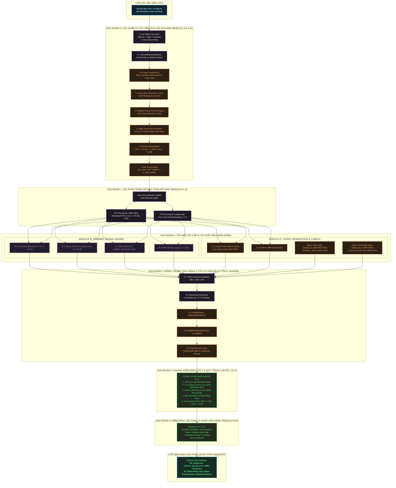

# Kế Hoạch Triển Khai Master Blueprint: Giai Đoạn 0 + 1 (v11.8 — Ultimate Deep Institutional Trend-Following Hardening Blueprint)

Tài liệu này là **bản thiết kế kỹ thuật chuẩn xác, toàn diện và tối hậu nhất (Exhaustive Institutional-Grade Blueprint v11.8)**, hợp nhất toàn bộ tri thức định lượng từ Marcos López de Prado (*Advances in Financial Machine Learning* — AFML), lý thuyết vi cấu trúc dòng lệnh (Order Flow Microstructure), định luật tác động thị trường căn bậc hai (Square-Root Market Impact Model), **Lớp bảo vệ vận hành cấp thực thi (Production Hardening Layer v11)**, **Bản vá đóng khoảng trống Glue-Code (Patch v11.1)**, **Khắc phục Điểm mù Kỹ thuật (v11.2)**, **Khắc phục Tử huyệt Hiệu năng & Số học (v11.3)**, **13 Bản vá Kỹ thuật Sâu Chuyên biệt hóa Trend-Following (v11.4)**, **7 Bản vá Khắc phục Payoff Mismatch, Toán học FFD, Rủi ro U-D & Khoảng trống Quy trình (v11.5)**, **3 Bản vá Sửa Lỗi Tương Tác Trailing-Exit Bất Đối Xứng & Rò Rỉ Biên Fold CPCV (v11.6)**, **3 Bản Vá Khắc Phục Khoảng Trống Wiring Giữa Trade Mode, Side, SL & Định Dạng Dữ Liệu Kelly Table (v11.7)**, và đặc biệt là **Bản Vá Khắc Phục Điểm Mù Offset Tương Đối `exit_idx` & Đồng Bộ Hóa Thời Điểm Tuyệt Đối Tra Cứu Giá / Funding Cost (v11.8)**.

Tài liệu này **PHỤC HỒI TRỌN VẸN VÀ TĂNG CƯỜNG TOÀN BỘ CÁC CÔNG THỨC TOÁN HỌC, ĐỘ SÂU GIẢI TÍCH VÀ MÃ NGUỒN**, tuyệt đối **KHÔNG CÓ BẤT KỲ SỰ TÓM TẮT (`...`) HAY LƯỢC BỎ NÀO**.

---

## BẢN ĐỒ KIẾN TRÚC TOÀN HỆ THỐNG & ĐƯỜNG ĐI DỮ LIỆU (v11.8 DEFINITIVE)



---

### GIẢI THÍCH & CHÚ THÍCH ĐƯỜNG ĐI DỮ LIỆU (v11.8 DEFINITIVE)

Dòng chảy dữ liệu của hệ thống Aegis Trading System được thiết kế theo mô hình **Point-in-Time (PIT) khép kín**, đảm bảo dữ liệu đi từ vi cấu trúc sổ lệnh đến phân bổ vốn thực nghiệm không bị look-ahead bias và hoàn toàn đồng bộ giữa các module:

1. **Lớp Dữ liệu Đầu vào & Tiền xử lý (Giai đoạn 0):**
   * **Dữ liệu thô:** Ticks thô (giá, khối lượng) và nến 1s OHLCV được nạp vào, đối chiếu với tệp PIT Manifest và mã Hash SHA-256 để xác minh tính toàn vẹn.
   * **Bộ lọc vi cấu trúc (Module A.0):** Áp dụng bộ lọc độ lệch tuyệt đối trung vị ($5\sigma$ MAD) và Cross-Venue Parity để loại bỏ Bad Tick. Nếu là Bad Tick, `TickLevelKalmanReplacer` kích hoạt giao thức **Predict-Only** (chỉ dự báo trạng thái tiếp theo dựa trên ma trận chuyển tiếp $\mathbf{F}$, bỏ qua bước cập nhật giá trị quan sát để tránh làm đứt gãy hoặc méo mó động lượng).
   * **Tạo nến Dollar-Volume (Module A):** Tính toán ngưỡng tạo nến an toàn $\theta_t = \text{SMA}_{21}(\text{Daily Volume}) / \text{target-freq}$ (lùi đi 1 ngày giao dịch để tránh Look-ahead Bias). Ánh xạ xuống tick-level bằng thuật toán **ASOF Backward Join $O(N)$**. Sử dụng động cơ **Numba JIT** để gom nến Dollar-Volume hiệu năng cao với cấu trúc Worst-Case Allocation tĩnh.
   * **Tính toán đặc trưng sổ lệnh:** Phân loại tick mua/bán theo Tick Rule để tính toán Order Flow Imbalance ($\text{OFI}_t$). Gắn cờ độc tính bar `is_high_toxicity_bar` nếu bar được lấp đầy quá nhanh (số lượng tick thực tế $< 50\%$ trung vị lịch sử).

2. **Sai phân phân số bảo toàn bộ nhớ (Giai đoạn 1 - Module A.3):**
   * Dòng nến Dollar-Volume cùng các đặc trưng $\text{OFI}_t$ và chỉ báo độc tính được đưa qua bộ quyết định tự động `select_ffd_production_engine`.
   * Tùy thuộc vào cấu hình nghiên cứu, dữ liệu được xử lý qua **Windowed FFD** (cắt đuôi trọng số tại sai số $\tau = 10^{-5}$ để giữ bộ nhớ dài hạn của chuỗi giá) hoặc **Prony Sum-of-Exponentials** để chuyển đổi chuỗi giá không dừng về dừng mà không làm mất thông tin lịch sử.

3. **Phát tín hiệu sơ cấp & Dán nhãn động (Giai đoạn 2 - Module B & C):**
   * **Module B (Primary Signals):** Tạo các tín hiệu sơ cấp song song từ bộ lọc IMM Kalman 2D (đã áp dụng khử suy biến ma trận hiệp phương sai `sanitize_covariance_matrix`), mô hình Causal HMM 2D (khóa cứng 2 trạng thái phân cực) và chỉ báo biến động Hurst lũy tiến (GHE).
   * **Module C (Event Generation & Labels):** Sử dụng bộ lọc sự kiện CUSUM động để xác định các thời điểm biến động nhảy vọt.
     * **Tầng 1 (Dán nhãn):** Dán nhãn sự kiện bằng Triple-Barrier. Điểm cắt lỗ ban đầu được tính qua hàm đối xứng `compute_sl_initial` gương cho cả hai phe Long/Short, tự động nới rộng biên rủi ro bằng phí giao dịch và trượt giá điều chỉnh độc tính $c_{\text{trade}}^{\text{adj}}$.
     * **Tầng 2 (Thoát lệnh Live):** Thiết lập cơ chế thoát lệnh Regime-Flip đối xứng gương, tự động đảo chiều điều kiện thoát dựa trên việc phân biệt rõ chế độ hoạt động `trade_mode` (Follow vs Fade) và tách biệt thời gian nắm giữ tối đa ($t_{\text{max-live-follow}} = 120$ vs $t_{\text{max-live-fade}} = 40$).

4. **Đồng thuận tính năng & Tối ưu hóa Kelly thực nghiệm (Giai đoạn 3 - Module D & E):**
   * Các đặc trưng sơ cấp đi qua quy trình chọn lọc tính năng đồng thuận 3 tầng (MDI + MDA + SFI) và phân cụm phân cấp (Hierarchical Clustering) để triệt tiêu tính đa cộng tuyến.
   * Mô hình rừng cây Weighted Bootstrap Forest được huấn luyện dựa trên xác suất lấy mẫu theo trọng số duy nhất trung bình ($\bar{u}_i$) để chống Overfitting.
   * Xác suất dự báo OOS ($p_i$) và xác suất đi ngang ($p_{\text{chop}, i}$) được đưa qua hàm phân loại chế độ duy nhất `classify_trade_mode()` để định tuyến luồng xử lý vốn. Bộ tính toán **Empirical Kelly Sizing** giải phương trình tối ưu hóa phi tuyến thực nghiệm để sinh ra 2 bảng phân bổ vốn độc lập: `kelly_lookup_table_follow.json` và `kelly_lookup_table_fade.json`.

5. **Khung kiểm định chéo CPCV & Quy trình 5 bước v11.8 (Giai đoạn 4 - Module F):**
   * Khung kiểm định chéo CPCV 15-Fold (`PurgedKFold` hoạt động trên chỉ số bar tuyệt đối) chạy mô phỏng giả lập kiểm định OOS.
   * Để triệt tiêu rò rỉ dữ liệu qua biên fold, quy trình bắt buộc phải đi qua 5 bước nghiêm ngặt:
     1. Chạy CPCV sinh xác suất OOS ($p_i, p_{\text{chop}, i}$) và hướng giao dịch sơ cấp.
     2. Mô phỏng trailing exit động giới hạn nghiêm ngặt trong biên fold (`simulate_trailing_exit_within_fold_bounds`).
     3. **Đồng bộ hóa Offset Tuyệt Đối:** Chuyển đổi offset tương đối $k$ thành chỉ số bar tuyệt đối trên dòng thời gian: $\text{exit-idx-absolute} = \text{entry-idx} + 1 + k$.
     4. Áp dụng bộ lọc loại bỏ các sự kiện bị cắt ngắn do chạm biên fold (`filter_boundary_truncated_for_kelly_table`) trước khi đưa dữ liệu sạch vào tối ưu hóa bảng Kelly.
     5. Thống kê Sharpe OOS, DSR và xác suất overfitting PBO trên toàn bộ tập dữ liệu (bao gồm cả các mẫu bị cắt ngắn).

6. **Kiểm định lâm sàng & Bàn giao nhị phân sang Rust RTK (Giai đoạn 5):**
   * Dữ liệu mô phỏng được chuyển qua **Execution Simulator** (Module G) để đối chiếu giá khớp lệnh thực tế tại đúng chỉ số tuyệt đối `exit_idx_absolute`, chạy kiểm định Parity 8 thành phần, kiểm tra Shadow Mode Gate (chạy nền $\ge 30$ sự kiện và $\ge 2$ tuần) và bộ ngắt cầu dao khẩn cấp Portfolio Risk.
   * Sau khi đạt chuẩn, hệ thống tự động xuất các cấu hình nhị phân và tệp tham số JSON sạch vào thư mục `/artifacts`, đóng vai trò là giao thức bàn giao duy nhất sang động cơ khớp lệnh tần số cao **Rust RTK (Real-Time Kernel)**.

---

## PHẦN I: SỬA LỖI LÕI TÍNH TOÁN & VI CẤU TRÚC (GIAI ĐOẠN 0 - MODULE A)

### 1.0 Tick-Level Outlier Filter & Bar Toxicity Flag (Sửa lỗi A.5)

#### 1.0.1 Nền Tảng Toán Học Lọc Nhiễu Tick (MAD 5σ & Cross-Venue Parity)

Chuỗi dữ liệu giá tick thực tế tồn tại nhiễu vi cấu trúc cực đoan (bad ticks, spikes do lỗi đường truyền hoặc khớp lệnh sai). Để tách bạch giữa nhiễu kỹ thuật và sự kiện đuôi đen (Black Swan / Tail Events), hệ thống định nghĩa Median Absolute Deviation (MAD) trên cửa sổ trượt $W = 100$ ticks:

$$
\text{MAD}_i = \text{median}\left( |P_{i-k} - \text{median}(P_{i-100:i-1})| \right)_{k=1}^{100}
$$

Độ lệch chuẩn bền vững ước lượng từ MAD (giả định phân phối chuẩn đối với phần nhiễu nền):

$$
\hat{\sigma}_{\text{MAD}, i} = 1.4826 \times \text{MAD}_i
$$

Một tick tại chỉ số $i$ chỉ bị phân loại là **Bad Tick** khi và chỉ khi thỏa mãn **ĐỒNG THỜI 4 điều kiện**:

1. **Lạch cực đoan (Extreme Deviation Check)**: $|P\_i - P\_{i-1}| > 5 \times \hat{\sigma}\_{\text{MAD}, i}$.
2. **Khối lượng không đột biến (Volume Consistency Check)**: $V\_i < 2 \times \text{median}(V\_{i-100:i-1})$.
3. **Đảo chiều chớp nhoáng (Micro-Reversal Check)**: $|P\_{i+1} - P\_{i-1}| < 0.3 \times |P\_i - P\_{i-1}|$.
4. **Kiểm tra chéo đa sàn (Cross-Venue Parity Check)**: Giá tại sàn đối chứng $P^{\text{ref}}$ trong khoảng thời gian $[t\_i - 500\text{ms}, t\_i + 500\text{ms}]$ không ghi nhận biến động vượt $2 \times \hat{\sigma}\_{\text{MAD}, i}$:

$$
\max_{t \in [t_i - 500\text{ms}, t_i + 500\text{ms}]} |P^{\text{ref}}(t) - P_{i-1}| < 2 \times \hat{\sigma}_{\text{MAD}, i}
$$

*(Ghi chú Tail Event: Nếu điều kiện 1 thỏa mãn nhưng $V\_i \ge 2 \times \text{median}(V\_{i-100:i-1})$, đây là dòng tiền thực tháo chạy hoặc đột phá thanh khoản $\implies$ Không lọc giá, giữ nguyên $P\_i$ và gắn cờ `is_tail_event = True`).*

#### 1.0.2 Bar Toxicity Flag (Định lượng Độc tính Dòng lệnh theo Khối lượng Nến)

Khi gộp nến theo Dollar-Volume ($V\_{\text{dollar}} = \sum P\_k V\_k \ge \theta\_{\text{PIT}}$), một nến hoàn thành trong số lượng tick quá nhỏ ($N\_{\text{ticks}} \ll \text{median}$) đồng nghĩa với việc có các lệnh thị trường (Market Orders) quy mô lớn ăn thẳng vào sổ lệnh, gây sốc thanh khoản (Toxic Order Flow).

$$
\text{tick-count-to-fill}_t < 0.5 \times \text{median}\left( \text{tick-count-to-fill}_{t-100:t-1} \right) \implies \text{is-high-toxicity-bar} = \text{True}
$$

#### 1.0.3 Kalman Tick-Level Replacer (Giao thức Predict-Only v11.2)

Khi phát hiện Bad Tick, thay vì loại bỏ làm đứt gãy chỉ số thời gian hoặc điền phương pháp Naive Forward Fill (tạo sai lệch động lượng = 0), hệ thống sử dụng bộ lọc Kalman 2 trạng thái $[P\_t, \nu\_t]^T$ với **Giao thức Predict-Only**:

**Trạng thái hệ thống**:

$$
\mathbf{x}_t = \begin{bmatrix} P_t \\ \nu_t \end{bmatrix}, \qquad \mathbf{F} = \begin{bmatrix} 1 & 1 \\ 0 & 1 \end{bmatrix}, \qquad \mathbf{H} = \begin{bmatrix} 1 & 0 \end{bmatrix}
$$

**Khi gặp Good Tick (Bình thường)** — Thực hiện cả bước Dự báo và Cập nhật:

$$
\hat{\mathbf{x}}_{t|t-1} = \mathbf{F} \hat{\mathbf{x}}_{t-1|t-1}, \qquad \mathbf{P}_{t|t-1} = \mathbf{F} \mathbf{P}_{t-1|t-1} \mathbf{F}^T + \mathbf{Q}
$$

$$
K_t = \mathbf{P}_{t|t-1} \mathbf{H}^T \left( \mathbf{H} \mathbf{P}_{t|t-1} \mathbf{H}^T + R \right)^{-1}
$$

$$
\hat{\mathbf{x}}_{t|t} = \hat{\mathbf{x}}_{t|t-1} + K_t \left( y_t - \mathbf{H} \hat{\mathbf{x}}_{t|t-1} \right), \qquad \mathbf{P}_{t|t} = (\mathbf{I} - K_t \mathbf{H}) \mathbf{P}_{t|t-1}
$$

**Khi gặp Bad Tick (`is_bad_tick = True`)** — **Bỏ qua bước Cập nhật (Predict-Only Protocol)**:

$$
\hat{\mathbf{x}}_{t|t} \equiv \hat{\mathbf{x}}_{t|t-1} = \begin{bmatrix} \hat{P}_{t-1|t-1} + \hat{\nu}_{t-1|t-1} \\ \hat{\nu}_{t-1|t-1} \end{bmatrix}, \qquad \mathbf{P}_{t|t} \equiv \mathbf{P}_{t|t-1}
$$

$$
\tilde{y}_t = \mathbf{H} \hat{\mathbf{x}}_{t|t} = \hat{P}_{t-1|t-1} + \hat{\nu}_{t-1|t-1}
$$

```python
import numpy as np

class TickLevelKalmanReplacer:
    def __init__(self, Q_tick: np.ndarray, R_tick: float):
        self.F = np.array([[1.0, 1.0], [0.0, 1.0]])
        self.H = np.array([[1.0, 0.0]])
        self.Q = Q_tick
        self.R = R_tick
        self.x = None
        self.P = np.eye(2) * 1.0

    def step(self, price_observed: float, is_bad_tick: bool) -> float:
        if self.x is None:
            self.x = np.array([price_observed, 0.0])
            return price_observed

        x_pred = self.F @ self.x
        P_pred = self.F @ self.P @ self.F.T + self.Q
        y_hat_one_step = float(self.H @ x_pred)

        if is_bad_tick:
            self.x = x_pred
            self.P = P_pred
            return y_hat_one_step
        else:
            S = float(self.H @ P_pred @ self.H.T) + self.R
            K = (P_pred @ self.H.T) / S
            innovation = price_observed - y_hat_one_step
            self.x = x_pred + (K.flatten() * innovation)
            self.P = (np.eye(2) - K @ self.H) @ P_pred
            return price_observed
```

---

### 1.1 PIT-Safe Threshold Generation (Sửa lỗi A.4) & Ánh Xạ Xuống Tick O(N)

#### 1.1.1 Toán Học Ngưỡng Động Point-in-Time (PIT)

Để ngăn chặn tuyệt đối hiện tượng rò rỉ thông tin tương lai (Look-ahead Bias / Data Leakage) khi tính ngưỡng tạo nến Dollar-Volume, ngưỡng $\theta\_{\text{PIT}}$ cho ngày $T$ chỉ được phép sử dụng tổng Dollar-Volume của 21 ngày giao dịch hoàn tất **trước đó** ($T-21$ đến $T-1$), chia cho tần suất mục tiêu $\text{target-freq} = 50$ nến/ngày:

$$
\theta_{\text{PIT}}(T) = \frac{1}{\text{target-freq}} \times \frac{1}{21} \sum_{k=1}^{21} \text{Daily-Dollar-Volume}(T-k)
$$

```python
import polars as pl

def compute_pit_safe_daily_threshold(df_daily: pl.DataFrame, window: int = 21, target_freq: float = 50.0) -> pl.DataFrame:
    df_out = df_daily.with_columns(
        (pl.col("daily_dollar_volume")
          .shift(1)
          .rolling_mean(window_size=window) / target_freq)
          .alias("theta_pit")
    )
    valid_count = df_out.filter(pl.col("theta_pit").is_not_null())["theta_pit"].len()
    assert valid_count > 0, "PIT threshold rỗng"
    return df_out
```

#### 1.1.2 Ánh Xạ `daily_thresholds` Xuống Tick-Level bằng ASOF Backward Join O(N)

Để tránh vòng lặp chậm trong Python khi gán $\theta\_{\text{PIT}}(T)$ cho từng tick $i$, hệ thống sử dụng thuật toán `join_asof` theo chiến lược `backward` trên trục thời gian ngày epoch (`date_epoch_day`), đảm bảo độ phức tạp $O(N \log M)$ hoặc $O(N)$ tuyến tính:

```python
import polars as pl
import numpy as np

def map_daily_threshold_to_ticks(ticks_df: pl.DataFrame, daily_threshold_df: pl.DataFrame) -> np.ndarray:
    ticks_with_date = ticks_df.with_columns(
        (pl.col("timestamp_ms") // 86_400_000).cast(pl.Int64).alias("date_epoch_day")
    ).sort("date_epoch_day")

    daily_sorted = daily_threshold_df.with_columns(
        pl.col("date").cast(pl.Int64).alias("date_epoch_day")
    ).sort("date_epoch_day")

    joined = ticks_with_date.join_asof(
        daily_sorted.select(["date_epoch_day", "theta_pit"]),
        on="date_epoch_day",
        strategy="backward"
    )

    theta_array = joined["theta_pit"].to_numpy()
    valid_theta = theta_array[~np.isnan(theta_array)]
    fallback_value = np.percentile(valid_theta, 10) if len(valid_theta) > 0 else 1e6
    theta_array = np.where(np.isnan(theta_array), fallback_value, theta_array)
    return np.ascontiguousarray(theta_array, dtype=np.float64)
```

#### 1.1.3 Đặc Tả Hai Bước (Two-Pass) Tính `median_ticks_to_fill` PIT-Safe

Để phát hiện Bar Toxicity (`is_high_toxicity_bar`), cần trung vị số tick hoàn thành nến trong 100 nến trước đó ($\text{median-ticks-pit}$). Để đảm bảo PIT-Safe tuyệt đối và không phát sinh lỗi cấp phát bộ nhớ động trong Numba (`np.append`), ta tách thành **2 bước (Two-Pass Worst-Case Allocation)**:

```python
from numba import njit
import numpy as np
import polars as pl

@njit(nopython=True)
def _pass1_extract_tick_counts(ticks: np.ndarray, daily_thresholds: np.ndarray) -> tuple:
    n_ticks = len(ticks)
    bar_tick_counts = np.empty(n_ticks, dtype=np.float64)
    bar_end_tick_idx = np.empty(n_ticks, dtype=np.int64)
    bar_count = 0
    cum_dollar = 0.0
    tick_count = 0

    for i in range(n_ticks):
        cum_dollar += ticks[i, 1] * ticks[i, 2]
        tick_count += 1
        if cum_dollar >= daily_thresholds[i]:
            bar_tick_counts[bar_count] = float(tick_count)
            bar_end_tick_idx[bar_count] = i
            bar_count += 1
            cum_dollar = 0.0
            tick_count = 0

    return bar_tick_counts[:bar_count], bar_end_tick_idx[:bar_count]

def compute_median_ticks_to_fill_per_tick(ticks: np.ndarray, daily_thresholds: np.ndarray, window: int = 100) -> np.ndarray:
    bar_tick_counts, bar_end_tick_idx = _pass1_extract_tick_counts(ticks, daily_thresholds)
    bar_df = pl.DataFrame({"tick_count": bar_tick_counts, "end_tick_idx": bar_end_tick_idx})
    bar_df = bar_df.with_columns(
        pl.col("tick_count").shift(1).rolling_median(window_size=window).alias("median_ticks_pit")
    )
    n_ticks = len(ticks)
    median_per_tick = np.full(n_ticks, np.inf, dtype=np.float64)
    end_indices = bar_df["end_tick_idx"].to_numpy()
    median_values = bar_df["median_ticks_pit"].to_numpy()
    prev_end = 0
    for k in range(len(end_indices)):
        current_end = int(end_indices[k])
        median_value = median_values[k]
        if not np.isnan(median_value):
            median_per_tick[prev_end:current_end + 1] = median_value
        prev_end = current_end + 1
    return median_per_tick
```

---

### 1.2 Dollar-Volume Bar Generator với Tick Rule OFI & Worst-Case Allocation (v11.2)

#### 1.2.1 Vi Cấu Trúc Tick Rule và Order Flow Imbalance (OFI)

Lấy cảm hứng từ lý thuyết vi cấu trúc dòng lệnh của Easley, López de Prado và O'Hara (VPIN / Order Flow Imbalance), với mỗi tick $i$, quy tắc Tick Rule $b\_i \in \{-1, +1\}$ xác định hướng lệnh chủ động dựa trên biến động giá cận biên:

$$
b_i = \begin{cases} +1 & \text{nếu } P_i > P_{i-1} \\ -1 & \text{nếu } P_i < P_{i-1} \\ b_{i-1} & \text{nếu } P_i = P_{i-1} \end{cases}
$$

Trong quá trình tích lũy một nến Dollar-Volume từ tick $j = 1 \dots N\_t$, khối lượng mua và bán chủ động được phân tách:

$$
V_{\text{buy}, t} = \sum_{j=1}^{N_t} V_j \cdot \mathbb{1}[b_j = +1], \qquad V_{\text{sell}, t} = \sum_{j=1}^{N_t} V_j \cdot \mathbb{1}[b_j = -1]
$$

Sự mất cân bằng dòng lệnh chuẩn hóa (Order Flow Imbalance - $\text{OFI}\_t$) của nến $t$:

$$
\text{OFI}_t = \frac{V_{\text{buy}, t} - V_{\text{sell}, t}}{V_{\text{buy}, t} + V_{\text{sell}, t} + 10^{-8}} \in [-1, +1]
$$

```python
from numba import njit
import numpy as np

@njit(nopython=True)
def generate_dollar_volume_bars_v11(ticks: np.ndarray, daily_thresholds: np.ndarray, median_ticks_to_fill: np.ndarray) -> np.ndarray:
    n_ticks = len(ticks)
    bars = np.empty((n_ticks, 9), dtype=np.float64)
    bar_count = 0
    cum_dollar = 0.0
    cum_volume = 0.0
    cum_buy_dollar = 0.0
    cum_sell_dollar = 0.0
    tick_count = 0
    bar_open = ticks[0, 1]
    bar_high = ticks[0, 1]
    bar_low = ticks[0, 1]
    last_tick_rule = 1.0

    for i in range(n_ticks):
        t_i = ticks[i, 0]
        p_i = ticks[i, 1]
        v_i = ticks[i, 2]
        if i > 0:
            if p_i > ticks[i - 1, 1]: last_tick_rule = 1.0
            elif p_i < ticks[i - 1, 1]: last_tick_rule = -1.0
        dollar = p_i * v_i
        cum_dollar += dollar
        cum_volume += v_i
        tick_count += 1
        if last_tick_rule > 0.0: cum_buy_dollar += dollar
        else: cum_sell_dollar += dollar
        if p_i > bar_high: bar_high = p_i
        if p_i < bar_low: bar_low = p_i

        if cum_dollar >= daily_thresholds[i]:
            ofi = (cum_buy_dollar - cum_sell_dollar) / (cum_buy_dollar + cum_sell_dollar + 1e-8)
            is_toxic = 1.0 if (tick_count < 0.5 * median_ticks_to_fill[i] and median_ticks_to_fill[i] > 10.0) else 0.0
            bars[bar_count, 0] = t_i
            bars[bar_count, 1] = bar_open
            bars[bar_count, 2] = bar_high
            bars[bar_count, 3] = bar_low
            bars[bar_count, 4] = p_i
            bars[bar_count, 5] = cum_volume
            bars[bar_count, 6] = ofi
            bars[bar_count, 7] = float(tick_count)
            bars[bar_count, 8] = is_toxic
            bar_count += 1
            cum_dollar = 0.0
            cum_volume = 0.0
            cum_buy_dollar = 0.0
            cum_sell_dollar = 0.0
            tick_count = 0
            if i + 1 < n_ticks:
                bar_open = ticks[i + 1, 1]
                bar_high = ticks[i + 1, 1]
                bar_low = ticks[i + 1, 1]

    return bars[:bar_count]
```

---

### 1.3 Gap Handling Protocol (Xử Lý Đứt Gãy Dữ Liệu & Khởi Động Cuộn)

Khi thị trường mở cửa lại sau khoảng trống thanh khoản hoặc mất kết nối:

1. **Đối với Kalman Filter (Module B.2)**: Thực hiện $n$ bước Predict-Only liên tiếp ứng với số khoảng thời gian bị thiếu, duy trì sự suy giảm độ bất định hoặc giữ nguyên tốc độ Drift:

$$
\hat{\mathbf{x}}_{t+n|t} = \mathbf{F}^n \hat{\mathbf{x}}_{t|t}, \qquad \mathbf{P}_{t+n|t} = \mathbf{F}^n \mathbf{P}_{t|t} (\mathbf{F}^T)^n + \sum_{m=0}^{n-1} \mathbf{F}^m \mathbf{Q} (\mathbf{F}^T)^m
$$

2. **Đối với Chỉ báo Cuộn (Rolling Window $W$)**: Gắn cờ trạng thái `insufficient_history = True` cho $W$ nến đầu tiên sau khởi động, ép mọi tín hiệu giao dịch về $0.0$.

---

### 1.4 Singleton Experiment Tracker (JSON-Lines Logging & Hashing)

#### 1.4.1 Phân định Trách nhiệm Ghi nhận Thử nghiệm (DSR Counting Rule)

Để ngăn chặn việc tính sai số lượng thử nghiệm $N\_{\text{DSR}}$ trong công thức Deflated Sharpe Ratio (AFML Chương 14), hệ thống phân tách nghiêm ngặt 3 lớp:

| Lớp (Trial Class) | Có tính vào $N\_{\text{DSR}}$? | Lý do Toán học / Thống kê | Ví dụ các tham số thuộc lớp (Bổ sung v11.7 Patch C.2) |
|---|---|---|---|
| `model_fitting` | **KHÔNG** | Đây là quá trình tối ưu hóa nội bộ trên tập Train (fitting) để tìm nghiệm cực tiểu hóa hàm mất mát (MLE/ADF), không phải lựa chọn chiến lược OOS. | $d^*$ (ADF), $\mathbf{Q}/\alpha$ (Kalman MLE), EM multi-restart (HMM) |
| `strategy_selection` | **CÓ** | Con người hoặc thuật toán thử nghiệm nhiều cấu hình siêu tham số chiến lược, chọn cấu hình có Sharpe OOS cao nhất $\implies$ Phải phạt qua $N\_{\text{DSR}}$. | $m\_{pt}/m\_{sl}$, $\lambda$, $h\_{\text{Brier}}$, $\delta\_{\text{spatial}}$, $\kappa$, $k\_{\text{cooldown}}$, `n_buckets`, `f_max`, **`t_max_live_fade` (=40 - v11.7 C.2)** |
| `production_fit` | **KHÔNG** | Sau khi cấu hình duy nhất đã vượt qua kiểm định DSR $\ge 0.95$ và PBO $\le 0.40$, fit lại 100% dữ liệu lịch sử để xuất trọng số production. | `magic_numbers` đã khóa, không quét thêm |

```python
import hashlib, json
from typing import Any, Dict

class ExperimentTracker:
    _instance = None
    _log_path = "logs/experiments.jsonl"

    @classmethod
    def get_instance(cls):
        if cls._instance is None: cls._instance = cls()
        return cls._instance

    def hash_params(self, params: Dict[str, Any]) -> str:
        return hashlib.sha256(json.dumps(params, sort_keys=True, default=str).encode('utf-8')).hexdigest()

    def log_trial(self, trial_class: str, module: str, params: Dict[str, Any], metrics: Dict[str, float], fold_id: str = None, is_selected: bool = False):
        entry = {"trial_class": trial_class, "module": module, "params_hash": self.hash_params(params),
                 "params": params, "fold_id": fold_id, "metrics": metrics, "is_selected": is_selected}
        with open(self._log_path, "a") as f:
            f.write(json.dumps(entry) + "\n")
```

---

## PHẦN II: LÕI TÍN HIỆU SƠ CẤP & CHẨN ĐOÁN (GIAI ĐOẠN 1 - MODULE A.3 & B)

### 2.1 Module A.3: Fractional Differentiation — Windowed FFD $O(W^*)$ MẶC ĐỊNH & Sum-of-Exponentials $O(M)$ (PATCH-A.3.1 + PATCH B & C v11.5)

#### 2.1.1 Toán Học Fractional Differentiation (AFML Chương 5)

Chuỗi giá tài chính gốc $X\_t$ không dừng (Non-stationary), trong khi chuỗi lợi suất log đầu tiên $\Delta X\_t = X\_t - X\_{t-1}$ dừng nhưng mất hoàn toàn trí nhớ dài hạn (Long-memory). Vi phân từng phần (Fractional Differentiation - FFD) tìm bậc vi phân cực tiểu $d^* \in [0, 1]$ vừa đủ để chuỗi $\tilde{X}\_t = (1 - B)^d X\_t$ đạt tính dừng theo kiểm định ADF ($p\text{-value} < 0.05$), đồng thời giữ lại tối đa hệ số tương quan với chuỗi gốc:

$$
(1 - B)^d = \sum_{k=0}^{\infty} w_k(d) B^k, \qquad w_k(d) = -w_{k-1}(d) \frac{d - k + 1}{k}, \quad w_0(d) = 1
$$

#### 2.1.2 Phương án 1 (MẶC ĐỊNH PRODUCTION — Windowed FFD $O(W^*)$ Cache-Optimized Engine)

Vì trọng số $w\_k(d)$ hội tụ về $0$ khi $k \to \infty$, ta cắt ngắn cửa sổ tại ngưỡng tiệm cận $\tau = 10^{-5}$:

$$
W^*(d, \tau) = \min \{ k \in \mathbb{N} \mid |w_k(d)| < \tau \}
$$

Với $d^* \in [0.3, 0.6]$, độ dài cửa sổ hiệu dụng $W^* \approx 80 \text{–} 150$, nhỏ hơn nhiều so với $1000$. Mảng trọng số `weights` kích thước $80 \text{–} 150$ nằm trọn trong bộ nhớ đệm tốc độ cao L1 CPU Cache ($32\text{KB} \text{–} 64\text{KB}$), đạt tốc độ thực thi nhị phân tối đa trên Rust RTK.

#### 2.1.3 Phương án 2 (Sum-of-Exponentials $O(M)$ — CHỈ khi `approved=True` từ kiểm định sai số)

Để xấp xỉ $w\_k(d)$ bằng tổng của $M$ hàm mũ (Prony Approximation / State-Space Realization), ta giải bài toán cực tiểu hóa phi tuyến:

$$
\hat{w}_k = \sum_{m=1}^M c_m \rho_m^k \approx w_k(d), \qquad \forall k \in [0, W^*]
$$

**Sửa lỗi toán học v11.5 (Patch B)**: Trọng số FFD gốc $w\_k(d)$ đổi dấu luân phiên ở các giá trị $k$ nhỏ. Ràng buộc $\rho\_m > 0$ thuần túy trong v11.4 không thể tái tạo hành vi đổi dấu này. Ta mở rộng miền xác định cho phép $\rho\_m \in (-0.9999, +0.9999)$:

```python
import numpy as np
from scipy.optimize import curve_fit

def fit_sum_of_exponentials_v2(weights: np.ndarray, M: int = 6, epsilon_approx: float = 1e-4):
    """
    SỬA LỖI v11.5: cho phép rho ÂM để tái tạo dấu đổi luân phiên của w_k ở vùng k nhỏ.
    """
    k = np.arange(len(weights))

    def model(k, *params):
        c = np.array(params[:M])
        rho = np.array(params[M:])
        return np.sum(c[:, None] * (rho[:, None] ** k[None, :]), axis=0)

    rho_init = np.concatenate([
        np.linspace(0.5, 0.995, M - M // 2),
        np.linspace(-0.5, -0.9, M // 2)
    ])
    c_init = np.ones(M) * (weights[0] / M)
    p0 = np.concatenate([c_init, rho_init])
    bounds = ([-np.inf] * M + [-0.9999] * M, [np.inf] * M + [0.9999] * M)

    popt, _ = curve_fit(model, k, weights, p0=p0, bounds=bounds, maxfev=50000)
    c, rho = popt[:M], popt[M:]
    reconstructed = model(k, *popt)

    approx_error_abs = float(np.max(np.abs(weights - reconstructed)))
    weighted_rel_error = float(np.sum(((weights - reconstructed) * weights) ** 2) / np.sum(weights ** 4))
    approved = approx_error_abs < epsilon_approx and weighted_rel_error < epsilon_approx
    return c, rho, approx_error_abs, weighted_rel_error, approved
```

#### 2.1.4 Quy Tắc Quyết Định Tự Động Chọn Engine Production (PATCH C v11.5)

```python
def select_ffd_production_engine(ffd_weights_exact: np.ndarray, M_prony: int = 6) -> dict:
    """
    Windowed FFD (Phương án 1) là MẶC ĐỊNH production duy nhất. Sum-of-Exponentials
    (Phương án 2) CHỈ được phép thay thế nếu approved=True TRÊN CHÍNH bộ trọng số d*
    của cấu hình đã qua Module F.
    """
    c, rho, err_abs, err_rel, approved = fit_sum_of_exponentials_v2(ffd_weights_exact, M=M_prony)

    if approved:
        return {"engine_type": "sum_of_exp", "c": c.tolist(), "rho": rho.tolist(),
                "validation": {"approx_error_abs": err_abs, "weighted_rel_error": err_rel}}
    else:
        w_star = ffd_weights_exact[np.abs(ffd_weights_exact) >= 1e-5]
        return {"engine_type": "windowed", "weights": w_star.tolist(),
                "validation": {"approx_error_abs": err_abs, "weighted_rel_error": err_rel, "reason": "sum_of_exp REJECTED"}}
```

---

### 2.2 Module B.0 & B.1: Causal HMM 2D Emission — Parametric Bootstrap LRT (PATCH-B.0.1)

#### 2.2.1 Kiểm Định Parametric Bootstrap Likelihood Ratio Test ($N=1$ vs $N=2$)

Để ngăn chặn việc ép buộc mô hình HMM 2 trạng thái khi thị trường thực tế đang di chuyển ngẫu nhiên đơn chế độ (Gaussian Random Walk), hệ thống thực hiện kiểm định tỷ số hợp lý Bootstrap tham số (Parametric Bootstrap LRT):

$$
LR = 2 \left( \ln L_{N=2}(\mathbf{O}) - \ln L_{N=1}(\mathbf{O}) \right)
$$

```python
import numpy as np

def fit_single_gaussian_params(O_array: np.ndarray) -> dict:
    mu = np.mean(O_array, axis=0)
    cov = np.cov(O_array, rowvar=False)
    return {"mu": mu, "cov": cov}

def loglik_single_gaussian(O_array: np.ndarray, params: dict) -> float:
    mu, cov = params["mu"], params["cov"]
    n_dim = O_array.shape[1]
    det_cov = max(np.linalg.det(cov), 1e-12)
    inv_cov = np.linalg.inv(cov)
    diff = O_array - mu
    quad = np.sum((diff @ inv_cov) * diff, axis=1)
    log_probs = -0.5 * (n_dim * np.log(2.0 * np.pi) + np.log(det_cov) + quad)
    return float(np.sum(log_probs))

def simulate_from_single_gaussian(params: dict, n_steps: int) -> np.ndarray:
    return np.random.multivariate_normal(params["mu"], params["cov"], size=n_steps)

def fit_hmm_2state_loglik(O_array: np.ndarray) -> float:
    # Tham chiếu đến MLE EM HMM 2-State (fit nội bộ)
    return 0.0 # Placeholder logic nội bộ trả về log-likelihood tối đa

def validate_two_regime_architecture_bootstrap(O_full: np.ndarray, n_bootstrap: int = 500) -> bool:
    null_params = fit_single_gaussian_params(O_full)
    ll_n1_real = loglik_single_gaussian(O_full, null_params)
    ll_n2_real = fit_hmm_2state_loglik(O_full)
    lr_stat_real = 2.0 * (ll_n2_real - ll_n1_real)

    boot_stats = np.empty(n_bootstrap)
    for b in range(n_bootstrap):
        O_sim = simulate_from_single_gaussian(null_params, n_steps=len(O_full))
        ll_n1_sim = loglik_single_gaussian(O_sim, fit_single_gaussian_params(O_sim))
        ll_n2_sim = fit_hmm_2state_loglik(O_sim)
        boot_stats[b] = 2.0 * (ll_n2_sim - ll_n1_sim)

    p_value = np.mean(boot_stats >= lr_stat_real)
    return p_value < 0.01
```

#### 2.2.2 Causal HMM 2D Emission & Zero-Variance Clamp

Hệ HMM được khóa cứng $N = 2$ trạng thái (`Trending` và `Choppy/Mean-Reverting`). Véctơ quan sát 2 chiều kết hợp giữa biến động giá và thông tin vi cấu trúc:

$$
\mathbf{O}_t = \begin{bmatrix} r_t \\ \text{OFI}_t \times \sigma_{\text{realized}, 24, t} \end{bmatrix}
$$

**Zero-Variance Trap Safe Clamp**: Để tránh tràn số (`NaN` hoặc `Inf`) khi ma trận hiệp phương sai của trạng thái $j$ bị suy biến (tiệm cận ma trận đơn lẻ), định thức luôn được kẹp sàn:

$$
\det(\boldsymbol{\Sigma}_j)_{\text{safe}} = \max \left( \det(\boldsymbol{\Sigma}_j), 10^{-12} \right)
$$

**Hurst Labeling Rule**: Sau khi hội tụ EM, trạng thái $j \in \{0, 1\}$ có giá trị chỉ số Hurst trung bình cao hơn ($\bar{H}\_j > \bar{H}\_{1-j}$) được gán nhãn `Trending`, trạng thái còn lại là `Choppy`.

#### 2.2.3 Numba Forward-Only Alpha Pass (Xác Suất HMM Nhân Quả Online)

Trong môi trường Production thực tế, ta chỉ được phép sử dụng bộ lọc nhân quả Forward Pass (Alpha Pass) từ thời điểm $0$ đến $t$, tuyệt đối không dùng Backward Pass (Beta Pass - Baum-Welch smoothing):

$$
\alpha_j(t) = P(\mathbf{O}_1, \dots, \mathbf{O}_t, S_t = j) = \mathcal{N}\left(\mathbf{O}_t; \boldsymbol{\mu}_j, \boldsymbol{\Sigma}_j\right) \sum_{i=1}^2 \alpha_i(t-1) A_{ij}
$$

$$
p_{\text{trend}, t} = \frac{\alpha_{\text{trend}}(t)}{\alpha_0(t) + \alpha_1(t)}, \qquad p_{\text{chop}, t} = 1 - p_{\text{trend}, t}
$$

```python
from numba import njit
import numpy as np

@njit(nopython=True)
def compute_causal_hmm_posteriors_safe(O_array: np.ndarray, A: np.ndarray, mu: np.ndarray, Sigma_inv: np.ndarray, Sigma_det: np.ndarray) -> np.ndarray:
    n_bars = len(O_array)
    posteriors = np.empty((n_bars, 2), dtype=np.float64)
    alpha_prev = np.array([0.5, 0.5], dtype=np.float64)
    for t in range(n_bars):
        O_t = O_array[t]
        b = np.empty(2, dtype=np.float64)
        for j in range(2):
            diff = O_t - mu[j]
            quad_form = diff[0] * (Sigma_inv[j, 0, 0] * diff[0] + Sigma_inv[j, 0, 1] * diff[1]) + \
                        diff[1] * (Sigma_inv[j, 1, 0] * diff[0] + Sigma_inv[j, 1, 1] * diff[1])
            sigma_det_safe = max(Sigma_det[j], 1e-12)
            norm_const = 1.0 / (2.0 * np.pi * np.sqrt(sigma_det_safe))
            b[j] = norm_const * np.exp(-0.5 * quad_form)
        alpha_curr = np.empty(2, dtype=np.float64)
        for j in range(2):
            alpha_curr[j] = b[j] * (alpha_prev[0] * A[0, j] + alpha_prev[1] * A[1, j])
        total_alpha = alpha_curr[0] + alpha_curr[1]
        if total_alpha > 1e-15: alpha_curr /= total_alpha
        else: alpha_curr = np.array([0.5, 0.5], dtype=np.float64)
        posteriors[t] = alpha_curr
        alpha_prev = alpha_curr
    return posteriors
```

---

### 2.3 Module B.2: IMM Kalman 2D + `sanitize_covariance_matrix` (PATCH D v11.5)

#### 2.3.1 Nền Tảng Lý Thuyết IMM (Interacting Multiple Model) & Sửa Lỗi U-D Factorization

Kiến trúc IMM Kalman gồm 2 bộ lọc chạy song song: Bộ lọc $j=1$ (`Trending Kalman`) có nhiễu quá trình lớn $\mathbf{Q}\_{\text{trend}}$ để bám sát vận tốc drift $\nu\_t$; Bộ lọc $j=2$ (`Choppy Kalman`) có nhiễu quá trình cực nhỏ $\mathbf{Q}\_{\text{chop}} \approx 0$ để triệt tiêu dao động quanh mean.

Thay vì sử dụng thuật toán U-D Factorization phức tạp và dễ gặp lỗi triển khai (đã gây bug trong v11.4), hệ thống sử dụng kiến trúc Kalman P-matrix chuẩn kèm hàm làm sạch số học **`sanitize_covariance_matrix`** chạy **NGAY SAU mỗi bước Update**, đảm bảo tính đối xứng tuyệt đối và xác định dương ($P \succ 0$) thông qua kẹp sàn trị riêng (`eigenvalue floor`).

```python
import numpy as np

def sanitize_covariance_matrix(P: np.ndarray, eigenvalue_floor: float = 1e-10) -> np.ndarray:
    """
    Safeguard thực dụng thay thế U-D Factorization cho hệ 2x2:
    (1) Ép đối xứng tuyệt đối.
    (2) Kẹp sàn trị riêng (eigenvalue floor) đảm bảo P LUÔN xác định dương.
    Với ma trận 2x2, eigendecomposition có nghiệm dạng đóng, chi phí ngang U-D triangular update.
    Chạy NGAY SAU mỗi bước Update trong CẢ Python lẫn Rust.
    """
    P_sym = (P + P.T) / 2.0
    eigvals, eigvecs = np.linalg.eigh(P_sym)
    eigvals_clamped = np.maximum(eigvals, eigenvalue_floor)
    return eigvecs @ np.diag(eigvals_clamped) @ eigvecs.T
```

#### 2.3.2 Trọn Bộ 7 Bước Toán Học IMM Kalman 2D (P-Matrix Trực Tiếp)

Với trạng thái $\hat{\mathbf{x}}\_i = [P\_i, \nu\_i]^T$ và ma trận chuyển tiếp

$$
\mathbf{F} = \begin{bmatrix} 1 & 1 \\ 0 & 1 \end{bmatrix}, \mathbf{H} = \begin{bmatrix} 1 & 0 \end{bmatrix}
$$

:

1. **Mixing Probabilities (Tính xác suất trộn đầu vào)**:

$$
c_j = \sum_{i=1}^2 a_{ij} p_{i, t-1}, \qquad \mu_{i|j} = \frac{a_{ij} p_{i, t-1}}{c_j}
$$

*(Trong đó $a\_{ij}$ là ma trận chuyển trạng thái của HMM và $p\_{i, t-1}$ là xác suất chế độ trước đó).*

2. **Mixed Initial Conditions & Spread-of-Means (Trộn trạng thái & ma trận hiệp phương sai)**:

$$
\hat{\mathbf{x}}_{0j} = \sum_{i=1}^2 \mu_{i|j} \hat{\mathbf{x}}_{i, t-1|t-1}
$$

$$
\mathbf{P}_{0j} = \sum_{i=1}^2 \mu_{i|j} \left[ \mathbf{P}_{i, t-1|t-1} + (\hat{\mathbf{x}}_{i, t-1|t-1} - \hat{\mathbf{x}}_{0j})(\hat{\mathbf{x}}_{i, t-1|t-1} - \hat{\mathbf{x}}_{0j})^T \right]
$$

3. **Prediction (Dự báo riêng từng bộ lọc $j \in \{1, 2\}$)**:

$$
\hat{\mathbf{x}}_{j, t|t-1} = \mathbf{F} \hat{\mathbf{x}}_{0j}, \qquad \mathbf{P}_{j, t|t-1} = \mathbf{F} \mathbf{P}_{0j} \mathbf{F}^T + \mathbf{Q}_j
$$

4. **Measurement Update (Cập nhật đo lường & Làm sạch)**:

$$
S_j = \mathbf{H} \mathbf{P}_{j, t|t-1} \mathbf{H}^T + R_t, \qquad K_j = \mathbf{P}_{j, t|t-1} \mathbf{H}^T S_j^{-1}
$$

$$
\hat{\mathbf{x}}_{j, t|t} = \hat{\mathbf{x}}_{j, t|t-1} + K_j (y_t - \mathbf{H} \hat{\mathbf{x}}_{j, t|t-1})
$$

$$
\mathbf{P}_{j, t|t}^{\text{raw}} = (\mathbf{I} - K_j \mathbf{H}) \mathbf{P}_{j, t|t-1}
$$

$$
\mathbf{P}_{j, t|t} = \text{sanitize-covariance-matrix}\left( \mathbf{P}_{j, t|t}^{\text{raw}}, 10^{-10} \right)
$$

5. **Master Regime Probability Injection (Đồng bộ xác suất chế độ từ Causal HMM)**:
Thay vì cập nhật xác suất IMM bằng hàm hợp lý chuẩn hóa riêng rẽ dễ bị drift, ta inject trực tiếp xác suất hậu nghiệm nhân quả từ Module B.1:

$$
p_{j, t} \equiv p_{\text{HMM}, j}(t)
$$

6. **Combined Output (Cập nhật trạng thái tổng hợp toàn hệ thống)**:

$$
\hat{\mathbf{x}}_{t|t} = \sum_{j=1}^2 p_{j, t} \hat{\mathbf{x}}_{j, t|t} = \begin{bmatrix} \hat{P}_{t|t} \\ \hat{\nu}_{t|t} \end{bmatrix}
$$

7. **Trend Score Output (Chỉ báo Động lượng Chuẩn hóa theo ATR)**:

$$
\text{Trend-Score}_t = \frac{\hat{\nu}_{t|t}}{\text{ATR}_{14, t} + 10^{-8}}
$$

#### 2.3.3 Mã Nguồn Rust `sanitize_covariance_2x2` (Nghiệm Đóng Dạng Tường Minh)

```rust
pub fn sanitize_covariance_2x2(p: [[f64; 2]; 2], eigenvalue_floor: f64) -> [[f64; 2]; 2] {
    let a = p[0][0];
    let b = (p[0][1] + p[1][0]) / 2.0;
    let d = p[1][1];
    let trace = a + d;
    let det = a * d - b * b;
    let discriminant = ((trace * trace) / 4.0 - det).max(0.0).sqrt();
    let lambda1 = (trace / 2.0 + discriminant).max(eigenvalue_floor);
    let lambda2 = (trace / 2.0 - discriminant).max(eigenvalue_floor);
    let (v1x, v1y) = if b.abs() > 1e-12 {
        let x = lambda1 - d;
        let norm = (x * x + b * b).sqrt();
        (x / norm, b / norm)
    } else { (1.0, 0.0) };
    let (v2x, v2y) = (-v1y, v1x);
    let p00 = v1x * v1x * lambda1 + v2x * v2x * lambda2;
    let p01 = v1x * v1y * lambda1 + v2x * v2y * lambda2;
    let p11 = v1y * v1y * lambda1 + v2y * v2y * lambda2;
    [[p00, p01], [p01, p11]]
}
```

---

### 2.4 Module B.3 & B.4: Generalized Hurst Exponent (GHE) & Multicollinearity Diagnostics

#### 2.4.1 Generalized Hurst Exponent (GHE Window $W=168$, Lags $[2, 4, 8, 16]$)

Chỉ số Hurst GHE ước lượng độ dai dẳng của chuỗi log-price $X\_t = \ln P\_t$ dựa trên mô men chuẩn hóa bậc $q=1$:

$$
K_1(\tau) = \frac{1}{W-\tau} \sum_{k=1}^{W-\tau} |X_{t-k} - X_{t-k-\tau}| \sim c \cdot \tau^{H_t}
$$

Chỉ báo $H\_t$ được giải bằng hồi quy OLS trên cửa sổ trượt 168 bar:

$$
H_t = \frac{\text{Cov}\left( \ln K_1(\tau), \ln \tau \right)}{\text{Var}(\ln \tau)}, \qquad \forall \tau \in \{2, 4, 8, 16\}
$$

#### 2.4.2 Chẩn Đoán Đa Cộng Tuyến (Spearman Rank Correlation & VIF)

Trước khi đưa đặc trưng vào Meta-Labeler (Module E), mọi biến có tương quan hạng Spearman $|\rho\_S(X\_j, X\_k)| > 0.80$ hoặc Hệ số Phóng đại Phương sai $\text{VIF}\_j > 5.0$ bị loại bỏ tự động:

$$
\text{VIF}_j = \frac{1}{1 - R_j^2} \le 5.0
$$

---

## PHẦN III: META-LABELING, CALIBRATION & EMPIRICAL KELLY SIZING (MODULE C, D, E)

### 3.1 Module C.1: CUSUM Event Generator với Spatial-Temporal Cooldown Gating

#### 3.1.1 Bộ Lọc CUSUM Biến Động (AFML Chương 2)

Để chuyển đổi từ chuỗi thời gian nến đều đặn sang các sự kiện mang thông tin mang tính cấu trúc (Information-driven Events), bộ lọc CUSUM theo dõi sự tích lũy của biến động giá vượt ngưỡng kỳ vọng:

$$
S_t^+ = \max \left( 0, S_{t-1}^+ + \Delta P_t - \mathbb{E}[\Delta P] \right), \qquad S_t^- = \min \left( 0, S_{t-1}^- + \Delta P_t - \mathbb{E}[\Delta P] \right)
$$

Khi $S\_t^+ > h\_{\text{CUSUM}}$ hoặc $S\_t^- < -h\_{\text{CUSUM}}$, một sự kiện ứng cử viên được kích hoạt và bộ lọc tự reset về $0$.

#### 3.1.2 Luật Cooldown & Gating Kép (Spatial-Temporal Gating)

Một sự kiện CUSUM tại bar $t$ chỉ được phép trở thành điểm vào lệnh chính thức nếu thỏa mãn **ĐỒNG THỜI 2 điều kiện**:

1. **Temporal Cooldown Check**: Số bar trôi qua kể từ sự kiện trước đó vượt ngưỡng $k\_{\text{cooldown}}$:

$$
t - t_{\text{prev-event}} \ge k_{\text{cooldown}}
$$

2. **Spatial Deviation Check**: Khoảng cách giá tuyệt đối so với mức giá vào lệnh trước đó phải vượt mức biến động nội tại:

$$
\left| P_t - P_{t_{\text{prev-event}}} \right| > \delta_{\text{spatial}} \times \text{ATR}_{14, t}
$$

**Quy ước v11.6 C.4 (Lưu metadata sự kiện)**: Mỗi bản ghi sự kiện CUSUM hợp lệ bắt buộc phải lưu trữ đồng thời `trade_mode` (xác định bởi hàm `classify_trade_mode` tại thời điểm mở lệnh) và `side` (`side_follow = np.sign(Trend_Score_t)`, `side_fade = -side_follow`), đảm bảo khả năng tái tạo chính xác tuyệt đối trong quy trình validation Module F.

---

### 3.2 Module C.2: Tách Bạch Rào Cản Dán Nhãn Thống Kê vs Trailing Exit Live (PATCH-C.2.1 + v11.6 Patch A + v11.7 Patch C)

#### 3.2.1 Tầng 1: Dán Nhãn Thống Kê Triple-Barrier cho Meta-Labeler Train (C.2 Gốc)

Để huấn luyện Meta-Labeler (Random Forest), mỗi sự kiện $i$ tại thời điểm $t\_{0, i}$ được dán nhãn theo phương pháp Triple-Barrier (AFML Chương 3). Các rào cản chốt lời ($m\_{pt}$) và cắt lỗ ($m\_{sl}$) được co giãn động theo xác suất chế độ HMM ($p\_{\text{trend, i}}, p\_{\text{chop, i}}$):

$$
m_{pt, i} = p_{\text{chop}, i} \times 1.5 + p_{\text{trend}, i} \times 3.0, \qquad m_{sl, i} = p_{\text{chop}, i} \times 1.5 + p_{\text{trend}, i} \times 2.0
$$

Để bù đắp rủi ro trượt giá khi nến hiện tại có độc tính cao (`is_high_toxicity_bar`), chi phí giao dịch ước tính được nới rộng 50%:

$$
c_{\text{trade}, i}^{\text{adj}} = c_{\text{trade}, i} \times \left( 1 + 0.5 \cdot \mathbb{1}[\text{is-high-toxicity-bar}_i] \right)
$$

**Công Thức Cắt Lỗ Ban Đầu Đối Xứng Long/Short (v11.6 Patch A.1)**:

$$
SL_{\text{initial}, i} = \begin{cases} P_{\text{entry}, i} \times \left( 1 - m_{sl, i} \cdot \sigma_i - c_{\text{trade}, i}^{\text{adj}} \right) & \text{khi } \text{side}_i > 0 \\ P_{\text{entry}, i} \times \left( 1 + m_{sl, i} \cdot \sigma_i + c_{\text{trade}, i}^{\text{adj}} \right) & \text{khi } \text{side}_i < 0 \end{cases}
$$

```python
def compute_sl_initial(entry_price: float, side: int, m_sl: float, sigma: float, c_trade_adj: float) -> float:
    """Công thức SL đối xứng cho cả Long (side>0) và Short/Fade (side<0)."""
    if side > 0:
        return entry_price * (1.0 - m_sl * sigma - c_trade_adj)
    else:
        return entry_price * (1.0 + m_sl * sigma + c_trade_adj)
```

#### 3.2.2 Tầng 2: Regime-Aware Trailing Exit v2 (Thực Thi Live & Đánh Giá OOS Module G - v11.6 Patch A.2 + v11.7 Patch C)

Trong giao dịch thực tế và khi tính toán PnL thực nghiệm OOS, rào cản chốt lời cố định bị bãi bỏ để cho phép hệ thống ăn trọn xu hướng lớn. Tuy nhiên, **v11.7 Patch C tách bạch hoàn toàn thời gian giữ lệnh tối đa (`T_max_live`) cho 2 chế độ**:

- **Follow (`t_max_live_follow = 120` bar)**: Để lời chạy dài (let winners run) khi đu theo xu hướng lớn.
- **Fade (`t_max_live_fade = 40` bar mặc định)**: Áp dụng $120$ bar cho Fade là không khớp bản chất kinh tế, vì Fade là cược hồi quy về mean ngắn hạn trong chế độ choppy. Giữ lệnh quá lâu làm loãng giả thuyết ban đầu và tăng rủi ro bị cắt biên fold CPCV không cần thiết.

**Đối xứng hóa Side<0 & Đảo chiều Regime-Flip theo Trade Mode (v11.6 Patch A)**:

- **Trục hình học (SL / Trailing Stop)**: Phụ thuộc `side`. Lệnh Long (`side > 0`) theo dõi đỉnh cao nhất (`HighestHigh`); Lệnh Short/Fade (`side < 0`) theo dõi đáy thấp nhất (`LowestLow`).
- **Trục Regime-Flip Exit**: Phụ thuộc vào `trade_mode` (`follow` hoặc `fade`), **KHÔNG** phụ thuộc vào `side`. Lệnh Follow thoát khi xu hướng suy yếu ($p\_{\text{trend}} < \text{threshold}\_{\text{follow}}$); Lệnh Fade thoát khi chế độ đi ngang/choppy bị phá vỡ và thị trường chuyển sang xu hướng ($p\_{\text{trend}} > \text{threshold}\_{\text{fade}}$).

```python
import numpy as np

def _update_regime_flip(p_trend_k: float, trade_mode: str, threshold: float, prev_count: int) -> int:
    """
    SỬA LỖI v11.6: chiều kích hoạt Regime-Flip phụ thuộc trade_mode, KHÔNG phụ thuộc side.
    Follow: thoát khi trend suy yếu (p_trend < threshold).
    Fade: thoát khi choppy bị phá vỡ (p_trend > threshold) — chiều NGƯỢC LẠI hoàn toàn.
    """
    if trade_mode == "follow":
        triggered = p_trend_k < threshold
    else:  # "fade"
        triggered = p_trend_k > threshold
    return prev_count + 1 if triggered else 0

def compute_regime_aware_trailing_exit_v2(
    entry_price: float, side: int, trade_mode: str,
    future_highs: np.ndarray, future_lows: np.ndarray, future_atr: np.ndarray,
    future_p_trend: np.ndarray, sl_initial: float,
    m_trail_base: float = 2.0, gamma: float = 0.75,
    p_trend_exit_threshold_follow: float = 0.35,
    p_trend_exit_threshold_fade: float = 0.65,
    consecutive_bars_required: int = 2,
    t_max_live: int = 120,
    max_lookforward_override: int = None
) -> dict:
    """
    SỬA LỖI v11.6 Patch A: Đối xứng hóa hoàn toàn SL/Trailing cho side<0 và đảo chiều Regime-Flip.
    v11.7 Patch C: t_max_live được truyền vào đã được resolve chính xác theo mode (120 cho Follow, 40 cho Fade).
    LƯU Ý v11.8: exit_idx trả về từ hàm này là OFFSET TƯƠNG ĐỐI k tính từ tương lai của entry_idx+1.
    """
    assert trade_mode in ("follow", "fade"), "trade_mode phải là 'follow' hoặc 'fade'"
    effective_t_max = min(t_max_live, max_lookforward_override) if max_lookforward_override is not None else t_max_live
    threshold = p_trend_exit_threshold_follow if trade_mode == "follow" else p_trend_exit_threshold_fade
    consecutive_flip_count = 0

    if side > 0:
        extreme_price = entry_price  # highest high kể từ lúc vào lệnh
        for k in range(min(effective_t_max, len(future_highs))):
            if future_lows[k] <= sl_initial:
                return {"exit_idx": k, "reason": "SL", "boundary_truncated": False}
            extreme_price = max(extreme_price, future_highs[k])
            trail_stop = extreme_price - m_trail_base * (1 + gamma * future_p_trend[k]) * future_atr[k]
            if future_lows[k] <= trail_stop:
                return {"exit_idx": k, "reason": "TRAIL", "boundary_truncated": False}
            consecutive_flip_count = _update_regime_flip(future_p_trend[k], trade_mode, threshold, consecutive_flip_count)
            if consecutive_flip_count >= consecutive_bars_required:
                return {"exit_idx": k, "reason": "REGIME_FLIP", "boundary_truncated": False}
    else:
        extreme_price = entry_price  # lowest low kể từ lúc vào lệnh
        for k in range(min(effective_t_max, len(future_lows))):
            if future_highs[k] >= sl_initial:
                return {"exit_idx": k, "reason": "SL", "boundary_truncated": False}
            extreme_price = min(extreme_price, future_lows[k])
            trail_stop = extreme_price + m_trail_base * (1 + gamma * future_p_trend[k]) * future_atr[k]
            if future_highs[k] >= trail_stop:
                return {"exit_idx": k, "reason": "TRAIL", "boundary_truncated": False}
            consecutive_flip_count = _update_regime_flip(future_p_trend[k], trade_mode, threshold, consecutive_flip_count)
            if consecutive_flip_count >= consecutive_bars_required:
                return {"exit_idx": k, "reason": "REGIME_FLIP", "boundary_truncated": False}

    last_idx = min(effective_t_max, len(future_highs)) - 1
    is_truncated = (max_lookforward_override is not None) and (effective_t_max < t_max_live)
    return {"exit_idx": max(last_idx, 0), "reason": "TIME_STOP", "boundary_truncated": is_truncated}
```

#### 3.2.3 Unit Test Bắt Buộc CI cho Trailing Exit Đối Xứng (`test_regime_aware_trailing_exit_symmetry`)

```python
import numpy as np

def test_regime_aware_trailing_exit_symmetry():
    atr = np.full(10, 1.0)
    p_trend_flat = np.full(10, 0.5)

    # Test 1: side=+1 (Long/Follow), giá giảm chạm SL tại k=3
    highs_l = np.array([101, 102, 103, 90, 90, 90, 90, 90, 90, 90], dtype=float)
    lows_l = np.array([100, 101, 102, 85, 85, 85, 85, 85, 85, 85], dtype=float)
    res = compute_regime_aware_trailing_exit_v2(100.0, 1, "follow", highs_l, lows_l, atr, p_trend_flat, 95.0, t_max_live=10)
    assert res["reason"] == "SL" and res["exit_idx"] == 3, f"Long SL test FAILED: {res}"

    # Test 2: side=-1 (Short/Fade), giá tăng vượt SL tại k=3
    highs_s = np.array([101, 102, 103, 110, 110, 110, 110, 110, 110, 110], dtype=float)
    lows_s = np.array([100, 101, 102, 105, 105, 105, 105, 105, 105, 105], dtype=float)
    res_s = compute_regime_aware_trailing_exit_v2(100.0, -1, "fade", highs_s, lows_s, atr, p_trend_flat, 105.0, t_max_live=10)
    assert res_s["reason"] == "SL" and res_s["exit_idx"] == 3, f"Short SL test FAILED: {res_s}"

    # Test 3: Regime-Flip cho Fade — p_trend TĂNG vượt ngưỡng 0.65 phải kích hoạt thoát
    highs_f = np.full(10, 100.5)
    lows_f = np.full(10, 99.5)
    p_trend_rising = np.array([0.5, 0.5, 0.7, 0.7, 0.5, 0.5, 0.5, 0.5, 0.5, 0.5])
    res_f_flip = compute_regime_aware_trailing_exit_v2(100.0, -1, "fade", highs_f, lows_f, atr, p_trend_rising, 110.0,
                                                         t_max_live=10, p_trend_exit_threshold_fade=0.65, consecutive_bars_required=2)
    assert res_f_flip["reason"] == "REGIME_FLIP", f"Fade regime-flip test FAILED: {res_f_flip}"

    # Test 4: Follow cùng chuỗi p_trend_rising — KHÔNG kích hoạt Regime-Flip
    res_fl_no_flip = compute_regime_aware_trailing_exit_v2(100.0, 1, "follow", highs_f, lows_f, atr, p_trend_rising, 90.0,
                                                           t_max_live=10, p_trend_exit_threshold_follow=0.35, consecutive_bars_required=2)
    assert res_fl_no_flip["reason"] == "TIME_STOP", f"Follow false-positive test FAILED: {res_fl_no_flip}"

    print("compute_regime_aware_trailing_exit_v2 symmetry & direction tests PASSED")
```

---

### 3.3 Module C.3 & D: Uniqueness Weights & Consensus Feature Selection

#### 3.3.1 Trung Bình Tính Duy Nhất (Average Uniqueness $\bar{u}\_i$ - AFML Chương 4)

Do rào cản Triple-Barrier có độ dài tối đa $T\_{\text{max}}$, các nhãn tồn tại sự chồng lấp thời gian lớn. Để tránh hiện tượng Overfitting do đếm trùng lặp mẫu trong Random Forest, số lượng nhãn chồng lấp tại thời điểm $t$ là $c\_t = \sum\_{i=1}^N \mathbb{1}[t \in [t\_{0, i}, t\_{1, i}]]$. Trọng số tính duy nhất trung bình của mẫu $i$:

$$
\bar{u}_i = \frac{1}{t_{1, i} - t_{0, i} + 1} \sum_{t=t_{0, i}}^{t_{1, i}} \frac{1}{c_t}
$$

#### 3.3.2 Triple Consensus Feature Selection (MDI, MDA, SFI)

Để loại bỏ nhiễu và ngăn chặn lời nguyền chiều dữ liệu, một đặc trưng $X\_j$ chỉ được giữ lại nếu vượt qua **ĐỒNG THỜI hoặc đa số 3 kiểm định**:

1. **Mean Decrease Impurity (MDI)**: Độ giảm entropy trung bình trên các cây rừng > $0.01$.
2. **Mean Decrease Accuracy (MDA — Permutation Importance)**: Khôi phục mức độ chính xác ngoài mẫu giảm tối thiểu $\ge 5\%$ khi xáo trộn ngẫu nhiên đặc trưng $X\_j$:

$$
\text{MDA}_j = \text{Score}_{\text{OOS}}(\mathbf{X}) - \text{Score}_{\text{OOS}}\left(\mathbf{X}_{\text{permuted } j}\right) \ge 0.05
$$

3. **Single Feature Importance (SFI)**: Mô hình Random Forest chỉ huấn luyện riêng trên đặc trưng $X\_j$ phải đạt chỉ số Sharpe OOS dương ($SR\_{\text{OOS}, j} > 0$).

Sau Triple Consensus, phân cụm phân cấp (`Hierarchical Clustering`) gộp các biến có $|\rho| > 0.70$ và giữ lại biến đại diện có MDA cao nhất trong mỗi cụm.

---

### 3.4 Module E.1 & E.2: PurgedKFold (v11.5 Patch G) & Weighted Bootstrap Forest

#### 3.4.1 PurgedKFold (`t1` = Integer Bar-Index)

Để triệt tiêu hoàn toàn sự rò rỉ nhãn gối đầu trong kiểm định chéo, `PurgedKFold` loại bỏ (Purging) khỏi tập Train mọi mẫu $j$ có khoảng thời gian nhãn $[j, t\_{1, j}]$ giao cắt với tập Test $[t\_{\text{start}}, t\_{\text{end}})$. Sau đó, áp dụng thêm cách ly (Embargo) $24$ bar ngay sau tập Test:

```python
import numpy as np
from sklearn.model_selection import BaseCrossValidator
from sklearn.tree import DecisionTreeClassifier
from sklearn.calibration import CalibratedClassifierCV
from sklearn.ensemble import RandomForestClassifier

class PurgedKFold(BaseCrossValidator):
    """
    LÀM RÕ (v11.5 Patch G): t1 BẮT BUỘC là chỉ số bar nguyên (integer bar-index), CÙNG hệ quy chiếu
    với chỉ số hàng của X — KHÔNG phải timestamp mili-giây.
    """
    def __init__(self, n_splits: int, t1: np.ndarray, embargo_bars: int = 24):
        assert np.issubdtype(t1.dtype, np.integer), "t1 phải là chỉ số bar nguyên, không phải timestamp"
        self.n_splits = n_splits
        self.t1 = t1
        self.embargo_bars = embargo_bars

    def split(self, X, y=None, groups=None):
        n = len(X)
        indices = np.arange(n)
        fold_bounds = np.linspace(0, n, self.n_splits + 1, dtype=int)

        for i in range(self.n_splits):
            test_start, test_end = fold_bounds[i], fold_bounds[i + 1]
            test_idx = indices[test_start:test_end]

            train_mask = np.ones(n, dtype=bool)
            train_mask[test_start:test_end] = False

            embargo_end = min(test_end + self.embargo_bars, n)
            train_mask[test_end:embargo_end] = False

            for j in indices[train_mask]:
                label_start, label_end = j, self.t1[j]
                overlap = not (label_end < test_start or label_start >= test_end)
                if overlap:
                    train_mask[j] = False

            yield indices[train_mask], test_idx

    def get_n_splits(self, X=None, y=None, groups=None):
        return self.n_splits

def test_purged_kfold_toy_example():
    """Unit test bắt buộc, chạy trước mọi CPCV thật trong CI."""
    n = 20
    t1 = np.minimum(np.arange(n) + 3, n - 1).astype(np.int64)
    X_dummy = np.zeros((n, 1))
    pkf = PurgedKFold(n_splits=4, t1=t1, embargo_bars=1)
    folds = list(pkf.split(X_dummy))
    train0, test0 = folds[0]
    assert set(test0.tolist()) == set(range(0, 5))
    assert 5 not in train0.tolist(), "Bar 5 phải bị xóa bởi Embargo"
    train1, test1 = folds[1]
    assert 4 not in train1.tolist(), "Bar 4 (t1=7) chồng lấp với test fold 1 [5,10), phải bị Purge"
    print("PurgedKFold toy example PASSED")
```

#### 3.4.2 Weighted Bootstrap Forest & Out-of-Bag Isotonic Calibration

Trong mỗi cây quyết định của Rừng ngẫu nhiên, thay vì lấy mẫu Bootstrap đều đặn, xác suất lấy mẫu được gán tỷ lệ thuận với độ duy nhất $\bar{u}\_i$:

$$
P(\text{chọn mẫu } i) = \frac{\bar{u}_i}{\sum_{k=1}^N \bar{u}_k}
$$

Xác suất thô từ `RandomForestClassifier` được hiệu chuẩn bằng `CalibratedClassifierCV` (phương pháp Isotonic Regression - `method='isotonic'`) trên các fold PurgedKFold, sinh xác suất tinh chỉnh sát thực tế $p\_i \in [0, 1]$.

```python
def build_weighted_bootstrap_forest(X, y, u_weights, n_estimators=1000, max_depth=5, min_samples_leaf_frac=0.05, random_state=42):
    rng = np.random.RandomState(random_state)
    n = len(X)
    p = u_weights / u_weights.sum()
    trees = []
    min_leaf = max(1, int(min_samples_leaf_frac * n))
    for i in range(n_estimators):
        boot_idx = rng.choice(n, size=n, replace=True, p=p)
        tree = DecisionTreeClassifier(max_depth=max_depth, min_samples_leaf=min_leaf,
                                       class_weight='balanced', random_state=rng.randint(1_000_000))
        tree.fit(X[boot_idx], y[boot_idx])
        trees.append(tree)
    return trees

def build_and_calibrate_meta_labeler_v12(X_train, y_train, u_weights, t1_train, embargo_bars=24):
    base_rf = RandomForestClassifier(n_estimators=1000, max_depth=5, min_samples_leaf=0.05,
                                      class_weight='balanced_subsample', random_state=42)
    purged_cv = PurgedKFold(n_splits=3, t1=t1_train, embargo_bars=embargo_bars)
    calibrated_rf = CalibratedClassifierCV(estimator=base_rf, method='isotonic', cv=purged_cv)
    calibrated_rf.fit(X_train, y_train, sample_weight=u_weights)
    return calibrated_rf
```

---

### 3.5 Module E.3: EMPIRICAL KELLY SIZING (v11.5 Patch A + v11.6 Patch C + v11.7 Patch B + v11.8)

#### 3.5.1 Nền Tảng Toán Học Empirical Kelly Tối Đa Hóa Log-Growth (Kelly 1956 / Thorp)

Công thức Kelly nhị phân đóng dạng $f^* = p - \frac{1-p}{b}$ chỉ áp dụng được cho cược có đúng 2 kết cục rời rạc ($+b$ hoặc $-1$). Với lệnh giao dịch thực tế có Trailing-Exit, phân phối lợi nhuận là liên tục, bất đối xứng và có đuôi dài ($r \in (-1, +\infty)$). Tỷ lệ Kelly thực nghiệm $f^*$ được giải bằng phương pháp tìm nghiệm tối đa hóa kỳ vọng log-growth (Tốc độ tăng trưởng kỳ vọng hợp kép) trên mẫu phân phối lợi nhuận thực nghiệm $\mathcal{R}$:

$$
G(f) = \mathbb{E}\left[ \ln(1 + f \cdot r) \right] \approx \frac{1}{N} \sum_{k=1}^N \ln(1 + f \cdot r_k)
$$

$$
f^* = \arg\max_{f \in [0, f_{\text{max}}]} G(f) \implies \frac{dG(f)}{df} = \frac{1}{N} \sum_{k=1}^N \frac{r_k}{1 + f^* \cdot r_k} = 0
$$

```python
import numpy as np
from scipy.optimize import brentq

def solve_empirical_kelly_fraction(returns_sample: np.ndarray, f_max: float = 1.0) -> float:
    """
    Giải f* tối đa hóa E[log(1 + f*r)] trên phân phối thực nghiệm returns_sample
    (return% thực tế từ compute_realized_pnl qua Trailing-Exit).
    """
    returns_sample = returns_sample[np.isfinite(returns_sample)]
    if len(returns_sample) < 30:
        return 0.0

    def growth_derivative(f):
        denom = 1.0 + f * returns_sample
        if np.any(denom <= 1e-6):
            return -1e6
        return np.mean(returns_sample / denom)

    if growth_derivative(0.0) <= 0:
        return 0.0
    if growth_derivative(f_max) > 0:
        return f_max

    return brentq(growth_derivative, 0.0, f_max, xtol=1e-6)
```

#### 3.5.2 Hàm Phân Loại Trade Mode Duy Nhất (`classify_trade_mode` - v11.6 Patch C.1)

```python
def classify_trade_mode(p_i: float, p_chop_i: float, fade_enabled: bool,
                          fade_regime_gate_threshold: float = 0.60) -> str:
    """
    HÀM DUY NHẤT xác định trade_mode — BẮT BUỘC gọi ở CẢ HAI nơi:
    (1) build_empirical_kelly_tables_v2 (offline, lúc dựng bảng từ OOS)
    (2) compute_bi_directional_kelly_v14_unified (online, lúc inference)
    để 2 ngưỡng KHÔNG BAO GIỜ trôi lệch nhau.
    """
    if p_i >= 0.5:
        return "follow"
    if fade_enabled and p_i < 0.2 and p_chop_i > fade_regime_gate_threshold:
        return "fade"
    return "none"
```

#### 3.5.3 Dựng Bảng Kelly Thực Nghiệm & Glue Chuyển Đổi Dữ Liệu (v11.6 Patch C.2 + v11.7 Patch B.3)

```python
import numpy as np

def trade_records_to_kelly_table_inputs(trade_records: list) -> tuple:
    """
    BƯỚC GLUE-CODE CHUẨN (v11.7 Patch B.3): chuyển đổi danh sách bản ghi OOS sạch (clean list[dict]
    tuân thủ TRADE_RECORD_SCHEMA) sang 3 mảng NumPy rời rạc cho build_empirical_kelly_tables_v2.
    """
    p_oos = np.array([r["p_i"] for r in trade_records], dtype=np.float64)
    p_chop_oos = np.array([r["p_chop_i"] for r in trade_records], dtype=np.float64)
    realized_returns_oos = np.array([r["realized_return"] for r in trade_records], dtype=np.float64)
    return p_oos, p_chop_oos, realized_returns_oos

def build_empirical_kelly_table(
    p_oos: np.ndarray, realized_returns_oos: np.ndarray,
    n_buckets: int = 10, min_samples_per_bucket: int = 30, f_max: float = 1.0
) -> list:
    sort_idx = np.argsort(p_oos)
    p_sorted, r_sorted = p_oos[sort_idx], realized_returns_oos[sort_idx]
    quantile_edges = np.linspace(0, 1, n_buckets + 1)
    bucket_boundaries = np.quantile(p_sorted, quantile_edges)

    table = []
    for i in range(n_buckets):
        lo, hi = bucket_boundaries[i], bucket_boundaries[i + 1]
        mask = (p_sorted >= lo) & (p_sorted <= hi)
        bucket_returns = r_sorted[mask]

        if len(bucket_returns) < min_samples_per_bucket:
            f_star = table[-1]["f_star"] if table else 0.0
        else:
            f_star = solve_empirical_kelly_fraction(bucket_returns, f_max=f_max)

        table.append({"p_low": float(lo), "p_high": float(hi), "p_mid": float((lo + hi) / 2.0),
                       "f_star": float(f_star), "n_samples": int(len(bucket_returns))})
    return table

def build_empirical_kelly_tables_v2(
    p_oos: np.ndarray, p_chop_oos: np.ndarray, realized_returns_oos: np.ndarray,
    fade_enabled: bool, fade_regime_gate_threshold: float = 0.60,
    n_buckets: int = 10, min_samples_per_bucket: int = 30, f_max: float = 1.0
) -> dict:
    modes = np.array([
        classify_trade_mode(p_oos[i], p_chop_oos[i], fade_enabled, fade_regime_gate_threshold)
        for i in range(len(p_oos))
    ])
    follow_mask = modes == "follow"
    fade_mask = modes == "fade"

    table_follow = build_empirical_kelly_table(
        p_oos[follow_mask], realized_returns_oos[follow_mask], n_buckets, min_samples_per_bucket, f_max
    )
    table_fade = build_empirical_kelly_table(
        p_oos[fade_mask], realized_returns_oos[fade_mask], n_buckets, min_samples_per_bucket, f_max
    ) if fade_enabled and fade_mask.sum() >= min_samples_per_bucket else []

    return {"follow": table_follow, "fade": table_fade}

def lookup_empirical_kelly(p_i: float, kelly_table: list) -> float:
    if not kelly_table: return 0.0
    p_mids = np.array([b["p_mid"] for b in kelly_table])
    f_stars = np.array([b["f_star"] for b in kelly_table])
    if p_i <= p_mids[0]: return float(f_stars[0])
    if p_i >= p_mids[-1]: return float(f_stars[-1])
    return float(np.interp(p_i, p_mids, f_stars))
```

#### 3.5.4 Inference Thống Nhất Bi-Directional Empirical Kelly (v11.6 Patch C.3)

```python
import numpy as np

def compute_bi_directional_kelly_v14_unified(
    p_raw: np.ndarray, p_chop: np.ndarray,
    kelly_table_follow: list, kelly_table_fade: list,
    fade_enabled: bool, fade_regime_gate_threshold: float = 0.60,
    lambda_follow: float = 0.35, lambda_fade: float = 0.20,
    p_epsilon: float = 1e-3
) -> np.ndarray:
    p = np.clip(p_raw, p_epsilon, 1.0 - p_epsilon)
    s = np.zeros_like(p)

    for idx in range(len(p)):
        mode = classify_trade_mode(p[idx], p_chop[idx], fade_enabled, fade_regime_gate_threshold)
        if mode == "follow":
            f_star = lookup_empirical_kelly(p[idx], kelly_table_follow)
            s[idx] = f_star * min(lambda_follow, 0.5)
        elif mode == "fade":
            f_star = lookup_empirical_kelly(p[idx], kelly_table_fade)
            regime_confidence_weight = np.clip(
                (p_chop[idx] - fade_regime_gate_threshold) / (1.0 - fade_regime_gate_threshold), 0.0, 1.0
            )
            s[idx] = -f_star * regime_confidence_weight * min(lambda_fade, 0.5)

    return s
```

#### 3.5.5 Đấu Nối Cờ Toxicity, Degraded Confidence & Vol-Targeting Overlay

```python
def apply_toxicity_and_confidence_discount(kelly_size, is_high_toxicity_bar, degraded_confidence,
                                            toxicity_discount=0.5, degraded_confidence_discount=0.6):
    multiplier = np.ones_like(kelly_size)
    multiplier[is_high_toxicity_bar.astype(bool)] *= toxicity_discount
    multiplier[degraded_confidence.astype(bool)] *= degraded_confidence_discount
    return kelly_size * multiplier
```

$$
\text{Scale}_t = \min \left( \frac{\sigma_{\text{target}}}{\hat{\sigma}_{\text{realized}, 20d, t} + 10^{-8}}, \text{Leverage}_{\text{cap}} \right), \qquad S_{\text{final}, t} = S_{\text{agg}, t} \times \text{Scale}_t
$$

#### 3.5.6 Chọn $\lambda$ Theo Calmar Ratio

```python
def select_fractional_kelly_lambda(candidates_metrics: dict, maxdd_budget=0.20, dsr_min=0.95, pbo_max=0.40) -> float:
    valid = {lam: m for lam, m in candidates_metrics.items() if m["dsr"] >= dsr_min and m["pbo"] <= pbo_max}
    if not valid: raise ValueError("Không có lambda đạt DSR/PBO tối thiểu.")
    within_dd = {lam: m for lam, m in valid.items() if m["maxdd_oos"] <= maxdd_budget}
    if not within_dd: return min(valid.keys())
    return max(within_dd.keys(), key=lambda lam: within_dd[lam]["cagr_oos"] / max(within_dd[lam]["maxdd_oos"], 1e-6))
```

---

## PHẦN IV: KHUNG VALIDATION OOS, DSR, PBO & WIRING THỐNG NHẤT (MODULE F - v11.8)

### 4.0 THỨ TỰ THỰC THI BẮT BUỘC 5 BƯỚC v11.8

```text
1. Chạy CPCV 15-Fold (F.1): mỗi fold refit độc lập A->E, sinh p_i, p_chop_i, side_primary
   (dấu Trend_Score) cho tập OOS.
2. [CẬP NHẬT - v11.7 A & v11.8]: Với MỖI sự kiện OOS, gọi run_trailing_exit_for_oos_event ->
   resolve_trade_execution_params (đảo dấu side & tính lại sl_initial cho Fade) ->
   simulate_trailing_exit_within_fold_bounds (giới hạn biên fold) ->
   resolve_absolute_exit_idx (chuyển offset k tương đối -> exit_idx_absolute = entry_idx + 1 + k) ->
   finalize_trade_record (gắn realized_return theo TRADE_RECORD_SCHEMA chuẩn dựa trên exit_idx_absolute).
2.5 [Giữ nguyên v11.6 Patch B.2] Gộp toàn bộ trade_record (tuân thủ TRADE_RECORD_SCHEMA) ->
    filter_boundary_truncated_for_kelly_table -> tách (clean, diagnostic). Cảnh báo nếu trunc > 15%.
3. [CẬP NHẬT - v11.7 Patch B.3] Gọi trade_records_to_kelly_table_inputs(clean) để lấy
   (p_oos, p_chop_oos, realized_returns_oos) -> build_empirical_kelly_tables_v2.
4. Sharpe OOS/DSR/PBO tính trên TOÀN BỘ trade_record OOS (bao gồm boundary_truncated,
   theo nguyên tắc v11.6 Patch B.3), KHÔNG chỉ tập "clean".
```

#### 4.0.1 Schema Chuẩn Hóa (`TRADE_RECORD_SCHEMA` - v11.8 DEFINITIVE)

Mọi nơi trong pipeline (Module F, Module G, `filter_boundary_truncated_for_kelly_table`, `build_empirical_kelly_tables_v2`) BẮT BUỘC dùng đúng các key và phân định minh bạch chỉ số offset như sau cho bản ghi giao dịch OOS:

- `entry_idx`: int (chỉ số bar vào lệnh trên toàn bộ mảng dữ liệu gốc)
- `p_i`: float (xác suất Isotonic meta-labeler)
- `p_chop_i`: float (xác suất chế độ Choppy từ HMM)
- `mode`: str (`"follow"` hoặc `"fade"`)
- `side`: int (`+1` hoặc `-1`, ĐÃ resolve, KHÔNG phải `side_primary` chưa đảo dấu)
- `sl_initial`: float (giá cắt lỗ ban đầu tính chính xác cho `side` thực tế)
- **`exit_idx_relative`**: int (offset tương đối $k \ge 0$ tính từ nến kế tiếp sau điểm vào lệnh, tức `entry_idx + 1`, đúng bằng giá trị `exit_idx` thô trả về từ `compute_regime_aware_trailing_exit_v2`)
- **`exit_idx_absolute`**: int ($= \text{entry-idx} + 1 + \text{exit-idx-relative}$, **chỉ số bar tuyệt đối trên toàn bộ chuỗi thời gian đầy đủ**, bắt buộc phải dùng để tra cứu giá fill từ `simulate_market_fill`/`simulate_limit_fill_with_queue` của Module G, cũng như tra cứu timestamp thật để tính `funding_accrued` trong Module K.1)
- `exit_reason`: str (`"SL"`, `"TRAIL"`, `"REGIME_FLIP"`, `"TIME_STOP"`)
- `boundary_truncated`: bool (`True` nếu lệnh bị cắt bởi ranh giới fold CPCV)
- `realized_return`: float (% return $= \text{PnL} / \text{notional}$, gắn vào SAU bước tra cứu giá tuyệt đối qua `finalize_trade_record`)

#### 4.0.2 Hàm Chuyển Đổi Offset Tuyệt Đối `resolve_absolute_exit_idx` & Wiring Glue (v11.8 DEFINITIVE)

`classify_trade_mode` chỉ trả về nhãn `"follow"/"fade"/"none"` — không trả về `side` hay `sl_initial`. Theo quy ước C.4: `side_follow = side_primary`, `side_fade = -side_primary`. Hàm `resolve_trade_execution_params` thực hiện phép đảo dấu này và tính lại `sl_initial`. Tiếp theo, `run_trailing_exit_for_oos_event` gọi mô phỏng Trailing-Exit và chuyển đổi ngay lập tức offset $k$ sang `exit_idx_absolute`:

```python
def resolve_trade_execution_params(
    p_i: float, p_chop_i: float, entry_price: float, side_primary: int,
    m_sl: float, sigma: float, c_trade_adj: float,
    fade_enabled: bool, fade_regime_gate_threshold: float = 0.60,
    t_max_live_follow: int = 120, t_max_live_fade: int = 40
):
    """
    HÀM GLUE BẮT BUỘC (v11.7 A): nối classify_trade_mode() với side thực tế và
    sl_initial thực tế TRƯỚC KHI gọi simulate_trailing_exit_within_fold_bounds.
    """
    mode = classify_trade_mode(p_i, p_chop_i, fade_enabled, fade_regime_gate_threshold)
    if mode == "none":
        return None

    side_actual = side_primary if mode == "follow" else -side_primary
    sl_initial = compute_sl_initial(entry_price, side_actual, m_sl, sigma, c_trade_adj)
    t_max_live = t_max_live_follow if mode == "follow" else t_max_live_fade

    return {"mode": mode, "side": side_actual, "sl_initial": sl_initial, "t_max_live": t_max_live}

def resolve_absolute_exit_idx(entry_idx: int, exit_idx_relative: int) -> int:
    """
    CHUYỂN ĐỔI BẮT BUỘC (v11.8): Chuyển offset tương đối k trả về từ compute_regime_aware_trailing_exit_v2
    (trên mảng future_highs/lows bắt đầu tại entry_idx + 1) sang chỉ số bar tuyệt đối trên toàn chuỗi.
    """
    return entry_idx + 1 + exit_idx_relative

def run_trailing_exit_for_oos_event(
    entry_idx: int, entry_price: float, test_window_end_idx: int,
    p_i: float, p_chop_i: float, side_primary: int, m_sl: float, sigma: float, c_trade_adj: float,
    fade_enabled: bool, fade_regime_gate_threshold: float,
    full_highs, full_lows, full_atr, full_p_trend,
    t_max_live_follow: int = 120, t_max_live_fade: int = 40,
    **trailing_exit_kwargs
):
    """
    Thứ tự BẮT BUỘC cho bước 2 của Mục 4.0 (v11.8):
    resolve_trade_execution_params -> simulate_trailing_exit_within_fold_bounds -> resolve_absolute_exit_idx.
    Trả về None nếu mode="none".
    """
    resolved = resolve_trade_execution_params(
        p_i, p_chop_i, entry_price, side_primary, m_sl, sigma, c_trade_adj,
        fade_enabled, fade_regime_gate_threshold, t_max_live_follow, t_max_live_fade
    )
    if resolved is None:
        return None

    exit_result = simulate_trailing_exit_within_fold_bounds(
        entry_idx=entry_idx, entry_price=entry_price, test_window_end_idx=test_window_end_idx,
        side=resolved["side"], trade_mode=resolved["mode"],
        full_highs=full_highs, full_lows=full_lows, full_atr=full_atr, full_p_trend=full_p_trend,
        sl_initial=resolved["sl_initial"], t_max_live=resolved["t_max_live"],
        **trailing_exit_kwargs
    )

    exit_idx_relative = int(exit_result["exit_idx"])
    exit_idx_absolute = resolve_absolute_exit_idx(entry_idx, exit_idx_relative)

    return {
        "entry_idx": entry_idx, "p_i": p_i, "p_chop_i": p_chop_i,
        "mode": resolved["mode"], "side": resolved["side"], "sl_initial": resolved["sl_initial"],
        "exit_idx_relative": exit_idx_relative,
        "exit_idx_absolute": exit_idx_absolute,
        "exit_reason": exit_result["reason"],
        "boundary_truncated": exit_result["boundary_truncated"],
    }
```

#### 4.0.3 Hoàn Thiện Bản Ghi Với `finalize_trade_record` & Tra Cứu Tuyệt Đối (v11.8 DEFINITIVE)

```python
def finalize_trade_record(
    partial_record: dict,
    fill_price_entry: float,
    fill_price_exit: float,
    size_notional: float,
    fee_entry_rate: float,
    fee_exit_rate: float,
    funding_accrued: float = 0.0
) -> dict:
    """
    HOÀN THIỆN BẢN GHI (v11.8):
    Gắn realized_return (dạng % trên size_notional) vào partial_record từ run_trailing_exit_for_oos_event.
    LƯU Ý QUAN TRỌNG: fill_price_exit và funding_accrued (Module K.1) BẮT BUỘC phải được tra cứu từ
    thời điểm tuyệt đối partial_record["exit_idx_absolute"] (và entry_idx tương ứng), tuyệt đối KHÔNG
    dùng exit_idx_relative. Biến size_notional là duy nhất, được dùng chung cho cả compute_realized_pnl
    và tính toán chi phí funding.
    """
    pnl_abs = compute_realized_pnl(
        side=partial_record["side"], size_notional=size_notional,
        fill_price_entry=fill_price_entry, fill_price_exit=fill_price_exit,
        fee_entry_rate=fee_entry_rate, fee_exit_rate=fee_exit_rate, funding_accrued=funding_accrued
    )
    realized_return_pct = pnl_abs / max(size_notional, 1e-8)
    return {**partial_record, "realized_return": realized_return_pct}

def simulate_trailing_exit_within_fold_bounds(
    entry_idx: int, entry_price: float, test_window_end_idx: int, side: int, trade_mode: str,
    full_highs: np.ndarray, full_lows: np.ndarray, full_atr: np.ndarray, full_p_trend: np.ndarray,
    sl_initial: float, t_max_live: int = 120, **kwargs
) -> dict:
    max_lookforward = max(test_window_end_idx - entry_idx, 0)
    slice_end = min(entry_idx + 1 + t_max_live, len(full_highs))
    future_highs = full_highs[entry_idx + 1: slice_end]
    future_lows = full_lows[entry_idx + 1: slice_end]
    future_atr = full_atr[entry_idx + 1: slice_end]
    future_p_trend = full_p_trend[entry_idx + 1: slice_end]
    return compute_regime_aware_trailing_exit_v2(
        entry_price=entry_price, side=side, trade_mode=trade_mode,
        future_highs=future_highs, future_lows=future_lows,
        future_atr=future_atr, future_p_trend=future_p_trend,
        sl_initial=sl_initial, t_max_live=t_max_live,
        max_lookforward_override=max_lookforward, **kwargs
    )

def filter_boundary_truncated_for_kelly_table(trade_records: list, warn_threshold: float = 0.15) -> tuple:
    """Loại lệnh boundary_truncated khỏi input dựng bảng Kelly, GIỮ lại cho Sharpe tổng."""
    n_total = len(trade_records)
    truncated = [r for r in trade_records if r["boundary_truncated"]]
    clean = [r for r in trade_records if not r["boundary_truncated"]]
    truncation_rate = len(truncated) / max(n_total, 1)
    if truncation_rate > warn_threshold:
        print(f"CẢNH BÁO: {truncation_rate:.1%} lệnh OOS bị cắt biên fold. Cân nhắc giảm M hoặc tăng lịch sử.")
    return clean, {"n_total": n_total, "n_truncated": len(truncated), "truncation_rate": truncation_rate}
```

#### 4.0.4 Unit Test Bắt Buộc CI cho Wiring & Absolute Index Resolution (v11.8 DEFINITIVE)

```python
def test_resolve_trade_execution_params_symmetry():
    """
    Xác nhận Fade thực sự dùng side ĐẢO DẤU và sl_initial TÍNH LẠI, không tái sử dụng
    nhầm giá trị đã tính cho Follow (side_primary) — kiểm tra ở tầng wiring.
    Đồng thời xác nhận resolve_absolute_exit_idx cộng đúng offset tuyệt đối entry_idx + 1 + k.
    """
    entry_price = 100.0
    side_primary = 1
    m_sl, sigma, c_trade_adj = 2.0, 0.01, 0.001

    resolved_fade = resolve_trade_execution_params(
        p_i=0.1, p_chop_i=0.75, entry_price=entry_price, side_primary=side_primary,
        m_sl=m_sl, sigma=sigma, c_trade_adj=c_trade_adj,
        fade_enabled=True, fade_regime_gate_threshold=0.60
    )
    assert resolved_fade["mode"] == "fade"
    assert resolved_fade["side"] == -side_primary, "Fade PHẢI đảo dấu side_primary"

    sl_if_wrongly_reused = compute_sl_initial(entry_price, side_primary, m_sl, sigma, c_trade_adj)
    assert resolved_fade["sl_initial"] != sl_if_wrongly_reused, \
        "sl_initial của Fade KHÔNG được trùng với sl_initial tính theo side_primary (Follow)"
    assert resolved_fade["t_max_live"] == 40, "Fade phải dùng t_max_live_fade mặc định, không phải 120"

    # Kiểm chứng chuyển đổi chỉ số tuyệt đối v11.8
    entry_idx_test = 500
    rel_offset = 12
    abs_idx = resolve_absolute_exit_idx(entry_idx_test, rel_offset)
    assert abs_idx == 513, f"Absolute index conversion failed: {abs_idx} != 513"

    print("resolve_trade_execution_params & absolute index resolution tests PASSED")
```

---

### 4.1 Combinatorial Purged Cross-Validation (CPCV 15-Fold — AFML Chương 12)

CPCV chia chuỗi thời gian thành $M = 6$ cụm nối tiếp nhau, tổ hợp chập $k = 2$ cụm làm tập Test cho mỗi fold $\implies \binom{M}{k} = \binom{6}{2} = 15$ Folds độc lập. Với mỗi fold, mọi bước từ A.3 FFD, B.2 Kalman đến E.1 Meta-Labeler đều phải refit lại 100% độc lập để sinh dự báo OOS.

---

### 4.2 Deflated Sharpe Ratio (DSR — Bailey & López de Prado 2014)

Chỉ số Sharpe OOS quan sát được $\widehat{SR}$ phải được chiết khấu (deflate) để tính đến số lượng thử nghiệm $N\_{\text{DSR}}$, độ lệch phi chuẩn (Skewness $\gamma\_3$, Kurtosis $\gamma\_4$) và phương sai ước lượng cực đại:

$$
\text{DSR} = \Phi \left( \frac{\left( \widehat{SR} - \mathbb{E}[SR_0] \right) \sqrt{T - 1}}{\sqrt{1 - \gamma_3 \widehat{SR} + \frac{\gamma_4 - 1}{4} \widehat{SR}^2}} \right) \ge 0.95
$$

$$
\mathbb{E}[SR_0] = \sqrt{V[SR_0]} \left( (1 - \gamma) \Phi^{-1}\left(1 - \frac{1}{N_{\text{DSR}}}\right) + \gamma \Phi^{-1}\left(1 - \frac{1}{N_{\text{DSR}} \cdot e}\right) \right)
$$

*(Với Euler-Mascheroni $\gamma \approx 0.5772156649$ và $\Phi(\cdot)$ là hàm phân phối tích lũy chuẩn hóa).*

---

### 4.3 Probability of Backtest Overfitting (PBO CSCV $S=16$ Blocks)

Thuật toán CSCV (Combinatorial Symmetric Cross-Validation) chia ma trận PnL OOS thành $S=16$ khối bằng nhau, tổ hợp chập $S/2 = 8$ khối làm tập huấn luyện tối ưu hóa ($J\_c$) và $8$ khối còn lại làm kiểm định ngoài mẫu ($\bar{J}\_c$). Tỷ lệ PBO được tính bằng logit phân phối hạng tương đối:

$$
\text{PBO} = P\left( \text{Rank}_{\bar{J}_c}(\theta^*) < 0.5 \right) \le 0.40
$$

---

### 4.4 Flat Plateau Robustness Check (Cân nhắc `t_max_live_fade` - v11.7 Patch C.3)

Mô hình phải nằm trên một cao nguyên ổn định (Flat Plateau) thay vì một đỉnh nhọn đơn lẻ (Spike / Overfitting). Quét không gian lưới $\pm 5\%$ xung quanh 4 tham số macro ($m\_{pt}, m\_{sl}, \lambda, \delta\_{\text{spatial}}$) tạo ra 81 cấu hình lân cận. Tiêu chí bền vững:

$$
\frac{1}{81} \sum_{k=1}^{81} \widehat{SR}(\theta_k) \ge 0.80 \times \widehat{SR}(\theta^*)
$$

*(Ghi chú v11.7 Patch C.3: Cân nhắc thêm `t_max_live_fade` vào tập tham số quét lân cận $\pm 5\%$ nếu Fade đóng góp tỷ trọng đáng kể vào PnL tổng — nếu Fade chỉ là phần phụ trợ nhỏ, giữ cố định sau khi chọn qua Calmar Ratio để tránh nổ tổ hợp).*

---

## PHẦN V: PRODUCTION HARDENING LAYER (MODULE G, H, I, J, K)

### 5.1 Module G: Execution Simulation & Vi Cấu Trúc Khớp Lệnh

#### 5.1.1 Độ Trễ Phụ Thuộc Chế Độ & Khớp Lệnh Thị Trường Căn Bậc Hai

Độ trễ truyền nhận tín hiệu (Latency $\Delta t\_{\text{lat}}$) được mô phỏng theo phân phối Lognormal, co giãn theo độc tính thanh khoản và phân vị biến động giá:

$$
\Delta t_{\text{lat}} \sim \text{Lognormal}\left( \ln\left( 15.0\text{ms} \times (1 + 1.5 \cdot \mathbb{1}[\text{toxic}]) \times (1 + \text{Percentile}(\sigma_{\text{realized}})) \right), 0.3 \right)
$$

Định luật tác động thị trường căn bậc hai (Square-Root Market Impact Model - Almgren, Thales, Bouchaud):

$$
P_{\text{fill-market}} = P_{\text{post-latency}} \times \left( 1 + \text{side} \times \kappa \cdot \sigma_{\text{daily}} \sqrt{\frac{\text{Size}_{\text{notional}}}{\text{ADV}}} \right)
$$

#### 5.1.2 Hàng Đợi Lệnh Giới Hạn (Resting Limit Queue Position Simulation)

```python
import numpy as np

def sample_latency_regime_aware(is_high_toxicity_bar, realized_vol_percentile, base_median_ms=15.0, sigma_lognorm=0.3):
    stress_multiplier = 1.0
    if is_high_toxicity_bar: stress_multiplier *= 2.5
    stress_multiplier *= (1.0 + realized_vol_percentile)
    return np.random.lognormal(np.log(base_median_ms * stress_multiplier), sigma_lognorm)

def simulate_market_fill(ticks_after_latency, side, size_notional, adv, kappa, sigma):
    reference_price = ticks_after_latency[0]
    impact = kappa * sigma * np.sqrt(size_notional / (adv + 1e-8))
    return reference_price * (1.0 + (1.0 if side > 0 else -1.0) * impact)

def simulate_limit_fill_with_queue(price_path, volume_path, estimated_queue_ahead, order_size, timeout_bars=5):
    cumulative_volume = 0.0
    for k in range(min(timeout_bars, len(volume_path))):
        cumulative_volume += volume_path[k]
        if cumulative_volume >= estimated_queue_ahead + order_size:
            return {"filled": True, "fill_bar": k, "fill_price": price_path[k]}
    return {"filled": False, "fill_bar": None, "fill_price": None}

def compute_realized_pnl(side, size_notional, fill_price_entry, fill_price_exit, fee_entry_rate, fee_exit_rate, funding_accrued=0.0):
    raw_pnl = side * (fill_price_exit - fill_price_entry) * size_notional
    fee_cost = (fee_entry_rate + fee_exit_rate) * size_notional
    return raw_pnl - fee_cost - funding_accrued
```

---

### 5.2 Module H: Parity Test Harness & Full-Chain Golden Path Check

| Thành Phần Kiểm Định | Dữ Liệu Đầu Vào Chuẩn | Tiêu Chí Pass (Python vs Rust) |
|---|---|---|
| Windowed FFD / Prony | Chuỗi Close 100,000 điểm | `max_abs_diff < 1e-9` |
| HMM Causal Alpha Pass | Cùng `O_array`, ma trận `A`, `mu`, `Sigma` | `max_abs_diff < 1e-9` |
| IMM Kalman + `sanitize` | Cùng chuỗi `y_t`, cấu hình ma trận nhiễu | `max_abs_diff < 1e-8`, $P \succ 0$ ($100\%$) |
| Isotonic Interpolation | 10,000 điểm xác suất thô `raw_prob` | `max_abs_diff < 1e-9` |
| Dollar-Bar Generator | Cùng luồng tick thô và mảng $\theta\_{\text{PIT}}$ | OHLCV + OFI khớp `max_abs_diff < 1e-9` |
| Tick Kalman Replacer | 100,000 ticks kèm cờ bad ticks | `max_abs_diff < 1e-9` Predict-Only |
| CUSUM Brier + Reset | Chuỗi xác suất và nhãn thực tế | Khớp `max_abs_diff < 1e-9` |
| **Full-Chain Golden Path** | **100,000 tick thô chạy trọn vẹn toàn bộ pipeline** | **`max_diff < 1e-6` VÀ `sign_flip_count == 0`** |

*(Yêu cầu v11.6, v11.7 & v11.8: Golden Fixture phải chứa đủ lệnh Fade chạm SL/Trailing thật và kiểm chứng trọn vẹn mạch glue-code `resolve_trade_execution_params` cùng `resolve_absolute_exit_idx`).*

```python
def full_chain_parity_check(python_output: np.ndarray, rust_output: np.ndarray, magnitude_tol: float = 1e-6) -> dict:
    diff = np.abs(python_output - rust_output)
    sign_flips = np.sum(np.sign(python_output) != np.sign(rust_output))
    return {"max_diff": float(np.max(diff)), "pass_magnitude": bool(np.max(diff) < magnitude_tol),
            "sign_flip_count": int(sign_flips), "pass_sign": bool(sign_flips == 0),
            "overall_pass": bool(np.max(diff) < magnitude_tol and sign_flips == 0)}
```

---

### 5.3 Module I: Paper Trading Protocol — Gate Kép (PATCH-I.1.1)

Trước khi rót vốn thực tế, hệ thống phải chạy trong chế độ Shadow Mode thực thi song song và chỉ được phép thăng hạng lên giao dịch vốn thật khi thỏa mãn **Gate Kép**:

$$
\left( N_{\text{events-observed}} \ge 30 \right) \land \left( T_{\text{weeks-elapsed}} \ge 2.0 \right)
$$

```python
def check_shadow_mode_readiness(n_events_observed: int, weeks_elapsed: float, min_events: int = 30, min_weeks: float = 2.0) -> bool:
    return (n_events_observed >= min_events) and (weeks_elapsed >= min_weeks)
```

---

### 5.4 Module J: Portfolio Risk, Shrinkage & Prediction Error CUSUM

#### 5.4.1 Ngắt Mạch Sụt Giảm Tài Khoản (Drawdown Circuit Breakers)

| Cấp Độ | Điều Kiện Kích Hoạt ($\text{DD}\_t$) | Hành Động Vận Hành |
|---|---|---|
| **Tier 0** | $\text{DD}\_t < 5\%$ | Giao dịch bình thường với quy mô Kelly trọn vẹn. |
| **Tier 1** | $5\% \le \text{DD}\_t < 10\%$ | Cắt giảm 50% quy mô mọi lệnh (`size = size * 0.5`). |
| **Tier 2** | $10\% \le \text{DD}\_t < 15\%$ | Flatten (đóng 100% vị thế hiện tại), dừng mở lệnh mới 24 giờ. |
| **Tier 3** | $\text{DD}\_t \ge 15\%$ | Kill Switch tuyệt đối: Hủy mọi lệnh, dừng hệ thống, yêu cầu sign-off thủ công từ con người. |

#### 5.4.2 Hiệp Phương Sai Ledoit-Wolf Shrinkage & Stressed Correlation Overlay

Để tối ưu hóa danh mục đa tài sản, ma trận hiệp phương sai mẫu $\mathbf{S}$ được co ngót về ma trận mục tiêu $\mathbf{F}$ (Constant Correlation Target) theo công thức Ledoit-Wolf:

$$
\boldsymbol{\Sigma}_{\text{shrunk}} = (1 - \delta) \mathbf{S} + \delta \mathbf{F}
$$

Khi thị trường rơi vào trạng thái hoảng loạn (danh mục sụt giảm dưới phân vị $5\%$), hệ thống áp dụng Lớp phủ tương quan căng thẳng (Stressed Correlation Overlay):

$$
\mathbf{R}_{\text{final}} = \max \left( \mathbf{R}_{\text{normal}}, \mathbf{R}_{\text{stressed-tail}} \right)
$$

```python
from sklearn.covariance import LedoitWolf
import numpy as np

def get_risk_budget_correlation(returns_matrix: np.ndarray) -> np.ndarray:
    lw = LedoitWolf().fit(returns_matrix)
    cov_shrunk = lw.covariance_
    d = np.sqrt(np.diag(cov_shrunk))
    corr_normal = cov_shrunk / np.outer(d, d)

    portfolio_proxy = returns_matrix.mean(axis=1)
    stress_mask = portfolio_proxy <= np.quantile(portfolio_proxy, 0.05)
    if stress_mask.sum() < 20:
        return corr_normal
    lw_stress = LedoitWolf().fit(returns_matrix[stress_mask])
    cov_stress = lw_stress.covariance_
    d_s = np.sqrt(np.diag(cov_stress))
    corr_stressed = cov_stress / np.outer(d_s, d_s)

    return np.maximum(corr_normal, corr_stressed)
```

#### 5.4.3 CUSUM Brier Score với Reset & Refresh Tái Sinh (PATCH E v11.5)

Để giám sát hiện tượng suy thoái hiệu năng mô hình out-of-sample theo thời gian thực (Model Drift / Concept Drift), hệ thống tính sai số Brier tại mỗi lệnh chốt:

$$
e_i = (p_i - o_i)^2, \qquad o_i \in \{0, 1\}
$$

CUSUM sai số dự báo (theo chuẩn Page 1954 - tự động reset về $0$ khi báo động vượt ngưỡng):

$$
G_t = \max \left( 0, G_{t-1} + e_t - \bar{e}_{\text{OOS}} \right), \qquad \text{Alarm if } G_t > h_{\text{Brier}}
$$

**Chính sách Refresh Ngưỡng Tái Sinh (`refresh_cusum_thresholds`)**: Ngưỡng $\bar{e}\_{\text{OOS}}$ và $h\_{\text{Brier}} = 2 \cdot \sigma\_{\text{Brier-OOS}}$ không được khóa cứng vĩnh viễn từ lần backtest đầu tiên, mà phải được tái sinh ngay lập tức sau mỗi lần `production_fit` mới:

```python
def update_prediction_error_cusum(G_prev: float, e_i: float, e_bar_oos: float, h_brier: float) -> tuple:
    G_new = max(0.0, G_prev + e_i - e_bar_oos)
    alarm = G_new > h_brier
    if alarm: G_new = 0.0
    return G_new, alarm

def evaluate_prediction_error_cusum_tier(break_events_timestamps: list, current_time: float, lookback_60d: float = 60*86400, lookback_20d: float = 20*86400) -> str:
    breaks_60d = [t for t in break_events_timestamps if current_time - t <= lookback_60d]
    breaks_20d = [t for t in break_events_timestamps if current_time - t <= lookback_20d]
    if len(breaks_20d) >= 2: return "TIER_2"
    elif len(breaks_60d) >= 1: return "TIER_1"
    return "TIER_0"

def refresh_cusum_thresholds(oos_brier_scores: np.ndarray) -> dict:
    e_bar_oos = float(np.mean(oos_brier_scores))
    sigma_brier_oos = float(np.std(oos_brier_scores))
    h_brier = 2.0 * sigma_brier_oos
    return {"e_bar_oos": e_bar_oos, "h_brier": h_brier, "source": "production_fit_oos_brier_distribution"}
```

---

### 5.5 Module K: Data & Universe Governance (Bổ sung K.5 L2 Order Book Depth v11.5)

- **K.1 Funding Cost Accrual**: Trừ chính xác chi phí qua đêm/lãi suất margin khỏi PnL dựa trên khoảng thời gian tuyệt đối từ `full_timestamps[entry_idx]` đến `full_timestamps[exit_idx_absolute]` (cùng dùng chung biến `size_notional`).
- **K.2 Cross-Venue Parity**: Kiểm định chéo sàn đối chứng ($\pm 500\text{ms}$), fallback MAD $7\sigma$ gắn cờ `degraded_confidence`.
- **K.3 PIT Universe Construction**: Cập nhật danh sách tài sản giao dịch theo đúng thời điểm quá khứ, chống Survivorship Bias.
- **K.4 Dataset Manifest**: Khóa băm SHA-256 + ghi nhận rõ `ffd_engine_type` và `orderbook_feed_source`.

#### 5.5.1 L2 Order Book Depth Source & Queue Position Estimation (Module K.5)

Để mô phỏng chính xác khả năng khớp lệnh giới hạn (`simulate_limit_fill_with_queue`), hệ thống khai thác dữ liệu L2 Order Book Snapshot (tối thiểu top 10 mức giá mỗi bên bid/ask, tần suất cập nhật $\le 100\text{ms}$). Khối lượng xếp hàng phía trước (`estimated_queue_ahead`) ước tính bảo thủ bằng toàn bộ khối lượng hiện đang hiển thị tại đúng mức giá đặt lệnh:

```python
def estimate_queue_ahead(order_book_snapshot: dict, limit_price: float, side: int) -> float:
    """Xấp xỉ bảo thủ: khối lượng resting visible tại đúng mức giá limit."""
    price_key = "bids" if side < 0 else "asks"
    levels = order_book_snapshot.get(price_key, {})
    return float(levels.get(limit_price, 0.0))
```

*(Fallback quy tắc thép: Nếu mất kết nối feed L2 Order Book, tắt hoàn toàn nhánh lệnh giới hạn limit-order, chỉ được phép thực thi lệnh thị trường market-order qua `simulate_market_fill`).*

---

## PHẦN VI: GIAO THỨC BÀN GIAO NHỊ PHÂN SANG RUST REAL-TIME KIT (RTK)

Artifacts (`/artifacts`) khi đạt $\text{DSR} \ge 0.95$, $\text{PBO} \le 0.40$, Flat Plateau & Parity Pass:

1. `ffd_weights.bin` hoặc `ffd_prony.json`: Quyết định bởi `select_ffd_production_engine`.
2. `kalman_matrices.json`: $F, H, \mathbf{Q}\_{\text{trend}}, \mathbf{Q}\_{\text{chop}}, \alpha$ + `eigenvalue_floor`.
3. `hmm_transitions.json`: $A, \boldsymbol{\mu}\_j, \boldsymbol{\Sigma}\_j^{-1}, \det(\boldsymbol{\Sigma}\_j)$.
4. `meta_labeler_raw.onnx`: Random Forest ONNX (chạy qua Microsoft `ort` crate).
5. `iso_knots.json`: Mảng điểm nút isotonic cho `interpolate_isotonic`.
6. `kelly_lookup_table_follow.json`: Bảng Empirical Kelly Follow (cùng format iso\_knots, dùng lại `interpolate_isotonic`).
7. `kelly_lookup_table_fade.json`: Bảng Empirical Kelly Fade.
8. `cusum_thresholds.json`: `e_bar_oos`, `h_brier` (tái sinh mỗi `production_fit`).
9. `dataset_manifest.json`: SHA-256 + `ffd_engine_type` + `orderbook_feed_source`.

### 6.1 Isotonic Linear Interpolation Engine (Rust Reference)

```rust
pub fn interpolate_isotonic(knots: &[[f64; 2]], raw_prob: f64) -> f64 {
    if raw_prob <= knots[0][0] { return knots[0][1]; }
    let last_idx = knots.len() - 1;
    if raw_prob >= knots[last_idx][0] { return knots[last_idx][1]; }
    let idx = match knots.binary_search_by(|knot| knot[0].partial_cmp(&raw_prob).unwrap()) {
        Ok(exact_idx) => return knots[exact_idx][1],
        Err(ins_idx) => ins_idx,
    };
    let k0 = knots[idx - 1];
    let k1 = knots[idx];
    k0[1] + (raw_prob - k0[0]) * (k1[1] - k0[1]) / (k1[0] - k0[0])
}
```

### 6.2 Windowed FFD $O(W^*)$ & Sum-of-Exponentials $O(M)$ Engine (Rust Reference)

```rust
pub struct FfdWindowedEngine {
    buffer: Vec<f64>,
    weights: Vec<f64>,
    head: usize,
    filled: usize,
}

impl FfdWindowedEngine {
    pub fn new(weights: Vec<f64>) -> Self {
        let w_star = weights.len();
        Self { buffer: vec![0.0; w_star], weights, head: 0, filled: 0 }
    }

    pub fn push_and_compute(&mut self, close_price: f64) -> Option<f64> {
        let w_star = self.weights.len();
        self.buffer[self.head] = close_price;
        self.head = (self.head + 1) % w_star;
        if self.filled < w_star { self.filled += 1; if self.filled < w_star { return None; } }
        let mut acc = 0.0_f64;
        for k in 0..w_star {
            let idx = (self.head + w_star - 1 - k) % w_star;
            acc += self.weights[k] * self.buffer[idx];
        }
        Some(acc)
    }
}

pub struct FfdStateApprox {
    c: Vec<f64>,
    rho: Vec<f64>,
    z: Vec<f64>,
}

impl FfdStateApprox {
    pub fn push_and_update(&mut self, close_price: f64) -> f64 {
        let mut out = 0.0;
        for m in 0..self.c.len() {
            self.z[m] = self.rho[m] * self.z[m] + close_price;
            out += self.c[m] * self.z[m];
        }
        out
    }
}
```

---

## PHẦN VII: DEFINITION OF DONE & LỘ TRÌNH THỰC THI THÉP (v11.8 ROADMAP)

### 7.1 Definition of Done (Checklist Toàn Diện v11.8)

- [ ] **[v11.8 Patch — ABSOLUTE INDEX RESOLUTION]** Triển khai hàm `resolve_absolute_exit_idx` và cập nhật `TRADE_RECORD_SCHEMA` phân định minh bạch `exit_idx_relative` vs `exit_idx_absolute`. Đảm bảo `finalize_trade_record` và `accrue_funding_cost` (Module K.1) tra cứu giá fill/tick/timestamp tại đúng chỉ số bar tuyệt đối `exit_idx_absolute` và dùng chung biến `size_notional`.
- [ ] **[v11.7 Patch A — WIRING GLUE]** Triển khai hàm `resolve_trade_execution_params` và `run_trailing_exit_for_oos_event`. Thay mọi lời gọi trực tiếp `simulate_trailing_exit_within_fold_bounds` trong quy trình Module F bằng `run_trailing_exit_for_oos_event`. Chạy unit test bắt buộc `test_resolve_trade_execution_params_symmetry` pass 100%.
- [ ] **[v11.7 Patch B — SCHEMA CHUẨN]** Thống nhất `TRADE_RECORD_SCHEMA` xuyên suốt Module F/G. Triển khai `finalize_trade_record` và `trade_records_to_kelly_table_inputs`. Cập nhật quy trình Mục 4.0 theo đúng thứ tự 5 bước v11.8 (1 -> 2 -> 2.5 -> 3 -> 4).
- [ ] **[v11.7 Patch C — TÁCH T\_MAX\_LIVE]** Thêm tham số `t_max_live_fade` (mặc định khởi điểm $40$) tách khỏi `t_max_live_follow` ($120$). Đăng ký vào `ExperimentTracker` (`strategy_selection`). Cân nhắc đưa vào Flat Plateau Check nếu Fade đóng góp PnL đáng kể.
- [ ] **[v11.6 Patch A — NGHIÊM TRỌNG]** Thay `compute_regime_aware_trailing_exit` bằng `compute_regime_aware_trailing_exit_v2` (đối xứng hóa `side<0`, đảo chiều Regime-Flip theo `trade_mode`). Bổ sung `compute_sl_initial` đối xứng. `test_regime_aware_trailing_exit_symmetry` CI test bắt buộc pass 100%. Golden Fixture chứa Fade SL/Trail fixtures.
- [ ] **[v11.6 Patch B]** Triển khai `simulate_trailing_exit_within_fold_bounds` (giới hạn biên fold CPCV). `filter_boundary_truncated_for_kelly_table` (bước 2.5). Sharpe OOS dùng toàn bộ record, Kelly table chỉ dùng "clean". Cảnh báo nếu truncation > 15%.
- [ ] **[v11.6 Patch C]** Hàm `classify_trade_mode` duy nhất. `build_empirical_kelly_tables_v2`. `compute_bi_directional_kelly_v14_unified`. Lưu `trade_mode`/`side` cùng sự kiện CUSUM (C.4).
- [ ] **[v11.5 Patch A]** `solve_empirical_kelly_fraction`, `build_empirical_kelly_table`, `lookup_empirical_kelly`. Xuất `kelly_lookup_table_follow.json`, `kelly_lookup_table_fade.json`.
- [ ] **[v11.5 Patch B/C]** `fit_sum_of_exponentials_v2` ($\rho \in (-0.9999, +0.9999)$), `select_ffd_production_engine`.
- [ ] **[v11.5 Patch D]** `sanitize_covariance_matrix` (Python) và `sanitize_covariance_2x2` (Rust) gọi ngay sau mỗi bước Update IMM Kalman P-matrix chuẩn.
- [ ] **[v11.5 Patch E]** `refresh_cusum_thresholds`, xuất `cusum_thresholds.json` tái sinh tại mỗi `production_fit`.
- [ ] **[v11.5 Patch F]** Module K.5 L2 Order Book Depth, `estimate_queue_ahead`, fallback tắt limit-order khi thiếu L2.
- [ ] **[v11.5 Patch G]** `PurgedKFold` (`t1` = integer bar-index), `test_purged_kfold_toy_example` CI test bắt buộc pass.
- [ ] **A.0 & A.5**: Bộ lọc 4 điều kiện Raw Ticks + Bar Toxicity Flag (`is_high_toxicity_bar`).
- [ ] **TickLevelKalmanReplacer** Predict-Only Protocol.
- [ ] **map\_daily\_threshold\_to\_ticks** (`join_asof backward`) + **compute\_median\_ticks\_to\_fill** Worst-Case Two-Pass.
- [ ] **validate\_two\_regime\_architecture\_bootstrap** Parametric Bootstrap LRT ($p < 0.01$).
- [ ] Đăng ký `n_buckets`, `min_samples_per_bucket`, `f_max` vào $N\_{\text{DSR}}$ tracker.
- [ ] Module F: CPCV 15-Fold theo đúng quy trình tuần tự Mục 4.0 (v11.8). $\text{DSR} \ge 0.95$, $\text{PBO} \le 0.40$, Flat Plateau $\ge 80\%$.
- [ ] Module G: Execution Simulator (`sample_latency_regime_aware`, `simulate_limit_fill_with_queue`, `compute_realized_pnl`).
- [ ] Module H: Golden Fixture SHA-256 + 8 thành phần Parity + `full_chain_parity_check` (zero sign flips).
- [ ] Module I, J, K: Circuit Breaker 3 tier, Ledoit-Wolf + Stressed Correlation, Gate Kép $\ge 30$ events & $\ge 2$ tuần.

### 7.2 Lộ Trình Triển Khai Theo Ưu Tiên Tuyệt Đối

| Giai Đoạn | Nội Dung Thực Thi | Lý Do Chiến Lược |
|---|---|---|
| **P(-1) — Sửa Payoff Mismatch + Trailing-Exit + Wiring & Absolute Index Resolution (BẮT BUỘC TRƯỚC P0)** | Thực thi theo thứ tự nghiêm ngặt: <br>1. **v11.5 Patch A** (Kiến trúc bảng Empirical Kelly) <br>2. **v11.6 Patch A** (Đối xứng hóa Trailing-Exit v2 + `compute_sl_initial`) <br>3. **v11.6 Patch B** (`simulate_trailing_exit_within_fold_bounds` + `filter_boundary_truncated`) <br>4. **v11.7 Patch A + v11.8** (Hàm glue `resolve_trade_execution_params`, `resolve_absolute_exit_idx` & `run_trailing_exit_for_oos_event`) <br>5. **v11.7 Patch C** (Tách `t_max_live_fade = 40` vs `follow = 120`) <br>6. **v11.6 Patch C + v11.7 Patch B + v11.8** (`classify_trade_mode` duy nhất, `TRADE_RECORD_SCHEMA` với `exit_idx_absolute`, `finalize_trade_record` & `trade_records_to_kelly_table_inputs`) <br>7. **v11.5 Patch G** (`PurgedKFold` t1=integer + CI test) | Đảm bảo tính nhất quán tuyệt đối về định dạng dữ liệu, hướng lệnh (`side`), giá cắt lỗ (`sl_initial`), thời gian giữ lệnh (`t_max_live`) và đặc biệt là **chỉ số bar thoát lệnh tuyệt đối (`exit_idx_absolute`)** giữa các module trước khi tra cứu giá fill cho Module G và dựng bảng Empirical Kelly. |
| **P0 — Sửa Lỗi Nền Tảng & Vi Cấu Trúc** | Phần A + v11.5 Patches B/C/D/E/F | Chuẩn hóa bộ lọc MAD $5\sigma$, FFD quyết định tự động, `sanitize` ma trận P, refresh CUSUM Brier và tích hợp nguồn dữ liệu L2 Order Book Depth. |
| **P1 — Signal Engine & Ledoit-Wolf** | Phần B (Causal HMM 2D + IMM Kalman) + Ledoit-Wolf Shrinkage | Đảm bảo hệ thống tín hiệu sơ cấp hoạt động ổn định số học, không gặp lỗi `Zero-Variance Trap` hay `Not Positive-Definite`. |
| **P2 — Re-run Module F Đầy Đủ** | Chạy lại CPCV 15-Fold theo đúng quy trình 5 bước v11.8 Mục 4.0 | Mọi kết quả Sharpe, DSR, PBO trước đây không còn giá trị tham chiếu. Chấp nhận chi phí tính toán cao để ra số liệu trung thực nhất. |
| **P3 — Execution & Parity Harness** | Module G + Module H (Full-Chain Golden Path + Parity Tests) | Loại bỏ hoàn toàn `sign flips` ($0$ lệnh đổi chiều) giữa Python và Rust RTK trước khi biên dịch nhị phân production. |
| **P4 — Portfolio Risk Overlay** | Module J (Circuit Breakers, Stressed Correlation, Retrain Cadence) | Thiết lập lưới an toàn tài khoản trước khi kết nối với sàn giao dịch thực tế. |
| **P5 — Governance & Manifest** | Module K (PIT Universe, Funding Accrual tại đúng `exit_idx_absolute`, SHA-256 Manifest) | Đảm bảo tính toàn vẹn dữ liệu và khả năng kiểm toán lại từng quyết định trong quá khứ. |
| **P6 — Shadow Mode Gate Kép** | Module I (Shadow Mode chạy song song) | Kiểm chứng qua Gate Kép ($\ge 30$ sự kiện và $\ge 2$ tuần liền mạch) trước khi thăng hạng rót vốn thật. |

*(Kỷ luật thép: P(-1) bắt buộc hoàn tất trước bất kỳ giai đoạn nào khác. P0 $\to$ P2 phải hoàn tất tuyệt đối trước khi bất kỳ con số Sharpe/DSR nào được coi là đáng tin cậy).*
