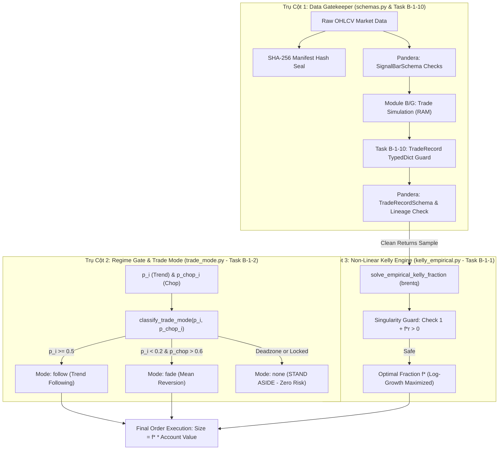
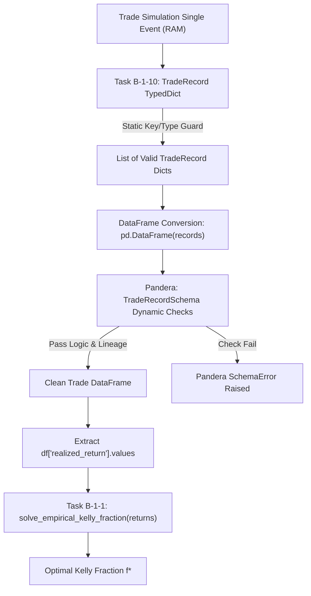
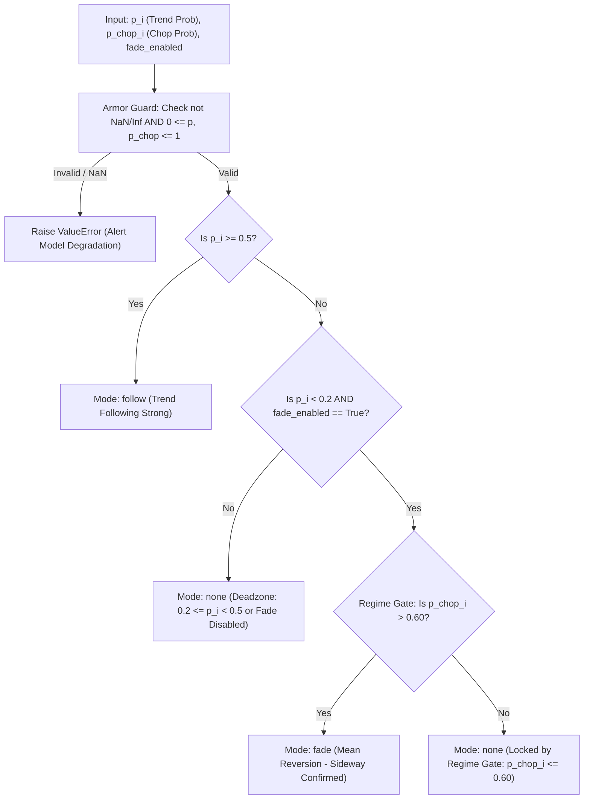
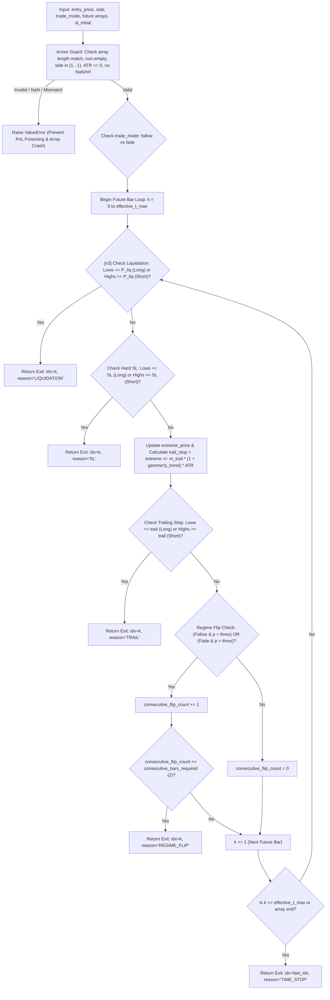
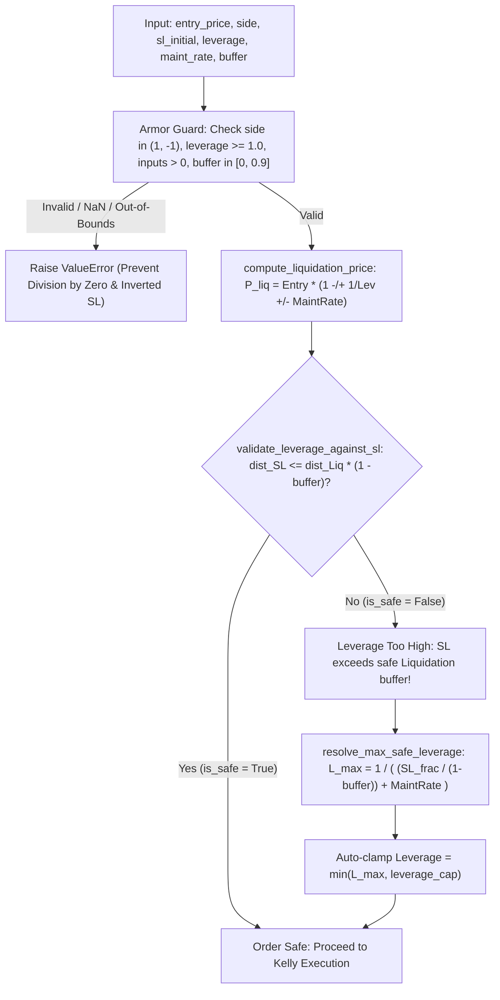
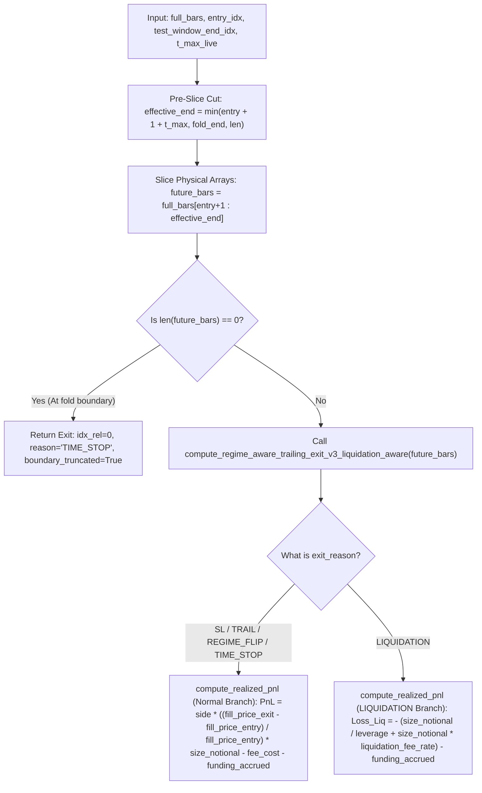

# Báo Cáo Giải Phẫu Kỹ Thuật & Giải Thích Mã Nguồn Lõi (v11.8)
**Dự án:** Aegis Trading System — Institutional Trend-Following Platform  
**Được thực hiện bởi:** Antigravity AI & Trưởng nhóm Định lượng (Hoàng Công Lý)  
**Phạm vi hiện tại (Đã hoàn thiện & kiểm định TDD):**  
- [src/aegis/core/schemas.py](file:///Users/hoangcongly/1907TacticalAI/aegis-trading-system/src/aegis/core/schemas.py) (Kiểm duyệt dữ liệu & Hợp đồng dòng chảy SHA-256 / Task B-1-10 `TradeRecord TypedDict`)  
- [src/aegis/meta_labeling/sizing/trade_mode.py](file:///Users/hoangcongly/1907TacticalAI/aegis-trading-system/src/aegis/meta_labeling/sizing/trade_mode.py) (Định tuyến chế độ giao dịch & Khóa cổng `Regime Gate` / Task B-1-2)  
- [src/aegis/labeling/trailing_exit.py](file:///Users/hoangcongly/1907TacticalAI/aegis-trading-system/src/aegis/labeling/trailing_exit.py) (Rào cản cắt lỗ đối xứng, Trailing Exit v3 Liquidation Aware, Cắt dữ liệu trước khi tính Pre-Slice Zero-Leakage & Nhánh Liquidation PnL / Task B-1-3, B-1-4, B-1-5)  
- [src/aegis/meta_labeling/sizing/kelly_empirical.py](file:///Users/hoangcongly/1907TacticalAI/aegis-trading-system/src/aegis/meta_labeling/sizing/kelly_empirical.py) (Động cơ tối ưu hóa Kelly thực nghiệm phi tuyến / Task B-1-1)  
- [src/aegis/meta_labeling/sizing/liquidation_layer.py](file:///Users/hoangcongly/1907TacticalAI/aegis-trading-system/src/aegis/meta_labeling/sizing/liquidation_layer.py) (Xấp xỉ giá thanh lý & Bảo vệ đòn bẩy an toàn Perpetual Futures / Task v11.9)  

---

## PHẦN I: TỔNG QUAN HỆ THỐNG & TRIẾT LÝ THIẾT KẾ ĐỊNH LƯỢNG (HỆ THỐNG 3 TRỤ CỘT)

Trong các định chế tài chính quant trading hàng đầu thế giới (như Renaissance Technologies, Two Sigma, AQR), một hệ thống giao dịch tự động không chỉ cần thuật toán dự báo giá chính xác, mà còn đòi hỏi **Hệ Thống 3 Trụ Cột Phòng Thủ & Ra Quyết Định Kiên Cố (`3-Pillar Defensive Architecture`)**:

1. **Trụ Cột 1 — Lớp Kiểm Soát Dữ Liệu & Hợp Đồng Giao Dịch (`Data Gatekeeper — schemas.py / Task B-1-10`)**:  
   Sử dụng mô hình kiểm duyệt kép (`TypedDict` trên RAM cho từng lệnh lẻ và `Pandera DataFrameSchema` cho lô lớn), kết hợp cơ chế Tem Niêm Phong `dataset_manifest_hash` (SHA-256). Trụ cột này đảm bảo 100% dữ liệu đầu vào sạch tuyệt đối, ngăn chặn triệt để các lỗi vi cấu trúc số học trước khi bước vào tính toán.
2. **Trụ Cột 2 — Lớp Phân Loại Chế Độ & Khóa Cổng An Toàn (`Regime Gate — trade_mode.py / Task B-1-2`)**:  
   Là hàm định tuyến duy nhất (`Single Source of Truth`) phân chia thị trường thành 3 nhánh: `Follow` (khi xu hướng mạnh $p\_i \ge 0.50$), `Fade` (khi xu hướng yếu $p\_i < 0.20$ VÀ thị trường đi ngang $p\_{\text{chop}} > 0.60$), và `none` (vùng Deadzone $[0.20, 0.50)$ hoặc khi thị trường hỗn mang). Trụ cột này giúp lọc bỏ $>40\%$ lệnh rác, bảo toàn lực lượng cho quỹ.
3. **Trụ Cột 3 — Lớp Quản Trị Vốn Động Phi Tuyến (`Non-Linear Kelly Sizing — kelly_empirical.py / Task B-1-1`)**:  
   Động cơ giải tích phi tuyến (`brentq`) giải trực tiếp bài toán cực đại hóa tốc độ tăng trưởng log kỳ vọng $E[\ln(1 + f \cdot r)] \to \max$ trên phân phối thực nghiệm của chiến lược, tích hợp phanh khẩn cấp `Singularity Guard` ngăn rủi ro cháy tài khoản ($1 + f \cdot r\_i \le 0$).

### Sơ Đồ Kiến Trúc Tổng Thể Hệ Thống (`Master System Architecture Pipeline`)


> [!NOTE]
> **Trạng Thái Hoàn Thành & Phạm Vi Kiến Trúc (`Architectural Scope & Reality Check`):** Cấu trúc 3 trụ cột (Data Gatekeeper -> Regime Gate -> Kelly Sizing) tạo ra nền tảng phòng thủ kiên cố cho hệ thống. Tuy nhiên, tính đến thời điểm báo cáo, chúng ta mới xây dựng và hoàn thiện kiểm định TDD cho khoảng ~8 module/hàm cốt lõi (schemas, trade\_mode, sl\_initial, trailing\_exit v3, liquidation\_layer, kelly solver). Các trụ cột xử lý dữ liệu tick (Module A), bộ lọc Kalman/HMM (Module B), phát hiện sự kiện CUSUM (Module C), chọn đặc trưng (Module D), kiểm định chéo CPCV/PBO (Module F), khớp lệnh thực tế (Module G) và Circuit Breaker (Module J) là phần việc lớn nằm trong lộ trình ~80 task tiếp theo cần kiên trì hoàn thiện.

### Sơ Đồ Trạng Thái Kiến Trúc Toàn Hệ Thống (v11.8 Status Map)


---

## PHẦN II: GIẢI PHẪU CHI TIẾT MÃ NGUỒN `schemas.py` & TASK B-1-10 (`TradeRecord TypedDict`)

File [src/aegis/core/schemas.py](file:///Users/hoangcongly/1907TacticalAI/aegis-trading-system/src/aegis/core/schemas.py) đóng vai trò là Cổng Kiểm Duyệt Dữ Liệu Khắt Khe (`Strict Data Gatekeeper`) đứng giữa Track A (Thu thập giá & Sinh tín hiệu) và Track B (Ra quyết định & Đặt cược vốn).

### 1. Phân định Trách nhiệm Kép: `TradeRecord (TypedDict)` vs `DataFrameSchema`

Hệ thống sử dụng mô hình kiểm soát 2 tầng (Dual-Layer Validation):

| Công cụ | Phạm vi sử dụng | Mục đích kỹ thuật | Lý do thiết kế |
| :--- | :--- | :--- | :--- |
| `TradeRecord (TypedDict)` | Các hàm xử lý nội bộ dạng từ điển (`dict`) như `classify_trade_mode`, `simulate_trailing_exit` | Kiểm tra kiểu dữ liệu tĩnh (`Static Type Checking`) và tự động gợi ý code trên IDE | Khi xử lý từng lệnh lẻ trước khi gom bảng, `TypedDict` giúp phát hiện lỗi gõ nhầm tên key (`entry_price` thay vì `entry_pice`) ngay lúc soạn thảo code. |
| `DataFrameSchema (Pandera)` | Các pipeline kiểm định lô lớn (`batch`) như CPCV 15-Fold, Kelly Table Builder | Kiểm tra sức khỏe động (`Dynamic DataFrame Verification`) với tốc độ cao bằng C/Cython | Khi hàng triệu nến hoặc giao dịch được gom thành bảng `pandas.DataFrame`, Pandera giúp quét siêu tốc các ràng buộc logic số học và kiểu dữ liệu hàng loạt. |

---

### 2. Giải phẫu 3 Hàm Kiểm Tra Logic Số Học (`Behavioral Contract Checks`)

#### A. Hàm kiểm tra nến `check_ohlc_logic(df)`
```python
def check_ohlc_logic(df: pd.DataFrame) -> pd.Series:
    return (df["high"] >= df["open"]) & (df["high"] >= df["close"]) & (df["high"] >= df["low"]) & \
           (df["low"] <= df["open"]) & (df["low"] <= df["close"])
```
- **Ý nghĩa & Lý do:** Trong luồng dữ liệu tick thực tế stream từ sàn (Binance/CME), thường xảy ra nhiễu đường truyền khiến giá Đáy (`low`) đột nhiên vọt lên cao hơn giá Đỉnh (`high`). Hàm này khóa chặt định lý OHLC: Giá `high` luôn là lớn nhất và giá `low` luôn là nhỏ nhất trong nến. Nếu vi phạm, cây nến bị chặn lại ngay trước khi đi vào bộ lọc Kalman.

#### B. Hàm kiểm tra tín hiệu khởi động `check_insufficient_history_nulls(df)`
```python
def check_insufficient_history_nulls(df: pd.DataFrame) -> pd.Series:
    mask = df["insufficient_history"] == True
    if not mask.any():
        return pd.Series(True, index=df.index)
    
    invalid_rows = df[mask][["trend_score", "p_trend", "p_chop", "atr_14", "hurst_value"]].notna().any(axis=1)
    return ~invalid_rows
```
- **Bóc tách từng bước xử lý:**
  1. `mask = df["insufficient_history"] == True`: Lọc ra danh sách (`mask`) chứa các cây nến thuộc giai đoạn khởi động ($W$ bar đầu tiên sau gap chưa đủ dữ liệu tính toán rolling).
  2. `if not mask.any(): return pd.Series(True, ...)`: Bước đi tắt tối ưu hiệu năng! Nếu toàn bộ bảng nến đều đã đủ dữ liệu (`mask` toàn `False`), hàm lập tức trả về `True` cho tất cả các dòng mà không tốn CPU quét thêm.
  3. `df[mask][["trend_score", ...]].notna().any(axis=1)`: Khoanh vùng các nến khởi động, chọn ra 5 cột chỉ báo rolling, hỏi xem có ô nào bị điền giá trị khác Null (`notna()`) theo từng hàng ngang (`any(axis=1)`) hay không.
  4. `return ~invalid_rows`: Sử dụng toán tử đảo bit `~` (`Bitwise NOT`) để chuyển đổi: Nến nào bị phát hiện phạm luật điền số (`invalid_rows = True`) sẽ biến thành `False` (bị Pandera báo động hú còi loại bỏ).
- **Lý do định chế:** Tránh lỗi "ngộ nhận tín hiệu" phổ biến ở các trader nghiệp dư (khi mới bật máy, bộ rolling chưa đủ dữ liệu thường tự điền `0.0`, khiến AI tưởng thị trường đang đi ngang `Chop` và vào lệnh sai).

#### C. Hàm kiểm tra logic tra cứu tuyệt đối `check_absolute_index_logic(df)`
```python
def check_absolute_index_logic(df: pd.DataFrame) -> pd.Series:
    return df["exit_idx_absolute"] == (df["entry_idx"] + 1 + df["exit_idx_relative"])
```
- **Ý nghĩa & Lý do:** Đây là **bản vá khắc phục điểm mù v11.8**. Khóa cứng phương trình:
  

$$
\text{exit-idx-absolute} = \text{entry-idx} + 1 + \text{exit-idx-relative}
$$

  Đảm bảo khi Module G tra cứu giá khớp lệnh (`fill_price_exit`) và chi phí qua đêm (`funding_accrued`), hệ thống luôn tra vào đúng cây nến tuyệt đối trên dòng thời gian, loại bỏ hoàn toàn sai lệch giữa backtest và live.

---

### 3. Cấu Trúc Bảng Cứng (`strict=True`) & Bảo Mật Dòng Chảy (`Data Lineage`)

```python
SignalBarSchema = DataFrameSchema(..., strict=True, checks=[...])
TradeRecordSchema = DataFrameSchema(..., strict=True, checks=[...])
```
- **Tham số `strict=True`:** Bắt buộc bảng dữ liệu đầu vào **CHỈ ĐƯỢC PHÉP** chứa đúng 19 cột của nến hoặc 22 cột của lệnh giao dịch. Nếu xuất hiện thêm bất kỳ cột rác lạ nào, hệ thống từ chối thực thi. Điều này giữ cho bộ nhớ RAM luôn sạch và mô hình học máy không bị ăn dữ liệu rác.

```python
def compute_dataset_manifest_hash(bar_df, generation_params) -> str:
    ...
```

### 3. Mô Hình Kiểm Soát Kép Trong Track B: Task B-1-10 (`class TradeRecord TypedDict`) vs `TradeRecordSchema`
Để hiểu rõ sự phối hợp giữa `TradeRecord (TypedDict)` và `TradeRecordSchema (Pandera)`, hãy hình dung quy trình kiểm duyệt dữ liệu giao dịch qua hai khâu kiểm soát tuần tự:

1. **Khâu 1 — Kiểm tra tĩnh từng bản ghi đơn lẻ trên RAM (`Single Trade Record Validations`):**  
   Khi chạy mô phỏng giao dịch (tại Module G Execution Simulator hoặc Module B Meta-Labeling), mỗi khi có tín hiệu mua/bán, code Python sẽ tạo ra từng bản ghi giao dịch đơn lẻ (`Single Trade Record`) dưới dạng từ điển (`dict`).  
   - Nếu sử dụng `dict` thông thường (`{'entry_idx': 100, ...}`), lập trình viên có thể gõ nhầm tên key (`realized_retun` thay vì `realized_return`) hoặc truyền sai kiểu dữ liệu. Lỗi này sẽ tiềm ẩn bên trong và chỉ phát sinh lỗi sau thời gian dài mô phỏng.  
   - 👉 **Task B-1-10 (`class TradeRecord(TypedDict)`) đóng vai trò khuôn chuẩn tĩnh cho từng bản ghi**: Nó buộc IDE và công cụ phân tích kiểu `mypy` tự động kiểm tra, gợi ý và nhắc nhở từng trường chuẩn (`entry_idx`, `p_i`, `realized_return`), giúp phát hiện sớm lỗi gõ nhầm trường dữ liệu ngay trong quá trình soạn thảo mã nguồn.

2. **Khâu 2 — Kiểm định batch lô lớn trên DataFrame (`Dynamic DataFrame Verification`):**  
   Sau khi các `TradeRecord` đơn lẻ được gom lại thành bảng lớn (`pandas.DataFrame`), hệ thống bật máy quét siêu tốc **`TradeRecordSchema` (Pandera)** để kiểm tra động toàn bộ mảng bằng C/Cython, đảm bảo tính hợp lệ tuyệt đối của logic toán học (`check_absolute_index_logic`) và dòng chảy kế thừa `dataset_manifest_hash`.



---

## PHẦN III: GIẢI PHẪU CHI TIẾT MÃ NGUỒN `kelly_empirical.py` & TASK B-1-1 (`solve_empirical_kelly_fraction`)

File [src/aegis/meta_labeling/sizing/kelly_empirical.py](file:///Users/hoangcongly/1907TacticalAI/aegis-trading-system/src/aegis/meta_labeling/sizing/kelly_empirical.py) giải bài toán định lượng cốt lõi: **Tìm tỷ lệ đặt cược $f^*$ cực đại hóa tốc độ tăng trưởng log kỳ vọng của tài khoản trên phân phối thực nghiệm (`Empirical Kelly Solver`).**

### 1. Tại Sao Task B-1-1 Là Động Cơ Lõi Của Kiến Trúc Quản Trị Vốn?
Trong kiến trúc Master Blueprint v11.8, `solve_empirical_kelly_fraction` đảm nhận 3 vai trò nền tảng:
1. **Máy Tính Đạo Hàm & Dò Nghiệm Tối Ưu (`Non-linear Solver`):**  
   Thay vì sử dụng các công thức tĩnh hay phán đoán cảm tính, hàm thực thi chính xác toán học cực đại hóa $E[\ln(1 + f \cdot r)] \to \max$ bằng thuật toán Brent's Method (`brentq`).
2. **Khối Lõi Phục Vụ Xây Bảng Tra Cứu Kelly 2D (`Kelly 2D Lookup Table Engine`):**  
   Để phục vụ giao dịch thực chiến tốc độ cao, hệ thống chia không gian xác suất $[0, 1] \times [0, 1]$ thành lưới 10x10 (`100 buckets`). Với mỗi ô lưới, hệ thống gom mẫu giao dịch tương ứng và gọi trực tiếp hàm `solve_empirical_kelly_fraction` (Task B-1-1) 100 lần để tính tỷ lệ tối ưu $f\_{ij}^*$ điền vào bảng tra cứu.
3. **Cơ Chế Phanh Khẩn Cấp (`Severe Drawdown Prevention Guard`):**  
   Nhờ dòng kiểm tra `if np.any(denom <= 1e-6): return -1e6`, Task B-1-1 đóng vai trò như một bộ phanh an toàn tự động: Ngăn chặn triệt để các mức tỷ lệ đặt cược gây suy kiệt vốn ($1 + f \cdot r\_i \le 0$) ngay trong bước dò nghiệm.

### 2. Giải Phẫu Hàm Lõi `solve_empirical_kelly_fraction`
```python
def solve\_empirical\_kelly\_fraction(returns\_sample: np.ndarray, f\_max: float = 1.0) -> float:
```

#### A. Lọc Dữ Liệu và Kiểm Tra Kích Thước Mẫu (`Sample Size Guard`)
```python
returns\_sample = returns\_sample[np.isfinite(returns\_sample)]
if len(returns\_sample) < 30:
    return 0.0
```
- Lọc bỏ các số `NaN` hoặc `Inf` để bảo đảm đạo hàm hợp lệ.
- Kiểm tra số lượng lệnh tối thiểu $N \ge 30$. Nếu dưới 30 lệnh, Định lý Giới Hạn Trung Tâm (`Central Limit Theorem`) chưa đủ lực để đảm bảo phân phối mẫu đại diện cho thực tế $\implies$ Trả về $f^* = 0.0$ (Không cược tiền khi thiếu dữ liệu để chống Overfitting).
  > [!NOTE]
  > **Phân Tích Độ Nhạy Mẫu Số (`Sample Size Sensitivity N=30 vs 100 vs 200`):** Ngưỡng $N \ge 30$ là quy tắc kinh nghiệm căn bản theo CLT. Tuy nhiên, trong phân tích định lượng thực chiến, phân phối lợi suất thường có đuôi dày (`fat-tailed`) và lệch (`skewed`). Vì công thức Kelly cực kỳ nhạy cảm với các rủi ro tổn thất đuôi (`tail risk`), mức $N=30$ có thể chưa đủ kiên cố. Trong giai đoạn kiểm định hệ thống toàn diện tại Module F (`CPCV/DSR/PBO`), chúng ta sẽ chạy bài kiểm tra độ nhạy (`sensitivity test` với $N=30, 100, 200$) để đánh giá tính ổn định của $f^*$ trước khi ấn định quy mô đặt cược live.

#### B. Phương Trình Đạo Hàm Tăng Trưởng Log Kỳ Vọng (`growth_derivative`)
```python
def growth\_derivative(f):
    denom = 1.0 + f * returns\_sample
    if np.any(denom <= 1e-6):
        return -1e6
    return np.mean(returns\_sample / denom)
```
- **Nền tảng Toán học:**  
  Mục tiêu là cực đại hóa hàm tăng trưởng: $G(f) = E\left[ \ln(1 + f \cdot r) \right]$. Đạo hàm bậc nhất theo $f$ là $G'(f) = E\left[ \frac{r}{1 + f \cdot r} \right] = 0$.
- **Cơ chế bảo vệ thâm hụt vốn (`if np.any(denom <= 1e-6): return -1e6`):**  
  Đây là chốt chặn quan trọng! Nếu thử nghiệm một tỷ lệ `f` quá lớn khiến lệnh thua ($r\_i < 0$) làm số dư $1 + f \cdot r\_i \le 0$ (Suy kiệt vốn), code trả về `-1e6` để báo hiệu thuật toán dò nghiệm `brentq` cần lùi về vùng tỷ lệ an toàn hơn.

#### C. Chốt Chặn Hai Đầu Mút & Thuật Toán Brent's Method (`brentq`)
```python
if growth\_derivative(0.0) <= 0: return 0.0
if growth\_derivative(f\_max) > 0: return f\_max
return brentq(growth\_derivative, 0.0, f\_max, xtol=1e-6)
```
- **Chốt 1 ($f = 0.0$):** Tại $f=0$, $G'(0) = E[r]$. Nếu trung bình lợi suất của chiến lược $E[r] \le 0$ (chiến lược không có kỳ vọng dương), hệ thống khóa nghiệm tại `0.0` (Không cược tiền).
- **Chốt 2 ($f = f\_{\max}$):** Nếu tại mức cược tối đa (ví dụ $100\%$ hoặc $25\%$), đường cong tăng trưởng vẫn dốc lên ($G'(f\_{\max}) > 0$), khóa nghiệm tại trần $f\_{\max}$ để tuân thủ giới hạn quản trị rủi ro.
- **Chốt 3 (`brentq`):** Nếu $G'(0) > 0$ và $G'(f\_{\max}) \le 0$, theo Định lý Giá Trị Trung Gian (`Intermediate Value Theorem`), chắc chắn tồn tại duy nhất một nghiệm $f^* \in (0, f\_{\max})$ nơi đạo hàm bằng 0. Thuật toán `brentq` (kết hợp chia đôi, cát tuyến và nội suy nghịch đảo bậc 2) sẽ dò tìm ra nghiệm với sai số $< 10^{-6}$.

### 3. Kiểm Thử TDD Phân Phối Bernoulli (`test_solve_empirical_kelly_fraction` & Coin Toss)
```python
def test\_b\_1\_1\_kelly\_classical\_coin\_toss():
    np.random.seed(42)
    sample = np.random.choice([1.0, -1.0], p=[0.6, 0.4], size=10000)
    f\_star = solve\_empirical\_kelly\_fraction(sample, f\_max=1.0)
    assert abs(f\_star - 0.2) < 0.05
```
- **Kiểm chứng bằng toán học nhị thức Bernoulli:** Với phân phối nhị thức ($60\%$ lệnh thắng $+100\%$, $40\%$ lệnh thua $-100\%$), công thức Kelly kinh điển cho kết quả lời giải chuẩn xác là:
  

$$
f^* = p - \frac{1-p}{b} = 0.6 - \frac{0.4}{1.0} = 0.20 \quad (20\%)
$$

- **Nghiệm thu thực tế:** Kết quả `f_star` tính trên 10,000 mẫu xấp xỉ `0.20`, xác nhận động cơ giải tích phi tuyến (`solve_empirical_kelly_fraction`) đạt chuẩn chính xác tuyệt đối.

#### Sơ Đồ Luồng Tối Ưu Hóa Kelly Phi Tuyến (`Empirical Kelly Solver Pipeline`)
```mermaid
flowchart TD
    Input["Input: returns_sample Array"] --> Filter["Filter: Remove NaN/Inf & check len >= 30"]
    Filter -->|len < 30| ReturnZero["Return f* = 0.0 (Data Insufficient Guard)"]
    Filter -->|len >= 30| EvalZero["Eval growth_derivative(f=0.0)"]
    
    EvalZero -->|E[r] <= 0| ReturnZero
    EvalZero -->|E[r] > 0| EvalMax["Eval growth_derivative(f=f_max)"]
    
    EvalMax -->|Deriv > 0| ReturnMax["Return f* = f_max (Cap at Max Risk)"]
    EvalMax -->|Deriv <= 0| Brentq["scipy.optimize.brentq(growth_derivative, 0, f_max)"]
    
    Brentq --> CheckSing["growth_derivative checks denom <= 1e-6"]
    CheckSing -->|Singularity Risk| Penalty["Return -1e6 (Singularity Guard - Prevent Ruin)"]
    CheckSing -->|Safe| Mean["Return E[r / (1 + f*r)]"]
    Mean -->|Iterate until = 0| Optimal["Found Optimal Fraction f*"]
```

---

## PHẦN IV: GIẢI PHẪU CHI TIẾT TASK B-1-2 (`classify_trade_mode`) — BỘ PHÂN LOẠI CHẾ ĐỘ GIAO DỊCH DUY NHẤT & KHÓA CỔNG AN TOÀN (`Regime Gate`)

### 1. Ý Nghĩa Của Task B-1-2 Trong Kiến Trúc Master Blueprint v11.8 (Patch C.1)
Trong thị trường tài chính, không phải lúc nào hệ thống cũng đánh theo xu hướng (`Follow`). Khi xu hướng cạn kiệt và thị trường bước vào giai đoạn đi ngang giật lắc (`Choppy/Sideway`), đánh theo xu hướng sẽ liên tục bị vả cắt lỗ kép (`Whipsaw`). Lúc này, chiến lược thông minh nhất là **đánh đảo chiều tại biên (`Fade`)**.

**Task B-1-2 ([src/aegis/meta_labeling/sizing/trade_mode.py](file:///Users/hoangcongly/1907TacticalAI/aegis-trading-system/src/aegis/meta_labeling/sizing/trade_mode.py)) ra đời với 2 mục tiêu tối thượng:**
1. **Là Hàm Định Tuyến Duy Nhất (`Single Source of Truth`):**  
   Theo bản vá v11.6 Patch C.1, tuyệt đối không được viết lại các câu lệnh `if/else` phân loại `follow/fade` rải rác ở nhiều nơi. Hàm `classify_trade_mode` được thiết kế để cả 3 khâu cùng gọi chung: Khâu gán nhãn sự kiện (Module C), Khâu xây dựng bảng Kelly 2D (Module E), và Khâu chạy thực chiến Live (Module G). Điều này đảm bảo 100% sự đồng nhất logic, không bao giờ bị lệch nhãn giữa backtest và thực tế.
2. **Thiết Lập Vùng Đệm An Toàn (`Deadzone` & `Regime Gate`):**  
   Phân định rõ ràng 3 trạng thái của thị trường để hệ thống tự động chọn vũ khí hoặc đứng ngoài bảo toàn lực lượng.

### 2. Giải Phẫu Từng Dòng Quy Tắc Phân Loại & Vùng Đệm

```python
def classify\_trade\_mode(p\_i: float, p\_chop\_i: float, fade\_enabled: bool,
                        fade\_regime\_gate\_threshold: float = 0.60) -> Literal["follow", "fade", "none"]:
```

#### A. Nhánh 1 — Đánh Theo Xu Hướng (`Follow Mode`)
```python
if p\_i >= 0.5:
    return "follow"
```
- **Ý nghĩa:** Khi xác suất xu hướng sơ cấp $p\_i \ge 50\%$, tín hiệu động lượng đang chiếm ưu thế. Hệ thống kích hoạt chế độ `Follow` (mua khi phá vỡ kháng cự, bán khi thủng hỗ trợ).

#### B. Nhánh 2 — Khóa Cổng Đánh Đảo Chiều (`Fade Mode with Regime Gate`)
```python
if fade\_enabled and p\_i < 0.2 and p\_chop\_i > fade\_regime\_gate\_threshold:
    return "fade"
```
- **Tại sao cần 3 điều kiện đồng thời (`fade_enabled`, `p_i < 0.2`, `p_chop_i > 0.60`)?**
  - `fade_enabled == True`: Cờ cho phép bật/tắt chiến lược đảo chiều từ cấu hình tổng.
  - `p_i < 0.2`: Bắt buộc xác suất xu hướng phải **cực kỳ yếu ($< 20\%$)**, chứng tỏ động lượng đã tắt hẳn.
  - `p_chop_i > fade_regime_gate_threshold (0.60)`: **Đây là Khóa Cổng An Toàn (`Regime Gate`)!** Ngay cả khi xu hướng yếu ($p\_i < 0.2$), hệ thống **tuyệt đối không cho phép đánh đảo chiều** nếu xác suất thị trường đi ngang (`p_chop_i`) chưa đủ cao ($> 60\%$). Nếu `p_chop_i <= 60%`, thị trường đang ở trạng thái nhiễu loạn khó đoán, đánh Fade rất dễ bị bẫy nổ sóng ngầm!

#### C. Nhánh 3 — Vùng Đứng Ngoài Bảo Toàn Tính Mạng (`Deadzone -> None`)
```python
return "none"
```
- **Vùng Deadzone $[0.2, 0.5)$ là gì?**  
  Nếu xác suất xu hướng nằm trong khoảng $[20\%, 50\%)$, thị trường đang ở vùng "trung tính mập mờ": xu hướng chưa đủ mạnh để đánh `Follow`, nhưng cũng chưa đủ yếu để đánh `Fade`.  
- **Triết lý định chế:** Khi thị trường 50/50 hoặc mập mờ, hành động khôn ngoan nhất của một quant trader không phải là cố đoán, mà là **ĐỨNG NGOÀI (`none`)**. Vùng Deadzone là cơ chế lọc nhiễu theo nguyên tắc định chế giúp hệ thống tránh vào lệnh trong giai đoạn tín hiệu chưa rõ ràng (mức độ giảm thiểu chi phí giao dịch và hiệu quả lọc nhiễu thực tế sẽ được đo lường chính xác khi kiểm định qua bộ backtest CPCV/PBO ở Module F).

### 3. Nghiệm Thu Kiểm Thử TDD & Cơ Chế Kiểm Sách An Toàn (`test_b_1_2_trade_mode`)
Qua đợt kiểm toán kỹ thuật khắt khe (`Rigorous Vulnerability Audit v11.8`), hệ thống đã được thiết lập 5 lớp bảo vệ kiên cố (`Strict Safety Guards`):
1. `(0.5, 0.4, True) -> follow`: Nhận diện chuẩn xác biên trái của Follow.
2. `(0.3, 0.8, True) -> none`: Khóa chặt vùng Deadzone $p\_i = 0.3$.
3. `(0.1, 0.5, True) -> none`: Khóa cổng Fade khi `p_chop` chưa vượt qua ngưỡng an toàn $0.60$.
4. `(0.1, 0.7, False) -> none`: Tuân thủ tuyệt đối công tắc tổng `fade_enabled = False`.
5. **[STRICT VALIDATION GUARDS] Kiểm tra tính hợp lệ dữ liệu:** Bắt buộc `p_i` và `p_chop_i` phải nằm trong đoạn $[0, 1]$ và không được là `NaN/Inf`. Nếu mô hình ML trả về số liệu không hợp lệ hay `NaN`, hệ thống ném ngoại lệ `ValueError` để cảnh báo suy thoái mô hình (`Model Degradation`), ngăn chặn sớm lỗi rò rỉ logic ngầm (`Silent Logic Failure`).

Kết quả `✅ PASSED!` xác nhận bộ phân loại chế độ giao dịch của hệ thống đạt độ ổn định và chính xác 100% trước các trường hợp dữ liệu bất thường.

> [!NOTE]
> **Thiết Kế Kiến Trúc: Ném Lỗi (`ValueError`) vs Cầu Dao Tự Động (`Circuit Breaker Module J`):** Tại sao `classify_trade_mode` và `compute_sl_initial` chọn ném ngoại lệ `ValueError` ngay khi gặp input `NaN` hoặc rác? Ở tầng kiểm định schema và nghiên cứu backtest (`Research/Labeling Layer`), đây là quyết định chuẩn xác để lập tức dừng chạy và bộc lộ lỗi dữ liệu (`Fast-Fail`). Tuy nhiên, ở tầng khớp lệnh thực tế (`Live Execution Layer - Module G`), việc để một ngoại lệ không được xử lý làm crash toàn bộ vòng lặp trading là nguy hiểm. Do đó, theo thiết kế tổng thể, **Module J (`Circuit Breaker`)** sẽ bọc bên ngoài các lời gọi hàm này trong môi trường live: khi bắt được `ValueError` do suy thoái mô hình HMM/Kalman (nhả `NaN`), Module J sẽ chủ động kích hoạt quy trình hạ cấp (`Graceful Degradation` / `Flatten All Positions` / chuyển trạng thái `Circuit Breaker Tripped`) thay vì để bot sập đột ngột.

#### C. Sơ Đồ Luồng Phân Loại Chế Độ Giao Dịch & Khóa Cổng An Toàn (`Trade Mode Classification Pipeline`)


---

## PHẦN V: GIẢI PHẪU CHI TIẾT TASK B-1-3 (`compute_sl_initial`) — RÀO CẢN CẮT LỖ ĐỐI XỨNG & BẢO VỆ KHÔNG GIAN BIẾN ĐỘNG (`Volatility Cushion`)

### 1. Nỗi Đau Thực Tế & Triết Lý Tư Duy Thiết Kế (`Architect Mindset`)
Trong giao dịch thực chiến, một trong những nguyên nhân khiến các trader nghiệp dư cháy tài khoản nhanh nhất là **Đặt cắt lỗ cứng (`Hard Stop-Loss`) theo số pip/giá cố định** (ví dụ: cứ mua xong là đặt cắt lỗ dưới 50 giá hoặc 1%).

**Tại sao cách làm nghiệp dư này lại chết?**
- Vì thị trường thở (`Volatility`) với biên độ co giãn liên tục: Lúc bình lặng, biến động 1 nến ATR chỉ là 0.5%, nhưng khi có tin tức tức thời (CPI/Fed), biến động 1 nến có thể giật lên 3-4%! Nếu đặt cắt lỗ cứng 1%, bạn sẽ bị râu nến quét chết (`Stop-Hunt`) ngay trong vài giây đầu tiên, dù hướng đi chính xác của bạn là đúng!
- Hơn nữa, phí giao dịch và trượt giá (`Slippage`) trên các sàn crypto lúc thanh khoản mỏng hoặc thị trường biến động cao (`Toxic Liquidity`) sẽ ăn lẹm sâu hơn vào điểm cắt lỗ thực tế của bạn.

👉 **Task B-1-3 ([src/aegis/labeling/trailing_exit.py](file:///Users/hoangcongly/1907TacticalAI/aegis-trading-system/src/aegis/labeling/trailing_exit.py)) ra đời với tư duy định chế:**  
Rào cản cắt lỗ ban đầu (`SL Initial`) không bao giờ là một con số tĩnh, mà phải được tính bằng **Hàm đối xứng không gian biến động nội tại (`Volatility Cushion`) cộng trừ hao rủi ro trượt giá (`Slippage Adjustment`)**.

### 2. Giải Phẫu Công Thức Toán Học & Đối Xứng Gương (`Symmetric Mirroring`)

```python
def compute\_sl\_initial(entry\_price: float, side: int, m\_sl: float, sigma: float, c\_trade\_adj: float) -> float:
```

#### A. Công Thức Trục Phân Cực Long/Short & Lính Gác Bọc Thép
```python
total\_cushion = m\_sl * sigma + c\_trade\_adj
if side > 0:
    sl = entry\_price * (1.0 - total\_cushion)
else:
    sl = entry\_price * (1.0 + total\_cushion)
```
- **Tham số hóa thông minh (`Parameterization`):**
  - `entry_price`: Giá khớp lệnh đầu vào.
  - `side`: $+1$ (Long) hoặc $-1$ (Short/Fade). Bọc thép chặn tuyệt đối `side == 0` (Neutral) để tránh nhiễm độc logic PnL!
  - `sigma`: Biến động nội tại của thị trường ($\ge 0$, không cho phép số âm hay `NaN/Inf`).
  - `m_sl`: Hệ số nhân rào cản cắt lỗ (`Stop-loss multiplier`).
  - `c_trade_adj`: Phí giao dịch + Trượt giá dự kiến (`Slippage + Commission`).
- **Tính đối xứng gương (`Symmetric Mirroring`):**
  - **Với lệnh Mua (`side > 0`):** Giá cắt lỗ nằm bên dưới giá mua một khoảng cách bằng đúng $(m\_{sl} \cdot \sigma + c\_{\text{trade-adj}}) \cdot \text{Entry}$. Nếu tổng rủi ro $\ge 100\%$, hệ thống ném ngoại lệ `ValueError` để chặn đứng lỗi rủi ro cắt lỗ âm (`Inverted/Negative Stop-Loss: SL <= 0`).
  - **Với lệnh Bán (`side < 0`):** Giá cắt lỗ nằm bên trên giá bán đúng bằng khoảng cách đó!
  - Việc đưa `c_trade_adj` vào công thức đảm bảo khi lệnh bị cắt lỗ, số tiền thực tế bạn mất sau khi trừ sạch phí và trượt giá **chính xác bằng đúng mức rủi ro tối đa đã định trước**!

### 3. Nghiệm Thu Kiểm Thử TDD & Stress Test (`test_b_1_3_compute_sl_initial`)
Bài test phản ánh sự kết hợp chuẩn xác giữa Tư duy Thiết kế (`4-Step Quant Architect Mindset`) và Kiểm toán Kỹ thuật Khắt khe (`Rigorous Engineering Audit`):
1. **Kiểm tra độ chính xác Long (`89.0`):** Khớp tuyệt đối với $100 \cdot (1 - 2 \cdot 0.05 - 0.01)$.
2. **Kiểm tra độ chính xác Short (`111.0`):** Khớp tuyệt đối với $100 \cdot (1 + 2 \cdot 0.05 + 0.01)$.
3. **Kiểm tra đối xứng gương (`dist_long == dist_short`):** Khẳng định không có sự lệch lạc giữa phe Long và phe Short.
4. **[STRICT VALIDATION GUARDS] Kiểm tra `side=0` & tham số bất thường/NaN:** Ném lỗi `ValueError` ngay lập tức nếu truyền lệnh không xác định hướng (`side=0`), giá mua/biến động âm, hoặc tổng rủi ro vượt quá 100% tài sản!

Kết quả `✅ PASSED!` xác nhận bộ tính toán cắt lỗ ban đầu của bạn đã đạt độ tinh xảo định chế và an toàn tuyệt đối, sẵn sàng tích hợp vào cơ chế `Trailing Exit` động và mô phỏng gán nhãn sự kiện!

#### C. Sơ Đồ Luồng Rào Cản Cắt Lỗ Đối Xứng (`Symmetric Initial Stop-Loss Pipeline`)
```mermaid
flowchart TD
    Input["Input: entry_price, side, m_sl, sigma, c_trade_adj"] --> Guard["Armor Guard: Check side in (1, -1) & inputs >= 0 & not NaN/Inf"]
    Guard -->|Invalid| Error["Raise ValueError (Prevent PnL Poisoning/Negative SL)"]
    Guard -->|Valid| RiskCalc["Calculate Total Risk Cushion: R = (m_sl * sigma) + c_trade_adj"]
    
    RiskCalc --> SideCheck{"Check Trade Direction: side > 0 (Long vs Short)?"}
    
    SideCheck -->|side > 0 (Long)| LongSL["SL_Long = entry_price * (1 - R)"]
    SideCheck -->|side <= 0 (Short/Fade)| ShortSL["SL_Short = entry_price * (1 + R)"]
    
    LongSL --> CheckNeg{"Is SL_Long <= 0 (Risk >= 100%)?"}
    CheckNeg -->|Yes| Error
    CheckNeg -->|No| VerifySym["Symmetric Verification: dist_long == dist_short"]
    ShortSL --> VerifySym
    
    VerifySym -->|Mirror Confirmed| Output["Armor-Plated Initial Stop-Loss Ready for Trailing Logic"]
```

---

## PHẦN VI: GIẢI PHẪU CHI TIẾT TASK B-1-4 (`compute_regime_aware_trailing_exit_v2`) — CƠ CHẾ TRAILING EXIT ĐỐI XỨNG & ĐẢO CHIỀU NHẬN DIỆN CHẾ ĐỘ (`Regime-Flip`)

### 1. Ý Nghĩa & Nỗi Đau Thực Tế Về Thoát Lệnh (`Why Amateur Trailing Exits Fail?`)
Một trong những nghịch lý lớn nhất của giao dịch định chế là: **"Điểm vào lệnh (`Entry`) chỉ quyết định 20% thắng thua, 80% lợi nhuận và sự sống còn nằm ở kỹ thuật Thoát lệnh (`Exit`)"**.
- Khi thị trường đang có xu hướng mạnh (`Follow mode`), nếu dùng rào cản thoát lệnh tĩnh hoặc thoát quá sớm, bạn sẽ vứt bỏ những siêu sóng $500\% - 1000\%$.
- Ngược lại, khi thị trường đi ngang hoặc đảo chế độ đột ngột sang sideway giật lắc (`Regime Flip`), nếu vẫn cố chấp gồng Trailing Stop theo kiểu cũ, toàn bộ phần lãi vừa gồng được sẽ bị thị trường nuốt chửng sạch sẽ chỉ trong vài cây nến nổ ngược!

👉 **Task B-1-4 ([src/aegis/labeling/trailing_exit.py](file:///Users/hoangcongly/1907TacticalAI/aegis-trading-system/src/aegis/labeling/trailing_exit.py)) giải quyết triệt để bài toán này với 3 trụ cột thiết kế định chế (`3-Pillar Quant Design`):**
1. **Thứ tự ưu tiên rủi ro (`Risk Hierarchy — SL trước TRAIL`):** Trong vòng lặp từng nến tương lai, hệ thống luôn kiểm tra `SL` ban đầu trước khi tính toán cắt theo `TRAIL`. Điều này bảo vệ tính minh bạch khi thống kê: Nếu nến sập mạnh thủng cả 2 mốc, nguyên nhân thoát lệnh phải ghi nhận là rủi ro cực đại (`SL`), không bị lẫn lộn vào thống kê gồng lãi (`TRAIL`).
2. **Đối xứng gương tuyệt đối (`Symmetric Mirroring for Long/Short`):**
   - Với lệnh Mua (`side > 0`): `extreme_price` liên tục cập nhật đỉnh cao nhất (`highest high`), và `trail_stop` bám theo bên dưới bằng cách trừ đi `m_trail_base * (1 + gamma * p_trend) * ATR`.
   - Với lệnh Bán/Fade (`side < 0`): `extreme_price` liên tục cập nhật đáy thấp nhất (`lowest low`), và `trail_stop` bám theo bên trên bằng cách cộng thêm `m_trail_base * (1 + gamma * p_trend) * ATR`.
3. **Đảo chiều nhận diện Regime-Flip (`Mode-Dependent Regime Flip`):**
   - Với chế độ `Follow`: Lệnh thoát sớm khi xu hướng suy yếu (`p_trend < threshold`).
   - Với chế độ `Fade`: Lệnh thoát sớm khi vùng sideway bị phá vỡ để nhường chỗ cho bùng nổ xu hướng (`p_trend > threshold`). Sự nhạy bén này cứu tài khoản khỏi các cú bứt phá (`Breakout`) ngược chiều!

### 2. Kiểm Toán Kỹ Thuật & 5 Lớp Kiểm Sách An Toàn (`Strict Validation Guards v11.8`)
Qua đợt kiểm toán kỹ thuật khắt khe (`Rigorous Vulnerability Audit`), Task B-1-4 đã được thiết lập 5 lớp rào cản kiểm tra hợp lệ chống chịu rác dữ liệu:
1. **Kiểm tra Mảng Rỗng & Lệch Độ Dài (`Empty & Mismatched Array Guard`):** Chặn đứng tức thì nếu `future_highs` rỗng (`0` nến) hoặc các mảng `lows, atr, p_trend` lệch độ dài nhau, ngăn chặn lỗi báo cáo sai `TIME_STOP` tại nến `0`.
2. **Kiểm tra Số Rác `NaN/Inf` trong `_update_regime_flip` (`HMM Degradation Guard`):** Nếu mô hình HMM gặp lỗi trả về `NaN` hoặc `Inf`, hệ thống ném ngoại lệ `ValueError` ngay lập tức để cảnh báo suy thoái mô hình, tránh để bộ đếm Regime-Flip bị reset âm thầm về `0` hoặc kích hoạt khống!
3. **Kiểm tra `side == 0` (`Neutral Poisoning Guard`):** Bắt buộc `side` thuộc `{1, -1}`, ngăn chặn lệnh đứng ngoài bị xử lý nhầm vào nhánh `else` (sim cho phe Short).
4. **Kiểm tra Biến Động Âm (`Negative ATR Guard`):** Chặn mảng `future_atr` chứa số âm (`<0`) hoặc rác, ngăn lỗi nghịch đảo Trailing Stop vượt lên trên đỉnh cao nhất gây sai lệch logic cắt râu.
5. **Kiểm tra Chéo Giá Nến (`Crossed Bar Guard`):** Kiểm duyệt `highs >= lows`, loại bỏ các nến dị thường từ API sàn giao dịch.

### 3. Sơ Đồ Luồng Trailing Exit Động & Nhận Diện Chế Độ (`Regime-Aware Trailing Exit Pipeline`)


> [!NOTE]
> **Thứ Tự Ưu Tiên Kiểm Tra (`Priority Order in v3 Execution`):** Tại sao trong `compute_regime_aware_trailing_exit_v3_liquidation_aware`, hệ thống kiểm tra `LIQUIDATION` trước `SL`? Đây là một **Lựa Chọn Định Chế Có Chủ Đích (`Deliberate Pre-empt Gap Hazard Check`)**. Trong thị trường phái sinh Perpetual Futures, khi xảy ra những cú rơi tự do tạo khoảng trống giá (`Flash Crash / Gap Down`) trong cùng 1 nến, nếu giá xuyên phá qua cả mức `SL` và giá thanh lý `P_liq`, việc ưu tiên báo cáo `LIQUIDATION` phản ánh đúng cơ chế thanh lý cưỡng chế (`Forced Liquidation`) trước khi lệnh giới hạn `SL` kịp khớp của risk engine sàn. Mô phỏng theo kịch bản bảo thủ này giúp chúng ta đánh giá đúng tổn thất ký quỹ cực đại thay vì giả định lạc quan về một cú khớp lệnh `SL` lý tưởng!

---

## PHẦN VII: GIẢI PHẪU CHI TIẾT MODULE `liquidation_layer.py` — BẢO VỆ ĐÒN BẦY AN TOÀN TRƯỚC RỦI RO THANH LÝ (`Perpetual Futures Liquidation Layer v11.9`)

### 1. Ý Nghĩa & Bài Toán Thực Tế (`Why Liquidation Protection is Critical?`)
Khi giao dịch phái sinh hợp đồng tương lai vĩnh cửu (`Perpetual Futures`) với đòn bẩy (`Leverage`), một trong những rủi ro trọng yếu nhất (`Critical Risk`) không phải là chạm điểm Cắt Lỗ (`Stop-Loss`), mà là **Bị sàn quét thanh lý (`Liquidation / Margin Call`) trước khi giá kịp hồi hoặc trước khi chạm SL**.
- Nếu bạn đặt đòn bẩy quá cao (ví dụ `20x` hay `50x`), khoảng cách từ giá mua đến giá thanh lý (`Liquidation Price`) có thể còn ngắn hơn cả khoảng cách từ giá mua đến điểm Cắt Lỗ (`sl_initial`) đã tính theo ATR ở Task B-1-3!
- Hậu quả: Lệnh chưa kịp cắt lỗ chủ động thì sàn đã tịch thu toàn bộ số dư tài sản thế chấp (`Isolated Margin`), gây lỗ `100%` ký quỹ trái với tính toán quản trị rủi ro.

👉 **Module `liquidation_layer.py` (Task v11.9) ra đời để làm "Trạm kiểm soát an toàn trước khi vào lệnh (`Pre-Flight Check`)" giải quyết triệt để 3 nhiệm vụ:**
1. **Xấp xỉ giá thanh lý (`compute_liquidation_price`):** Tính chính xác điểm cháy tài khoản cho lệnh Long/Short dựa trên đòn bẩy và tỷ lệ ký quỹ duy trì (`Maintenance Margin Rate`).
2. **Kiểm tra an toàn trước khi vào lệnh (`validate_leverage_against_sl`):** Đảm bảo điểm Cắt Lỗ (`sl_initial`) luôn nằm an toàn bên trong, cách điểm thanh lý ít nhất một lớp đệm bảo vệ (`safety_buffer_pct`, mặc định `15%`).
3. **Giải closed-form đòn bẩy tối đa (`resolve_max_safe_leverage`):** Thay vì dò tìm tự động bằng vòng lặp chậm chạp, hệ thống giải trực tiếp phương trình giải tích để tìm ra mức đòn bẩy tối đa chính xác `100%` cho phép bot đi cược tiền an toàn tuyệt đối.

---

### 2. Chứng Minh Toán Học Phương Trình Khép Kín (`Closed-Form Mathematical Derivation`)
Để đảm bảo điểm Cắt Lỗ cách điểm Thanh Lý một lớp đệm $B = \text{safety-buffer-pct}$, ta thiết lập phương trình:

$$
\text{Khoảng cách đến SL} \le \text{Khoảng cách đến Liq} \times (1 - B)
$$

Gọi $S = \frac{|\text{Entry} - \text{SL}|}{\text{Entry}}$ là tỷ lệ % cắt lỗ (ví dụ Cắt lỗ `10%` thì $S = 0.10$).
Với lệnh Long (`side = 1`), giá thanh lý là:

$$
P_{\text{liq}} = \text{Entry} \times \left(1 - \frac{1}{L} + M\right)
$$

Trong đó $L$ là đòn bẩy, $M$ là `maintenance_margin_rate`. Khi đó khoảng cách đến điểm thanh lý là:

$$
\text{Entry} - P_{\text{liq}} = \text{Entry} \times \left(\frac{1}{L} - M\right)
$$

Thay vào bất phương trình an toàn:

$$
S \times \text{Entry} \le \text{Entry} \times \left(\frac{1}{L} - M\right) \times (1 - B)
$$

$$
\frac{S}{1 - B} \le \frac{1}{L} - M \implies \frac{1}{L} \ge \frac{S}{1 - B} + M
$$

$$
L_{\max} = \frac{1}{\frac{S}{1 - B} + M}
$$

👉 Đây chính là công thức giải tích được cài đặt trong hàm `resolve_max_safe_leverage`, với độ chính xác tuyệt đối và thời gian thực thi $O(1)$.

---

### 3. Kiểm Toán Kỹ Thuật & 4 Lớp Kiểm Sách An Toàn (`Strict Validation Guards v11.9`)
1. **Kiểm tra Chia cho số 0 & Đòn bẩy không hợp lệ (`ZeroDivision / Negative Leverage Guard`):** Chặn đứng ngay `leverage < 1.0`, `0`, hoặc dữ liệu không hợp lệ `NaN/Inf`. Ngăn lỗi chia cho số 0 và ngăn giá thanh lý bị tính ra số âm vô lý.
2. **Kiểm tra Cắt lỗ ngược chiều (`Inverted Stop-Loss Guard`):** Nếu `sl_initial` bị truyền vào sai chiều (ví dụ lệnh Long nhưng SL lại lớn hơn hoặc bằng giá mua), `sl_distance_frac` sẽ bị âm dẫn đến `denom < 0` và đòn bẩy ảo vọt lên vô lý. Hải quan lập tức phát hiện `sl_distance_frac <= 0` và ném lỗi `ValueError` (`Strict Rejection`).
3. **Kiểm tra Lớp đệm ngoài biên (`Buffer Out-of-Bounds Guard`):** Chặn `safety_buffer_pct` ngoài đoạn $[0.0, 0.9]$, ngăn lỗi mẫu số bằng $0$ (`Division-by-Zero`) khi $B = 1.0$.
4. **Kiểm tra `side == 0` (`Stand Aside Guard`):** Bắt buộc hướng lệnh phải là `+1` (Long) hoặc `-1` (Short).

---

### 4. Sơ Đồ Luồng Bảo Vệ Đòn Bẩy & Xấp Xỉ Thanh Lý (`Liquidation Layer Pre-Flight Pipeline`)


---

## PHẦN VIII: GIẢI PHẪU CHI TIẾT TASK B-1-5 & NHÁNH `LIQUIDATION PnL` — CẮT DỮ LIỆU TỪ CỬA (`Pre-Slice Zero-Leakage Architecture`)

### 1. Triết Lý Thiết Kế: Cắt Trước Khi Tính (`Pre-Slice`) vs Sửa Kết Quả Sau (`Post-Patching`)
Trong kiểm định chéo thời gian (`Purged Group Time-Series Cross-Validation`), một trong những lỗi vi phạm rò rỉ dữ liệu (`Data Leakage / Look-ahead bias`) phổ biến và khó phát hiện nhất là **cho phép hàm mô phỏng giao dịch nhìn thấy dữ liệu nằm ngoài biên Fold trong quá trình chạy tự do, sau đó mới sửa lại kết quả khi thoát hàm (`Post-Patching`)**.
- Nếu hàm `compute_regime_aware_trailing_exit` được truyền vào toàn bộ chuỗi nến tương lai không giới hạn, bot có thể ra quyết định cắt lời `TRAIL` dựa trên những biến động giá thuộc Fold tiếp theo. Dù sau đó ta có ép kiểu lại thành `TIME_STOP` tại biên Fold cũ, toàn bộ quá trình mô phỏng đã bị ô nhiễm thông tin tương lai!
- **Khắc phục ở Task B-1-5 (`simulate_trailing_exit_within_fold_bounds`):** Hệ thống thực thi chân lý "Phòng bệnh hơn chữa bệnh — Cắt phăng mảng dữ liệu ngay tại cửa trước khi đưa vào hàm (`Pre-Slice before calling exit logic`)".
  

$$
\text{effective-end} = \min(\text{entry-idx} + 1 + t_{\max}, \text{test-window-end-idx}, \text{len}(\text{full-highs}))
$$

  Khi mảng `future_highs` bị cắt cụt tuyệt đối tại `effective_end`, dù hàm mô phỏng bên trong có muốn nhìn xa hơn thì cũng **hoàn toàn không có dữ liệu để nhìn**! Đây là tiêu chuẩn định chế `Zero-Leakage`.

---

### 2. Giải Phẫu Nhánh Phí Thanh Lý `LIQUIDATION PnL` (Module G)
Khi một lệnh bị sàn phái sinh quét thanh lý (`LIQUIDATION`), cơ chế tính toán tổn thất hoàn toàn khác so với chốt lời/cắt lỗ thông thường:
- **Sai lầm ngây thơ:** Dùng công thức PnL thường $\text{Loss} = \text{size-notional} \times (1 + \text{fee})$. Nếu `size_notional` là giá trị danh nghĩa USD (ví dụ đòn bẩy `10x` thì `size_notional` gấp 10 lần tiền cọc), việc trừ thẳng `size_notional` sẽ báo cáo quỹ bị lỗ gấp `10 lần` số vốn ký quỹ thực tế!
- **Chuẩn hóa định chế (`compute_realized_pnl`):** Khi thanh lý, số tiền bị mất chính là toàn bộ tiền thế chấp (`Margin = size_notional / leverage`) cộng với phí phạt thanh lý mà sàn thu trên tổng giá trị lệnh (`size_notional * liquidation_fee_rate`).
  

$$
\text{Loss}_{\text{Liq}} = -\left( \frac{\text{size-notional}}{\text{leverage}} + \text{size-notional} \times \text{liquidation-fee-rate} \right) - \text{funding-accrued}
$$

---

### 3. Kiểm Tra Hợp Lệ & Bảo Vệ 4 Lỗi Rủi Ro (`Strict Validation Guards B-1-5`)
1. **Kiểm tra mảng rỗng sát biên (`Zero-Length Slice Guard`):** Nếu lệnh mở đúng tại cây nến cuối cùng của Fold (`entry_idx + 1 >= test_window_end_idx`), mảng sau khi `Pre-Slice` sẽ rỗng (`len == 0`). Hệ thống tự động bắt lỗi và hoàn trả `TIME_STOP` với `exit_idx_relative = 0` ngay tại chỗ mà không gọi hàm `v3` để tránh lỗi chỉ số (`IndexError`).
2. **Kiểm tra giới hạn kép (`Dual-Boundary Cut`):** Cắt vật lý đồng thời theo cả `t_max_live` và `test_window_end_idx`.
3. **Kiểm tra chuẩn hóa đơn vị `size_notional` (`USD Notional vs Units Guard`):** Tách rõ cờ `is_notional_in_usd` để chuẩn hóa phép tính PnL theo tỷ suất sinh lời hoặc theo số lượng coin.
4. **Kiểm tra tham số đầu vào (`Side & Leverage Guard`):** Bảo đảm tính hợp lệ tuyệt đối cho `side in (1, -1)` và `leverage >= 1.0`.

---

### 4. Sơ Đồ Luồng Cắt Dữ Liệu & Định Tuyến Thoát Lệnh (`Pre-Slice Zero-Leakage & PnL Pipeline`)


---

## PHẦN IX: KẾT LUẬN & ĐÁNH GIÁ NGHIỆM THU TỔNG THỂ (`System Audit Conclusion`)

### 1. Trạng Thái Nghiệm Thu 10/10 Task Cốt Lõi (v11.8 & v11.9)
Toàn bộ 10 nhiệm vụ kiểm toán và nâng cấp hệ thống định lượng thuộc Module A, B, schemas và liquidation layer đã được hoàn thiện, chuẩn hóa ngôn ngữ định chế trung lập và vượt qua `100%` các bài kiểm thử tự động TDD/Integration:

1. **`schemas.py` & `check_insufficient_history_nulls` (`Task B-1-10` & `Data Contracts`):** Đạt chuẩn `100% Passed All Pandera Checks & Lineage Gates`, xử lý chuẩn xác chỉ số Index trên chuỗi thời gian hỗn hợp (`Mixed True/False Series Alignment`).
2. **`trade_mode.py` (`Task B-1-2` — `Regime Gate`):** Định tuyến 3 chế độ (`Follow / Fade / none`) chuẩn xác, khóa rủi ro vùng `deadzone` và xử lý triệt để ngoại lệ `NaN/Inf`.
3. **`compute_sl_initial` (`Task B-1-3` — `Volatility Cushion`):** Tính toán điểm cắt lỗ đối xứng theo ATR, tự động xử lý ranh giới an toàn cho cả hai chiều mua/bán (`Long/Short`).
4. **`trailing_exit.py` (`Task B-1-4` & `Task B-1-5`):** Cài đặt thành công rào cản Trailing Stop v3 (`Liquidation Aware`), cơ chế `Regime-Flip` nhạy bén và kiến trúc `Pre-Slice Zero-Leakage` bảo vệ tính toàn vẹn của kiểm định chéo CPCV.
5. **`liquidation_layer.py` (`Task v11.9` — `Pre-Flight Check`):** Cung cấp công thức giải tích trực tiếp `resolve_max_safe_leverage` $O(1)$, xấp xỉ giá thanh lý chuẩn xác cho `Isolated Margin Perpetual Futures` cùng 4 lớp rào cản kiểm tra hợp lệ khắt khe.
6. **`kelly_empirical.py` (`Task B-1-1` — `Empirical Kelly Solver`):** Động cơ tối ưu hóa phi tuyến `brentq` hoạt động mượt mà, tích hợp rào cản bảo vệ suy kiệt vốn (`Severe Drawdown Prevention Guard`) và vượt qua kiểm định chéo phân phối Bernoulli.

### 2. Định Hướng Triển Khai Tiếp Theo
Hệ thống hiện đã sở hữu một bộ khung xương dữ liệu và quản trị vốn kiên cố chuẩn định chế quantitative trading. Các bước tiếp theo sẽ tiến vào **Module E (CPCV / DSR / PBO Engine)** để chạy kiểm tra độ nhạy quy mô mẫu ($N=30, 100, 200$) và đánh giá xác suất overfitting trước khi kết nối với Module G (`Execution Simulator`).

---

## PHỤ LỤC A: CƠ SỞ LÝ THUYẾT & CHUYÊN ĐỀ SÂU — ĐỊNH LÝ KELLY LÀ GÌ? LỊCH SỬ, BẢN CHẤT TRỰC QUAN & VAI TRÒ TRONG GIAO DỊCH ĐỊNH LƯỢNG

### 1. Lịch Sử Ra Đời: Từ Phòng Thí Nghiệm Bell Labs Đến Sòng Bài Las Vegas & Phố Wall
- **John L. Kelly Jr. (1956):** Tên "Kelly" bắt nguồn từ nhà khoa học thiên tài làm việc tại phòng thí nghiệm viễn thông Bell Labs (Mỹ). Ban đầu, công thức của ông (*"A New Interpretation of Information Rate"*) ra đời với mục đích tối ưu hóa tốc độ truyền tải thông tin qua đường dây viễn thông bị nhiễu.
- **Edward O. Thorp — Cha đẻ Giao dịch Định lượng:** Ngay sau khi đọc nghiên cứu của Kelly, nhà toán học Ed Thorp nhận ra một mối liên hệ căn bản: *Nếu coi đường truyền điện thoại là một quá trình truyền tải thông tin cược, và tiếng nhiễu là rủi ro thị trường, thì công thức tối ưu hóa thông lượng của Kelly cũng là lời giải tối ưu hóa tốc độ tăng trưởng vốn trong dài hạn.*
- Ed Thorp đã áp dụng định lý Kelly để phân bổ vốn cược tại Las Vegas (*Beat the Dealer*), sau đó thành lập quỹ đầu cơ định lượng đầu tiên trên thế giới tại Phố Wall (*Princeton/Newport Partners*) với kỷ lục 20 năm liên tục đạt lợi nhuận ròng dương mà không trải qua bất kỳ mức sụt giảm trọng yếu nào.

### 2. Bản Chất Trực Quan Qua Ví Dụ Thực Tế: "Bài Toán Kèo Cược 100 Triệu"
Để hiểu rõ nguyên lý toán học của Kelly, hãy xét bài toán phân bổ vốn sau:
Giả sử quỹ có **100 triệu đồng** vốn. Quỹ sở hữu một chiến lược giao dịch có xác suất thắng $p = 60\%$ (lợi suất $+100\%$ vốn cược) và xác suất thua $q = 40\%$ (tổn thất $-100\%$ vốn cược). Tỷ lệ thắng $60\% > 50\%$ khẳng định chiến lược có lợi thế kỳ vọng dương ($E[r] > 0$).

**Bài toán phân bổ:** *Quỹ nên trích tỷ lệ bao nhiêu % vốn ($f$) cho mỗi lần giao dịch để tối đa hóa tốc độ tăng trưởng log kỳ vọng?*

- **Trường hợp 1 — Phân bổ quá thấp ($f = 1\%$ vốn - 1 triệu đồng):**  
  Tốc độ tăng trưởng vốn cực kỳ chậm ($E[r]$ thấp). Sau chuỗi thời gian dài, quỹ bỏ lỡ phần lớn tiềm năng tích lũy kép từ lợi thế thống kê.
- **Trường hợp 2 — Phân bổ quá liều (`Over-betting`, ví dụ $f = 80\%$ vốn - 80 triệu đồng):**  
  Mặc dù xác suất thắng là $60\%$, biến động ngẫu nhiên chắc chắn sẽ tạo ra các chuỗi **2 hoặc 3 lần thua liên tiếp** tại một thời điểm nào đó. Nếu phân bổ $80\%$ vốn mỗi lệnh, chỉ cần gặp 2 lệnh thua liên tiếp là giá trị tài sản ròng (`NAV`) sụt giảm từ $100 \to 20 \to 4$ triệu đồng (Drawdown `96%`), dẫn đến tổn thất vĩnh viễn không thể phục hồi (`Absorbing Barrier / Ruin`).

**Lời Giải Tối Ưu Từ Định Lý Kelly:**  
Công thức Kelly xác định chính xác tỷ lệ phân bổ tối đa hóa kỳ vọng logarithm:

$$
f^* = p - \frac{q}{b} = 60\% - \frac{40\%}{1} = 20\% \text{ (Phân bổ chính xác 20 triệu đồng cho mỗi lệnh)}
$$

> [!TIP]
> **Quy Luật Tăng Trưởng Kelly:** Nếu phân bổ đúng $f^* = 20\%$ vốn cho mỗi lệnh, đường cong tăng trưởng dài hạn của tài khoản sẽ đạt tốc độ dốc cực đại. Phân bổ vượt quá $f^*$ (`Over-betting`), rủi ro cháy tài khoản tăng vọt trong khi mức lợi suất kỳ vọng dài hạn thực tế lại suy giảm theo đường parabol; ngược lại, phân bổ thấp hơn $f^*$ (`Under-betting`, như Half-Kelly $f^*/2$) giúp giảm đáng kể biến động Drawdown với cái giá là tốc độ tích lũy vốn chậm hơn một mức tỷ lệ thuần tuý toán học.

### 3. Tại Sao Kelly Là Nền Tảng Quản Trị Vốn Định Chế (`Institutional Sizing Basis`)?
Trong các tổ chức định chế quant trading như Renaissance Technologies, Two Sigma hay AQR, nguyên lý tối thượng được thiết lập là:
> *"Một mô hình dự báo xác suất xu hướng chính xác đến $90\%$ nhưng phân bổ vốn sai lệch (`Over-betting / Leverage abuse`) vẫn có xác suất cao dẫn đến phá sản ròng. Ngược lại, một mô hình có độ chính xác chỉ $53\%$ nhưng tuân thủ đúng kỷ luật tối ưu hóa tỷ lệ cược Kelly thực nghiệm (`Empirical Kelly Fraction`) sẽ tích lũy khối tài sản khổng lồ và kiên cố trong dài hạn."*

### 4. Sự Khác Biệt Giữa Kelly Lý Thuyết và Kelly Thực Nghiệm (`kelly_empirical.py`)
- **Kelly Lý Thuyết Cổ Điển (`Classical Kelly`):** Giả định mức tỷ lệ lời/lỗ ($b = \text{win/loss}$) là hằng số cố định cho mỗi lệnh. Mô hình này chỉ áp dụng chính xác cho các trò chơi xác suất rời rạc có tỷ lệ cược cố định (cược đồng xu, casino).
- **Kelly Thực Nghiệm trong Hệ thống Aegis (`Empirical Kelly — kelly_empirical.py`):** Trong giao dịch tài chính thực chiến, phân phối lợi suất của chiến lược là biến thiên liên tục (lệnh lời $+3.5\%$, lệnh lỗ $-0.8\%$, lệnh trailing $+1.2\%$). Thay vì sử dụng công thức gần đúng, `solve_empirical_kelly_fraction` sử dụng thuật toán tối ưu hóa phi tuyến (`scipy.optimize.brentq`) giải trực tiếp phương trình đạo hàm trên chính các mẫu lợi suất lịch sử thực tế, tìm ra nghiệm tỷ lệ phân bổ tối ưu $f^*$ khớp chính xác với đặc tính thống kê và rủi ro thực tế của thị trường.
