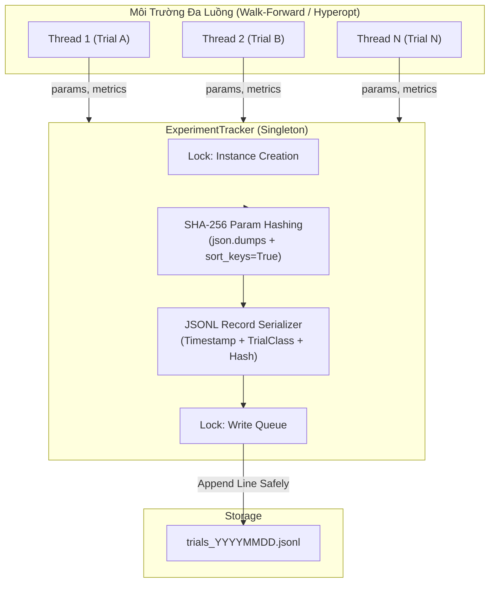
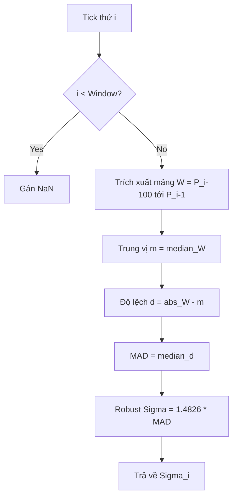
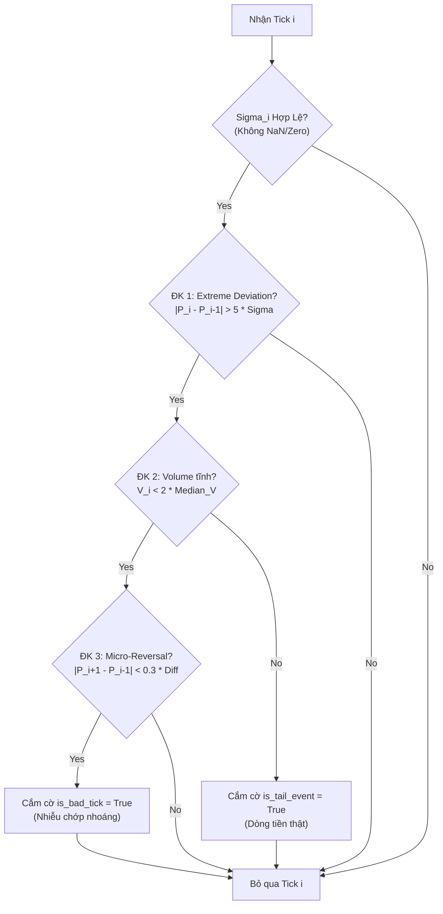

# Báo Cáo Giải Phẫu Kỹ Thuật & Giải Thích Mã Nguồn Lõi - Track A
**Dự án:** Aegis Trading System — Institutional Trend-Following Platform  
**Phân hệ:** Track A (Data & Signal Pipeline)

**Phạm vi hiện tại (Đã hoàn thiện & kiểm định TDD):**  
- [src/aegis/core/trial_classes.py](file:///Users/hoangcongly/1907TacticalAI/aegis-trading-system/src/aegis/core/trial_classes.py) (Phân loại cấu hình thử nghiệm / Task A-0-2 `TrialClass Enum`)
- [src/aegis/core/experiment_tracker.py](file:///Users/hoangcongly/1907TacticalAI/aegis-trading-system/src/aegis/core/experiment_tracker.py) (Hệ thống theo dõi thí nghiệm JSONL & SHA-256 / Task A-0-1 `ExperimentTracker Singleton`)
- [src/aegis/data/outlier_detection.py](file:///Users/hoangcongly/1907TacticalAI/aegis-trading-system/src/aegis/data/outlier_detection.py) (Tính MAD 5σ & Lọc nhiễu vi cấu trúc `detect_bad_tick_core` / Task A-1-1 & A-1-2)

---

## PHẦN I: TỔNG QUAN HỆ THỐNG TRACK A

Track A (Data & Signal Pipeline) đóng vai trò là "Đầu vào Dữ liệu & Não bộ Dự báo" của hệ thống Aegis. Nhiệm vụ cốt lõi là làm sạch dữ liệu nhiễu (Bad Tick Detection & Replacement), tạo nến theo chuẩn định lượng (Dollar Volume Bars), và thông qua các mô hình thống kê (FFD, HMM, IMM Kalman) xuất ra tín hiệu dự báo (`trend_score`) cho hệ thống ra quyết định (Track B).

---

## PHẦN II: GIẢI PHẪU CHI TIẾT TASK A-0-1 & A-0-2 — HẠ TẦNG LÕI THEO DÕI THÍ NGHIỆM (`Core Experiment Infrastructure`)

File [src/aegis/core/experiment_tracker.py](file:///Users/hoangcongly/1907TacticalAI/aegis-trading-system/src/aegis/core/experiment_tracker.py) và [src/aegis/core/trial_classes.py](file:///Users/hoangcongly/1907TacticalAI/aegis-trading-system/src/aegis/core/trial_classes.py) đóng vai trò nền móng của hệ thống Data & Signal Pipeline (Track A), nhưng cũng được chia sẻ toàn diện cho hệ thống ra quyết định (Track B). Chúng cung cấp các cơ chế phân loại phiên chạy và lưu vết thí nghiệm một cách an toàn, tránh chồng chéo khi có nhiều luồng (thread) đánh giá chiến lược.

### 1. Task A-0-1: ExperimentTracker singleton (hash_params, log_trial)

#### A. Tại sao lại dùng Singleton Pattern?
Khi chạy Walk-Forward đa luồng (Multi-threading), nếu nhiều luồng cùng cố gắng mở một file log để ghi thử nghiệm, nó sẽ dẫn đến thắt cổ chai I/O (`I/O bottleneck`) hoặc xung đột file (file lock / race condition). 
Mẫu thiết kế **Singleton** kết hợp `threading.Lock()` bảo đảm:
- Chỉ duy nhất một đối tượng `ExperimentTracker` tồn tại trong vòng đời ứng dụng.
- Cơ chế khóa vòng ghi (`_write_lock`) đảm bảo các luồng ghi dữ liệu vào file `JSONL` tuần tự, an toàn, không bị rác (corrupted file).

#### B. Cơ chế Hashing SHA-256 Cấu Hình (Dataset Manifest Hash)
```python
serialized = json.dumps(params, sort_keys=True)
hashlib.sha256(serialized.encode('utf-8')).hexdigest()
```
Trong môi trường giao dịch hệ thống, mỗi bộ tham số (ví dụ: `learning_rate=0.01`, `max_depth=5`) cấu thành nên một kết quả thí nghiệm độc nhất.
- Bằng cách đặt `sort_keys=True`, hệ thống đảm bảo 2 dictionary có thứ tự key truyền vào khác nhau vẫn tạo ra chuỗi string giống hệt nhau, từ đó băm ra cùng một chuỗi SHA-256 (Hash consistency).
- Hàm băm này được dùng làm tem xác thực (Seal) kết nối giữa cấu hình tín hiệu (Track A) và kết quả PnL (Track B).

#### C. Sơ Đồ Luồng Hoạt Động Theo Dõi Thử Nghiệm (`Experiment Tracking Pipeline`)



#### D. Kiểm Thử TDD (`test_experiment_tracker.py`)
- **Kiểm tra tính nhất quán Hash (`test_hash_consistency`)**: Đảo ngược thứ tự các key trong `dict` và xác nhận mã SHA-256 xuất ra giống nhau 100%.
- **Kiểm tra An toàn Singleton (`test_singleton_identity`)**: Đảm bảo 2 lần khởi tạo object trả về chung một `id()`.
- **Kiểm tra Ghi/Đọc File JSONL (`test_log_trial_jsonl_io`)**: Ghi 2 record thử nghiệm, sau đó đọc lại bằng bộ đọc dòng `f.readlines()`, dùng `json.loads` kiểm chứng tính toàn vẹn của dữ liệu và hash lưu lại khớp với dữ liệu gốc.

### 2. Task A-0-2: Enum trial_class dùng chung 2 người
Trong nghiên cứu định lượng, việc nhầm lẫn giữa một phiên đánh giá thông thường và một phiên tối ưu hoá siêu tham số (`hyper-parameter optimization`) có thể dẫn đến lỗi báo cáo Overfitting (ví dụ sai sót trong chỉ số `Deflated Sharpe Ratio - DSR`). 
- **`MODEL_FITTING`**: Đánh dấu các lượt chạy nhằm khớp mô hình cơ sở (không bị phạt PBO).
- **`STRATEGY_SELECTION`**: Đánh dấu các vòng lặp tinh chỉnh tham số chọn chiến lược (được bộ lọc DSR đếm và phạt lỗi thử nghiệm nhiều lần).
- **`PRODUCTION_FIT`**: Chạy huấn luyện mô hình cuối cùng trên toàn bộ dữ liệu mang ra production.

---

## PHẦN III: PHÁT HIỆN PHÁT SINH (BUG FIXES VÀ CẬP NHẬT CONTRACT V11.9)

Trong quá trình rà soát toàn bộ dự án (`src/aegis/`), 5 lỗi tiềm ẩn nghiêm trọng liên quan đến Data Contract và các lớp bảo vệ đã được phát hiện và khắc phục:

1. **Cập nhật `exit_reason` cho `LIQUIDATION`**: Hàm tính giá thanh lý `compute_regime_aware_trailing_exit_v3_liquidation_aware` trả về `exit_reason = "LIQUIDATION"`, nhưng giá trị này bị thiếu trong `CONSTRACT.md` và `TradeRecordSchema` (`schemas.py`). Đã bổ sung `"LIQUIDATION"` vào `Check.isin` và `TypedDict` để ngăn chặn lỗi `SchemaError` làm sập toàn bộ pipeline.
2. **Khắc phục lỗi lệch `exit_idx_absolute` khi mảng tương lai rỗng**: Trong `trailing_exit.py` (dòng 452), khi mảng rỗng (nến cuối fold), hệ thống trả về sai `exit_idx_absolute = entry_idx` (đúng chuẩn theo Data Contract phải là `entry_idx + 1`). Đã sửa đổi để đồng bộ với định lý chỉ số tuyệt đối tuyệt đối tại `CONSTRACT.md`.
3. **Bọc thép (Armor-Plated Guards) cho mảng giá ở `trailing_exit_v3`**: Hàm v3 vô tình loại bỏ các bước xác thực `NaN/Inf` từ v2. Đã phục hồi và chèn bổ sung các ngoại lệ (`ValueError`) chặn ngay đầu vào nếu mảng giá chứa rác (`NaN/Inf`) hoặc biểu đồ nến bị hỏng (`High < Low`), chặn rủi ro *silent corruption*.
4. **Cảnh báo `ExperimentTracker` Singleton**: Thêm cảnh báo (`warnings.warn`) khi người dùng cố gắng gọi `ExperimentTracker(log_dir=...)` với một đường dẫn mới nhưng đối tượng Singleton đã được khởi tạo trước đó. Tránh hiểu nhầm về tính năng thay đổi thư mục lưu log.

---

## PHẦN IV: GIẢI PHẪU CHI TIẾT TASK A-1-1 & A-1-2 — LỌC NHIỄU VI CẤU TRÚC (`Tick-Level Outlier Filter`)

### 1. Task A-1-1: compute_rolling_mad (100-tick) + robust sigma
- **Vị trí Module:** `src/aegis/data/outlier_detection.py` (Mới được khởi tạo).
- **Trách nhiệm:** Trích xuất đặc trưng kháng nhiễu cực đại từ luồng Tick Data.
- **Tại sao lại dùng MAD thay vì Standard Deviation (Std)?**
  - Trong thị trường Crypto (Perp Futures), hiện tượng râu nến giả (spikes) hoặc lỗi đường truyền (bad ticks) xảy ra liên tục.
  - Nếu dùng hàm `np.std()`, chỉ cần 1 cú giật 1000 giá sẽ làm độ lệch chuẩn của toàn bộ cửa sổ 100-tick phình to gấp hàng chục lần, dẫn đến việc bộ lọc bị mù và cho phép các Bad Tick tiếp theo lọt qua.
  - **Median Absolute Deviation (MAD)** đo lường độ lệch tuyệt đối so với giá trị trung vị, hoàn toàn miễn nhiễm với các điểm ngoại lai cục bộ.
- **Biến đổi sang Robust Sigma:** Hệ số $1.4826$ được nhân với MAD để quy đổi nó về cùng thang đo với độ lệch chuẩn của phân phối chuẩn $\mathcal{N}(\mu, \sigma^2)$, giúp hệ thống dễ dàng cấu hình ngưỡng $5\sigma$.

#### A. Tối ưu Hiệu năng với Numba (`@njit`)
- Việc quét cửa sổ trượt (rolling window) và tính Median hai lần liên tiếp tại mức độ Tick-Level là một thảm họa về hiệu năng nếu chạy bằng vòng lặp Python thuần hoặc Pandas.
- Hàm đã được biên dịch thẳng ra mã máy C (C-level Machine Code) thông qua `Numba JIT`, giảm độ trễ xuống cấp độ Micro-giây (µs) trên mỗi Tick, đáp ứng đúng yêu cầu của Master Blueprint.

#### B. Nguyên Tắc Causal (Chống Nhìn Trước Tương Lai)
- Tại vòng lặp `i`, cửa sổ trượt được định nghĩa là `prices[i - window : i]`.
- Việc **Tách biệt hoàn toàn** điểm `i` ra khỏi cửa sổ quá khứ đảm bảo rằng hệ thống không lấy chính Bad Tick hiện tại để đánh giá bản thân nó (Triệt tiêu Look-ahead Bias).



### 2. Task A-1-2: detect_bad_tick_core (Điều kiện 1-3: deviation/volume/reversal)
- **Vị trí Module:** `src/aegis/data/outlier_detection.py`
- **Trách nhiệm:** Dựa vào `Robust Sigma` đã tính, phân loại một cú giật mạnh là Nhiễu (Bad Tick) hay là Dòng tiền thật (Tail Event).
- **Cơ chế hoạt động:**
  - **ĐK 1 (Lệch giá):** Giá giật quá $5\sigma$.
  - **ĐK 2 (Khối lượng tĩnh):** Lượng volume tại tick đó không đột biến (nhỏ hơn 2 lần trung vị quá khứ). Nếu volume tăng vọt $> 2\times$ trung vị, hệ thống hiểu đây là dòng tiền quét lệnh (Sweeping Market Order), nên sẽ gán cờ `is_tail_event = True` và **KHÔNG** xóa tick này.
  - **ĐK 3 (Vi Đảo Chiều - Micro Reversal):** Bắt buộc giá tick liền sau ($P_{i+1}$) phải giật lùi về (độ lệch $< 0.3 \times$ độ giật ban đầu). Nếu giá trụ vững ở mốc mới, đó là sự điều chỉnh vi mô hợp lệ chứ không phải nhiễu.
- **Độ trễ 1-tick (1-Tick Latency):** Vì ĐK 3 bắt buộc phải dùng $P_{i+1}$, module này chủ động lùi vòng lặp kết thúc ở `n-2` để chờ thông tin từ tương lai gần nhất. Sự đánh đổi 1-tick latency ở mức vi cấu trúc là cần thiết để phân loại đúng đắn.

#### A. Sơ Đồ Luồng Thuật Toán `detect_bad_tick_core`


