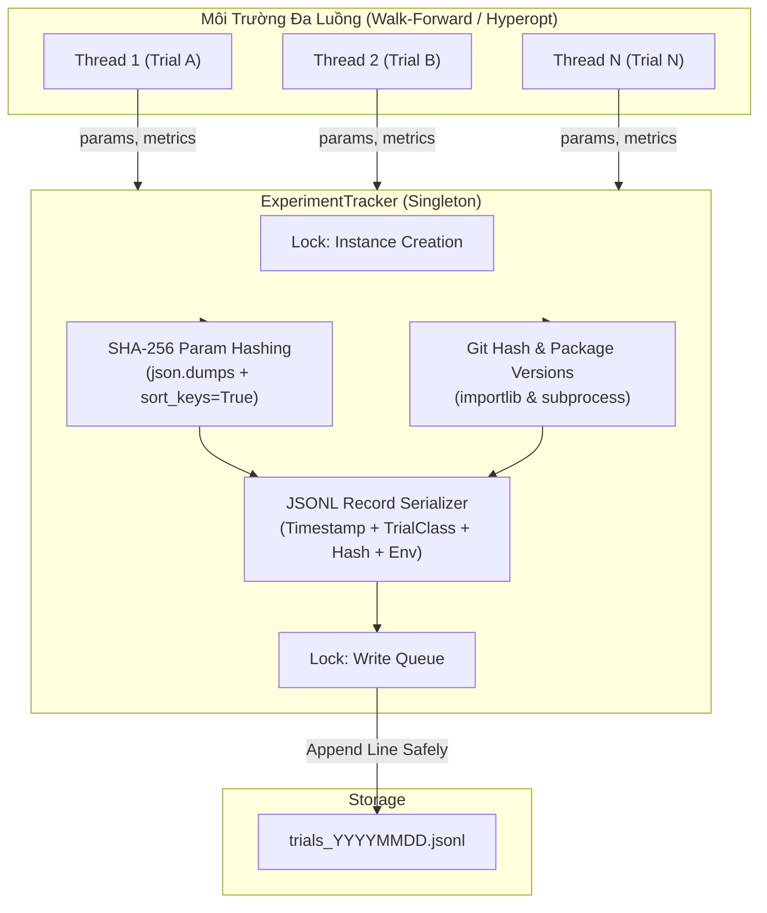

# Báo Cáo Giải Phẫu Kỹ Thuật & Giải Thích Mã Nguồn Lõi - Track A
**Dự án:** Aegis Trading System — Institutional Trend-Following Platform  
**Phân hệ:** Track A (Data & Signal Pipeline)

**Phạm vi hiện tại (Đã hoàn thiện & kiểm định TDD):**  
- [src/aegis/core/trial_classes.py](file:///Users/hoangcongly/1907TacticalAI/aegis-trading-system/src/aegis/core/trial_classes.py) (Phân loại cấu hình thử nghiệm / Task A-0-2 `TrialClass Enum`)
- [src/aegis/core/experiment_tracker.py](file:///Users/hoangcongly/1907TacticalAI/aegis-trading-system/src/aegis/core/experiment_tracker.py) (Hệ thống theo dõi thí nghiệm JSONL & SHA-256 / Task A-0-1 `ExperimentTracker Singleton`)

---

## PHẦN I: TỔNG QUAN HỆ THỐNG TRACK A

Track A (Data & Signal Pipeline) đóng vai trò là "Đầu vào Dữ liệu & Não bộ Dự báo" của hệ thống Aegis. Nhiệm vụ cốt lõi là làm sạch dữ liệu nhiễu (Bad Tick Detection & Replacement), tạo nến theo chuẩn định lượng (Dollar Volume Bars), và thông qua các mô hình thống kê (FFD, HMM, IMM Kalman) xuất ra tín hiệu dự báo (`trend_score`) cho hệ thống ra quyết định (Track B).

---

## PHẦN II: GIẢI PHẪU CHI TIẾT TASK A-0-1 & A-0-2 — HẠ TẦNG LÕI THEO DÕI THÍ NGHIỆM (`Core Experiment Infrastructure`)

File [src/aegis/core/experiment_tracker.py](file:///Users/hoangcongly/1907TacticalAI/aegis-trading-system/src/aegis/core/experiment_tracker.py) và [src/aegis/core/trial_classes.py](file:///Users/hoangcongly/1907TacticalAI/aegis-trading-system/src/aegis/core/trial_classes.py) đóng vai trò nền móng của hệ thống Data & Signal Pipeline (Track A), nhưng cũng được chia sẻ toàn diện cho hệ thống ra quyết định (Track B). Chúng cung cấp các cơ chế phân loại phiên chạy và lưu vết thí nghiệm một cách an toàn, tránh chồng chéo khi có nhiều luồng (thread) đánh giá chiến lược.

### 1. Phân loại cấu hình thử nghiệm (`TrialClass` - Task A-0-2)
Trong nghiên cứu định lượng, việc nhầm lẫn giữa một phiên đánh giá thông thường và một phiên tối ưu hoá siêu tham số (`hyper-parameter optimization`) có thể dẫn đến lỗi báo cáo Overfitting (ví dụ sai sót trong chỉ số `Deflated Sharpe Ratio - DSR`). 
- **`MODEL_FITTING`**: Đánh dấu các lượt chạy nhằm khớp mô hình cơ sở (không bị phạt PBO).
- **`STRATEGY_SELECTION`**: Đánh dấu các vòng lặp tinh chỉnh tham số chọn chiến lược (được bộ lọc DSR đếm và phạt lỗi thử nghiệm nhiều lần).
- **`PRODUCTION_FIT`**: Chạy huấn luyện mô hình cuối cùng trên toàn bộ dữ liệu mang ra production.

### 2. Hệ thống theo dõi thí nghiệm JSONL & Cơ chế chống rò rỉ SHA-256 (`ExperimentTracker` - Task A-0-1)

#### A. Tại sao lại dùng Singleton Pattern?
Khi chạy Walk-Forward đa luồng (Multi-threading), nếu nhiều luồng cùng cố gắng mở một file log để ghi thử nghiệm, nó sẽ dẫn đến thắt cổ chai I/O (`I/O bottleneck`) hoặc xung đột file (file lock / race condition). 
Mẫu thiết kế **Singleton** kết hợp `threading.Lock()` bảo đảm:
- Chỉ duy nhất một đối tượng `ExperimentTracker` tồn tại trong vòng đời ứng dụng.
- Cơ chế khóa vòng ghi (`_write_lock`) đảm bảo các luồng ghi dữ liệu vào file `JSONL` tuần tự, an toàn, không bị rác (corrupted file).

#### B. Cơ chế Hashing SHA-256 Cấu Hình (Dataset Manifest Hash)
```python
serialized = json.dumps(params, sort_keys=True)
hashlib.sha256(serialized.encode('utf-8')).hexdigest()
```
Trong môi trường giao dịch hệ thống, mỗi bộ tham số (ví dụ: `learning_rate=0.01`, `max_depth=5`) cấu thành nên một kết quả thí nghiệm độc nhất.
- Bằng cách đặt `sort_keys=True`, hệ thống đảm bảo 2 dictionary có thứ tự key truyền vào khác nhau vẫn tạo ra chuỗi string giống hệt nhau, từ đó băm ra cùng một chuỗi SHA-256 (Hash consistency).
- Hàm băm này được dùng làm tem xác thực (Seal) kết nối giữa cấu hình tín hiệu (Track A) và kết quả PnL (Track B).

#### C. Cơ chế Tracking Môi trường & Phiên bản (Reproducibility)
Để đáp ứng nghiêm ngặt Mục 5 của SOP (Experiment Tracking), lớp này bổ sung 2 cơ chế tự động lấy metadata của môi trường:
- **Git Commit Hash**: Dùng `subprocess.check_output(['git', 'rev-parse', 'HEAD'])` để đính kèm commit hash vào record.
- **Environment Versions**: Dùng `importlib.metadata.version()` tự động quét phiên bản các thư viện lõi định lượng (`numpy`, `polars`, `numba`, `scikit-learn`). 
=> **Mục đích**: Chống lại rủi ro sai lệch Sharpe/DSR khi môi trường hoặc mã nguồn thay đổi ngầm (silent changes) giữa các đợt backtest.

### 3. Sơ Đồ Luồng Hoạt Động Theo Dõi Thử Nghiệm (`Experiment Tracking Pipeline`)



### 4. Kiểm Thử TDD (`test_experiment_tracker.py`)
- **Kiểm tra tính nhất quán Hash (`test_hash_consistency`)**: Đảo ngược thứ tự các key trong `dict` và xác nhận mã SHA-256 xuất ra giống nhau 100%.
- **Kiểm tra An toàn Singleton (`test_singleton_identity`)**: Đảm bảo 2 lần khởi tạo object trả về chung một `id()`.
- **Kiểm tra Ghi/Đọc File JSONL (`test_log_trial_jsonl_io`)**: Ghi 2 record thử nghiệm, sau đó đọc lại bằng bộ đọc dòng `f.readlines()`, dùng `json.loads` kiểm chứng tính toàn vẹn của dữ liệu và hash lưu lại khớp với dữ liệu gốc.
